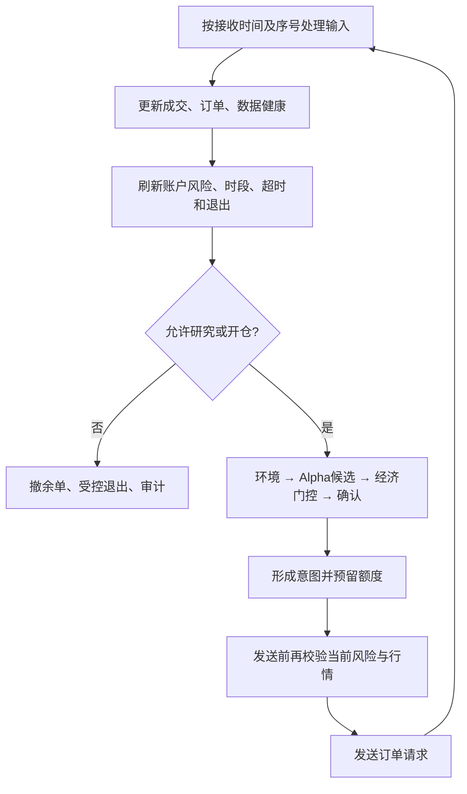

# Claude / Codex 协作审查与整改文档

审查日期：2026-10-04（JST）  
审查对象：当前目录代码 v0.1.0，策略规格 v1.2  
当前结论：**离线研究原型；实盘准入 FAIL。先修复交易安全与执行流程，再优化计算，最后验证策略净优势。**  
本轮状态：审查及离线复现已完成；下列生产代码整改均为 **OPEN，尚未实施**。

## 1. 审查基准和证据边界

检查了 `ibkr_microalpha/` 全部 16 个 Python 文件（4,799 行）、现有测试、配置、README、IMPLEMENTATION_STATUS、v1.2 策略规格，以及 `runs/demo/` 和 `runs/replayed/` 的输入、报告、审计和执行账本。当前目录没有 Git 仓库，不能给出提交号或判断其他机器是否另有新版；这里的“最新版本”指本次读取的当前文件。最新核心文件为 2026-10-03 08:57:13 JST 的 `engine.py`。

已经冻结 45 个输入文件的大小、修改时间和 SHA-256，见 [source-manifest.json](audit/2026-10-04/source-manifest.json)。问题行号对应这份基准。文档更新后的代码应重新生成版本基准，不能沿用旧行号和旧验收结论。

本次重新运行：

| 检查 | 结果 | 能证明什么 |
| --- | --- | --- |
| 现有完整测试套件 | 142 项通过，0.209 秒 | 既有测试场景通过；不能覆盖本次新增复现 |
| 示例配置校验 | 通过 | 当前示例可以构建；F08 说明校验仍有缺口 |
| Python 编译检查 | 通过；Python 3.14.0 | 语法和导入可编译 |
| 原始人工输入重新回放 | 报告与已有报告一致 | 确定性；不是独立第二个交易样本 |
| 专项缺陷复现 | 见第 8 节脚本和 JSON | 特定故障能够在当前代码稳定出现 |

没有发现真实 TWS/Gateway 日志、实际账户余额、真实行情链路计时、长期 CPU/内存监控、历史训练数据或样本外研究结果。程序明确只有 replay 模式，没有实盘适配器。本次没有发送交易、修改生产模块或覆盖已有 runs。审查新增内容均在本文与 `audit/2026-10-04/`。

证据分三级：

- **已观察**：现有人工日志里直接出现的结果或偏差。
- **已复现**：在当前代码上注入明确输入后出现的缺陷；不代表已有日志曾发生同类事故。
- **待验证**：缺少真实环境或研究数据，不能把可能性写成既成事实。

## 2. 整体结构与策略设计判断

### 2.1 当前策略是什么，流程是否清楚

策略标签：分钟级日内长仓趋势延续；相对强弱、RVOL、VWAP/采样代理、L1 盘口持续性；多股票共享风险。当前协调器采用主动限价入场与退出，被动/主动比较只是独立研究模块，自动 maker 切换尚未接入。普通 IBKR API 可以承载这类研究方向，当前没有依据转向纯做市或延迟套利。

模块边界基本清楚：

| 层 | 当前职责和位置 | 判断 |
| --- | --- | --- |
| 数据与特征 | `market.py`、`features.py` | 价档、时段、时效、窗口分离合理；存在波动边界与查询效率缺陷 |
| 信号 | `signals.py` 的 Regime、Alpha、Confirmation | 环境→候选→持续确认有明确条件；不能把多层过滤等同多个独立 alpha |
| 决策 | `engine.py:evaluate/poll` | 风险退出原则明确；具体事件顺序和失效传播仍有漏洞 |
| 执行 | `execution.py` | 已有撤单确认、部分成交、UNKNOWN、成交更正和去重；F01/F02 阻断安全闭环 |
| 风险与组合 | `risk.py`、`engine.py:_sync_risk` | 预分配和持仓限额值得保留；真实资金与账户边界未接入 |
| 研究与审计 | `economics.py`、`reporting.py`、`replay.py` | 净均值下界/完整意图口径合理；更正计量、漂移取样、日志恢复有缺口 |

理想执行顺序是：



当前 `requests` 事件实际先发送，再执行 `poll`（F02），而 `stream_health` 失效只修改特征状态，没有立即撤掉已有买单（F03）。所以“风险优先”的设计方向正确，但实现尚未在所有入口成立。

### 2.2 科学性判断

理论假设可以明确表达：市场和个股环境较强时，短期相对强弱与放量预示趋势延续；盘口持续性用于选择更有利的入场时刻；完整执行成本后的条件净均值下界应覆盖安全余量。

这个假设可检验，尚未验证。当前没有结果能证明环境、主信号、确认三层分别提供稳定净增量；它们还共享收益、VWAP、盘口等信息，不能按“层数更多”认定信号更可靠。固定 5 JPY 止损跨价格股票的含义不同，20 日 RVOL、评分权重、2 秒确认、8 次更新窗口、1000 bps 上限及 30 样本门槛也没有真实校准证据。

需要区分“参数缺少验证”和“已经过拟合”：本次只能够确认前者。具体研究方案见 F17。保持简单 L1 基线，增强版必须同时通过覆盖、净增量和执行稳定性验证才启用。

### 2.3 红线与 Gate

**实盘红线未通过：**

1. 已发送卖单没有在成交更正后重新受持仓约束，可形成意外空头（F01）。
2. 请求发送先于当时风险检查，失效行情仍可发送买单（F02）。
3. 原始数据明确失效未立即传递到活动订单（F03）。
4. 风险退出价格异常会漏出事件循环，没有完成阻塞记录与后续标的风险处理（F04）。

未发现 spoofing、wash trade、无限加仓、价格浮点直接用于下单或主回调同步网络/磁盘 I/O。已有 kill switch、日损失锁定、时段退出、Decimal、限速和审计应保留。但是其存在不能覆盖上面的故障；真实连接、账户资金、退出可达性仍是待验证项。

以下是**工程原型成熟度**的审查判断，不是收益评级或实盘性能评分：

| 五层 Gate | 分数 | 主要理由 |
| --- | --- | --- |
| 信号 | 5/10 | 公式和冻结版本明确；F07 波动错误，F17 无真实净优势验证 |
| 决策 | 6/10 | 有默认拒绝、TTL、持续确认、冷却；F02/F03 事件衔接不完整 |
| 执行 | 4/10 | 生命周期基础较好；F01 超卖、F04 风险退出中断 |
| 风险 | 4/10 | 硬门控存在；发送时点、失效传播和真实账户证据不足 |
| 组合 | 5/10 | 多股票预分配/行业限额存在；账户其他资金与持仓边界尚未闭合 |

| 八维工程评分 | 得分 |
| --- | --- |
| 策略定位 | 6/10 |
| 信号 | 8/15 |
| 决策 | 9/15 |
| 执行 | 6/15 |
| 撤单能力 | 5/15 |
| 风险 | 7/15 |
| 实盘适配 | 4/10 |
| 复盘与日志 | 3/5 |
| **合计** | **48/100，D 级研究原型；实盘 FAIL** |

执行与风险层 ≤4/10，且触发红线，故总分不能改变准入结论。可继续离线修复与研究；完成真实适配器和证据门槛之前不能直接实盘。

## 3. 运行日志与性能证据

### 3.1 原日志能够证明的事实

demo 和 replay 的 raw-input、冻结配置、报告、审计、journal、execution 六类文件分别具有相同 SHA-256。它们是同一个人工序列的生成与重放，不能累计为两个独立样本。

| 项目 | 实际值 |
| --- | --- |
| 输入时间范围 | 2026-10-02 08:55:00–09:12:30 JST，1,050 秒事件时间 |
| 事件数 | 6,786 |
| 主要组成 | 3,020 历史量基准、1,502 报价、751 成交、751 市场快照、751 请求消费 |
| 研究候选 / 执行候选 / 确认 / 意图 | 各 1 |
| 意图成交与退出 | 买 100、卖 100；结束持仓和活动订单为 0 |
| 净结果 | 毛价格亏损 1,130 JPY，费用 160 JPY，净亏损 1,290 JPY |
| 审计 | 1,490 条，其中 NO_TRADE 1,484 条 |
| 拒绝原因 | SESSION_WARMUP 1,200；cooldown 260；environment_not_long 20；确认等待 2；重复更新 2 |
| 报警 | 此人工轨迹为 0；不等于长期没有异常 |
| 交易所时间 | 1,502 报价和 751 成交均没有 exchange_at |

执行 journal 第 3–8 行显示：09:10:12 创建、发送、Submitted、成交、Filled 均为同一个人工时刻；第 9–14 行的退出在 09:10:20 同样如此。因此不能由它计算真实提交、确认或成交延迟，更不能声称零延迟。首次持仓约 8 秒后按跳价止损退出，仅验证该路径。

`fill_callbacks=1` 只计买入回报（`engine.py:236–237`），而执行质量记录买卖共 2 次 fill。不是仓位漏记，但字段名容易误读，建议改为 `entry_fill_callbacks`，见 F20。

现有报告中的 5 秒 BUY 漂移还有取样偏差，详见 F10：报告 4.16038 bps，按 09:10:17 真正当秒报价应为 5.20021 bps。

### 3.2 本机新增离线测量

环境：Windows 11、Python 3.14.0；单进程顺序 dispatch。两次基准预读 JSONL，包含计时插桩，不含输出保存、网络和券商。数据仅一只人工股票加基准。结果不是实盘容量认证。

| 指标 | 第一次 | 第二次 |
| --- | --- | --- |
| 6,786 事件 dispatch 耗时 | 13.939 秒 | 14.334 秒 |
| 混合事件吞吐 | 486.8 事件/秒 | 473.4 事件/秒 |
| trade 本地处理 p99 | 12.787 ms | 13.801 ms |
| quote 本地处理 p99 | 12.273 ms | 13.144 ms |
| 该基准峰值工作集 | 约 45.2 MiB | 约 45.6 MiB |
| 与原报告一致 | 是 | 是 |

注意混合事件含大量低成本基准加载，不能把 473–487 事件/秒当作纯行情处理能力。quote 分布还混有低成本基准报价。工作集包含预读事件，不能等同策略对象净占用。

独立 profile：

| 热点 | 调用数 | 累计耗时 |
| --- | --- | --- |
| `snapshot` | 1,502 | 19.531 秒 |
| `_rvol_baseline` | 7,060 | 13.273 秒，约占 profile 总自耗时 64.1% |
| `_return` | 25,534 | 2.469 秒 |
| `poll` | 6,788 | 0.385 秒 |
| `deepcopy` | 13,600 次顶层/253,408 次含递归 | 0.180 秒 |

profile 总计约 20.721 秒、27,862,022 次调用。profile 插桩有额外成本，各累计时间包含子调用，不能相加。

审查专用索引探针保留原 temporal/revision 筛选规则：读盘回放 14.370 秒 → 5.028 秒，报告一致，约 2.86 倍。这说明 F12 可具体优化；探针没有修改生产代码，单次同结果也不代替正式修订/迟到数据/多股票验收。

独立内存探针仅输入唯一 timer，audit 为 0：10,000 / 50,000 / 100,000 事件分别保留约 3.59 / 18.82 / 37.65 MB 的 traced 对象。说明 `seen_events` 随事件数线性增长。tracemalloc 和 no-op 轨迹不能外推真实整日 RSS。

**性能判断：单股票人工回放可稳定复现，但已存在可测的特征瓶颈和线性内存增长；当前资料不足以判断多股票实盘速度、队列积压、链路尾延迟或全天稳定性。优先优化查询和重复特征，保留安全检查。**

## 4. 问题登记与整改方法

优先级定义：**P0**＝接入任何实盘通道前必须先修复的交易安全阻断；**P1**＝核心路径、数据真实性、运行可靠性或研究准入的必修问题；**P2**＝维护性、数据覆盖或后续容量优化。P0 不表示已有实盘事故。

下列代码均为**建议实现片段**，用于明确整改方向；没有作为生产补丁应用。新增方法、持久化或事件类型还需完整实现与测试，不能直接复制片段即宣称完成整改。

### F01 · P0 · 成交更正后，已发送卖单可能超过真实持仓【已复现】

- **位置**：`execution.py:519–582 _rebuild`，尤其 576–582；`engine.py:352–359 _request_exit`。
- **原因**：持仓按更正重建，但只检查单个订单成交量超原量，没有检查活动卖单剩余量总和是否仍受新持仓约束。发送前检查只能保护未发送的卖单。
- **证据**：买入 100 → 发送卖出 100 → 买入更正为 50；持仓 50、卖余量 100、WORKING、无锁无撤单。卖价 2999≤当前 Bid 3000，过退出 TTL 仍不撤；随后卖 100，持仓为 -50。
- **影响**：长仓策略形成无法按现有长仓退出逻辑消除的意外空头，风险账本不再可信。
- **处理**：保留更正重建；新增重建后卖量不变量与强制撤单/查询/报警。不能把撤单请求视为撤单完成，也不能凭旧数量下替换单。

```python
# 在每次成交重建后检查；缩量更正时进入隔离状态
for symbol, position in self.positions.items():
    sells = [o for o in self.active_orders(symbol) if o.side == Side.SELL]
    if sum(o.possible_remaining for o in sells) > max(0, position.quantity):
        self._lock("ledger: live sell quantity exceeds confirmed holding", at)
        for order in sells:
            self.cancel(order.order_id, at)
        self._query(at)  # 等完整回报/对账，不释放未确认卖量
```

验收：更正到 50/0、多个卖子单、撤单途中成交、重复/迟到更正均不能继续盲卖；若撤单前已形成负持仓，保留真实账本、报警并转人工/专门恢复流程，不能记为已平。

### F02 · P0 · 请求消费先发订单，后检查当前风控【已复现】

- **位置**：`replay.py:152–156 requests` 分支与 171–172 尾部 `poll`；`execution.py:614–669 drain_commands`。
- **原因**：排队意图和真正发送分离后，发送时没有先刷新时效、组合风险、市场状态和经济门槛。
- **证据**：最新报价年龄 3 秒，配置只允许 2 秒；requests 先返回 SUBMIT，随后 poll 才进入 MARKET_RISK_OFF、改为 CANCEL_PENDING，排队 CANCEL。
- **影响**：失效信号产生买单，随后撤单仍可能发生真实成交；日损失/kill 之后的排队买单也需要发送时硬阻断。
- **处理**：重构请求发送入口，把风险刷新放在 drain 前；对每个待发送 BUY 再校验 quote、forecast、价格上限、候选 TTL、账户和风险。只换 poll 顺序不足以检查所有 forecast/alpha 条件。

```python
elif kind == "requests":
    e.poll(at)
    e.revalidate_pending_entries(at)  # 新增：只取消失效意图，不生成新意图
    self.last_commands = e.book.drain_commands(at)
    # 记录 REQUEST_DISPATCHED；此分支不再重复执行尾部 poll
```

验收：分别在排队后触发报价过期、预测过期、kill、日损失、断线、收盘门控；发送结果不能包含 BUY SUBMIT，风险 CANCEL/合法受控退出仍有发送容量。

### F03 · P1 · 数据健康失效没有立即传递到候选和活动订单【已复现】

- **位置**：`replay.py:89–90 stream_health`；`features.py:216–229 set_trade_stream_health`；`engine.py:386–468 poll`。
- **原因**：stream_health 清掉成交窗口，但 poll 只检查外部市场快照、报价和账户，没有重验已缓存特征健康。缓存 snapshot 继续显示 valid=True。
- **证据**：原 demo 处理到首笔 fill 前（6,089 个事件）已有 WORKING 买单；注入同源 healthy=False 后，新特征 snapshot invalid，缓存仍 valid，买单仍 WORKING，没有 CANCEL 或锁。
- **影响**：已失效 RVOL/TI/VWAP 支持的入场单继续工作，直到下一行情重新评估或其他时效门控触发。
- **处理**：新增统一数据失效入口，接通 stream_health、data_reset、subscription_failed、冲突行情等事件；撤掉依赖该数据的买单，重置 READY。持仓数据失效按既定 DATA_RISK 处理并记录无法退出的原因。

```python
healthy = e.features.set_trade_stream_health(at=at, **data)
if not healthy:
    e.on_data_invalid(data["symbol"], at, "TRADE_STREAM_UNHEALTHY")
    # 新入口应清候选/缓存有效性、撤 BUY、处理持仓，不只是改 features
```

直接调用 `engine.on_quote` 的冲突 ID 分支也应传播 `CONFLICTING_MARKET_EVENT`：features 返回 False，而合法原始报价不会触发现有 invalidate 分支。当前 Replay 自身会先拒绝冲突 ID；该分支主要影响未来直接适配器入口。不要把它当作已有 replay 超卖事故。

验收：在没有下一条 quote/trade 的情况下发健康失效事件，活动买单立即进入撤销/本地取消路径；恢复后重新暖机，不拼接旧确认计数。

### F04 · P1 · 退出限价非正时异常漏出，风险循环中断【已复现】

- **位置**：`engine.py:360–367 _request_exit`，`market.py:198–199/216–229`。
- **原因**：`round_price(bid-exit_slippage)` 位于 try 外；固定 JPY 滑点大于低价股 Bid 时输入非正。
- **证据**：合法 Bid/Ask=0.5/0.6、exit_slippage=1，抛 `price must be positive`；卖单 0，EXIT_BLOCKED 审计 0。
- **影响**：当前离线运行终止；未来共享事件循环可能漏掉后续标的风险管理。
- **处理**：保留合法价档和限价保护；把计算与提交统一放入受控异常路径。价格不可执行时记录阻塞与报警，继续其他标的；不要静默改成无限制市价单。

```python
try:
    raw_limit = quote.bid - self.config.exit_slippage
    if raw_limit <= 0:
        raise ValueError("EXIT_LIMIT_NONPOSITIVE")
    limit = self.ticks.round_price(raw_limit, "down", at, category)
    order = self.book.submit(intent_key, symbol, Side.SELL, available, limit, at,
                             emergency=emergency)
except ValueError as error:
    self.risk.lock("exit_price_unavailable")
    self._record(at, "EXIT_BLOCKED", symbol=symbol, reason=str(error))
    return
```

上线前还应按价档/股票冻结滑点预算；低价股若采用最小合法正价，也必须显式批准这一价格政策并重新核算压力风险。验收包含低价、跨价档、不可用价表和多股票中的单股失败。

### F05 · P1 · 增强版研究候选统计调用错误，直接 TypeError【已复现】

- **位置**：`engine.py:583–584 evaluate`；`subscriptions.py:203–207 record_candidate`。
- **原因**：调用传一个 enhanced_ready 布尔值，函数要求 symbol、at、requirements 三个参数。
- **证据**：合法增强配置，第 10 秒形成首个研究候选后抛缺少 at/requirements 的 TypeError。现有测试检查增强配置但没有覆盖完整候选流程。
- **影响**：增强策略中断，READY 覆盖统计不可用。
- **处理**：保留统计功能，修复接口并接入完整增强版集成测试。

```python
self.subscription_scheduler.record_candidate(
    symbol, at, self.subscription_requirements
)
```

验收：L1 与增强配置各自完整运行候选→订阅/READY→确认→意图→撤单/退出；明确无 READY 时只研究或等待，不放行增强订单。

### F06 · P1 · 增强版订阅预分配依赖未订阅数据，冷启动相互等待【已复现】

- **位置**：`engine.py:528–542 _enhanced_ready`；`signals.py:96–102 alpha_score`；`config.py:107–108`。
- **原因**：预订阅排名复用完整 Alpha，要求 rvol_30 和 VWAP slope；增强配置却规定这些来自尚未订阅的 TBT。
- **证据**：连续 600 秒 L1 行情后，r_300 和 rs_300 均为 317.47 bps，缺 rvol/VWAP，rankings 与 active_subscriptions 仍为空。
- **影响**：没有已有持仓或外部预载足量TBT派生数据时无法建立首个增强订阅；仅给日VWAP种子也不能补足30秒RVOL，理论增强确认根本不可用。
- **处理**：拆出独立 L1 预分配分数，消费已有 L1 数据；不能用 replace(valid=True) 把缺数据的完整信号当作有效。订阅确认、流健康、窗口和可信同源日 VWAP 种子分别管理。

```python
def preallocation_score(snapshot):
    # 阈值和权重必须独立冻结；不读取 TBT 的 RVOL/TI/VWAP
    values = snapshot.values
    return (values["rs_300"], values["r_300"], -values["spread_bps"])
```

验收：仅 L1 输入可产生订阅计划；订阅尚未收到健康确认时 READY=False；迟到订阅没有完整日 VWAP 种子时不得冒充全日 VWAP。

### F07 · P1 · 波动率窗口漏掉左边界跳价【已复现】

- **位置**：`features.py:451–454 snapshot`；同文件 521–528 已有带锚点的 `_realized_volatility`。
- **原因**：收益计算允许 cutoff 前报价作锚点，个股波动却仅筛 q.at>=cutoff，漏掉锚点到第一条窗口内报价的变化。
- **证据**：窗口内跳价 100→200 后价格不变；60.5 秒快照 valid=True，r_60=6928.97 bps，volatility_bps=0；带锚点方法为 6928.97。
- **影响**：绕过最大波动门控；启用波动止损时低估止损距离和压力预算。
- **处理**：删除第二套波动实现，合并为统一锚点估计器。

```python
volatility = self._realized_volatility(state, at, 60)
if volatility is not None:
    values["volatility_bps"] = volatility
```

验收：cutoff 前/等于/后、非整秒、不规则更新、价格无变化和覆盖断裂；波动不完整时保持缺失，不能输出假零。

### F08 · P1 · 数据和数值配置校验不完整【已复现】

- **位置**：`domain.py:99–102 FeatureSnapshot.__post_init__`；`features.py:102–115 FeatureConfig.__post_init__`；`config.py:16–32 _construct`。
- **原因**：FeatureSnapshot.valid 没有严格 bool 校验；rvol_days/rvol_min_days 没有严格整数校验。
- **证据**：同一测试轨迹 valid=False 开出 0 个买单，valid="false" 却开出 1 个买单并进入 LONG；rvol_days=20.5 通过 build_engine，首次基准切片 TypeError。
- **影响**：无效数据标记变成有效；错误配置从启动校验延迟到盘中才中断。
- **处理**：保留严格边界校验，统一 dataclass 字段校验；错误值应拒绝，不做宽松 bool/int 转换。

```python
# FeatureSnapshot
if type(self.valid) is not bool:
    raise ValueError("snapshot.valid must be a boolean")
# FeatureConfig
for name in ("rvol_days", "rvol_min_days"):
    value = getattr(self, name)
    if type(value) is not int or value <= 0:
        raise ValueError(f"{name} must be a positive integer")
```

验收：JSON 中的 "false"、0/1、None、true 作为整数、20.5、NaN/Infinity、空 required_features 的策略依赖检查。不能仅凭类型注解判断输入已校验。

### F09 · P1 · 执行质量报告重复累加更正成交，撤销成交也不去除旧损耗【已复现】

- **位置**：`reporting.py:124–135 on_fill`、161–175 summary；`engine.py:228–230`。
- **原因**：账本按 correction_of 替换旧成交，诊断报告却追加所有版本并求和，只有 correction 布尔值，没有更正链身份。
- **证据**：原成交损耗 100、更正后 200，报告总损耗 300；bust 为 0 股后仍报旧损耗 100，应为 0。
- **影响**：执行政策比较和成本校准失真。当前 reporting 不控制交易，因此不是当前账户 PnL 重复扣费。
- **处理**：原始回报全部保留为审计，汇总只消费账本有效成交版本；漂移也应移除被替换/撤销的样本。

```python
# summary 从 ExecutionBook 的有效更正链重建，不再 sum 所有回报
effective_fills = book.effective_fills()  # 新增只读公共接口
cost = sum(price_cost(fill, book.orders[fill.order_id],
                      self.arrival.get(fill.order_id))
           for fill in effective_fills)
```

验收：多次更正、零量 bust、重复更正、晚到费用、不同接收/执行顺序；诊断和账本使用相同有效执行身份。

### F10 · P1 · 到达漂移目标时使用目标之前的报价，并冻结错误结果【已观察＋已复现】

- **位置**：`reporting.py:137–159 ExecutionQuality.observe`。
- **原因**：at 到达目标时间即接受“目前仍新鲜”的报价，没有要求 quote.at>=target；同秒 market_snapshot 先 poll 时，沿用上一秒报价。
- **证据**：09:10:12 fill，09:10:17 首条市场快照先触发 poll，使用 09:10:16 中价 961.65，报 4.16038 bps；实际 09:10:17 中价 961.75 应为 5.20021。独立旧价100/新价101复现报0，应为99.5033 bps。
- **影响**：5/30/120 秒漂移带系统性的事件顺序偏差，误判执行后不利变化。
- **处理**：冻结取样定义，建议“目标之后第一条有效报价、限容忍迟到”；未收到目标后报价时先等待，超时才记 unavailable。已记录样本带实际测量时间。

```python
target = drift.fill_at + timedelta(seconds=horizon)
if at < target:
    continue
if quote is not None and target <= quote.at <= target + tolerance:
    drift.results[horizon] = signed_drift(quote.mid, drift.reference_mid)
elif at > target + tolerance:
    drift.results[horizon] = None
# 不因 quote.at < target 提前锁定一个目标期结果
```

验收：同秒不同事件排列、目标前仍新鲜报价、目标后首条报价、报价缺口与迟到。参考中价也需保存实际取样时点；不能默默把其他时点称为成交时点。

### F11 · P2 · 历史“有效日”先截取再过滤，足量样本仍缺特征【已复现】

- **位置**：`features.py:413–415 _rvol_baseline`；497–498 市场波动历史。
- **原因**：先取最近 D 日，再剔除 invalid，和“最近 D 个有效交易日”含义不同。
- **证据**：21 日记录、20 日有效，最近一天 invalid；D=min_days=20 时返回 None。
- **影响**：RVOL/市场波动缺失，减少可用候选并增加无意义暖机/拒绝；不是虚增盈利。
- **处理**：若规格要求有效日，按当时可知修订覆盖后先过滤有效日，再选 D 个；若坚持最近 D 个交易日必须全部有效，须独立命名、冻结并改文档。

```python
latest = [by_day[d] for d in sorted(by_day, reverse=True)]
rows = [r for r in latest if r.valid][:self.config.rvol_days]
if len(rows) < self.config.rvol_min_days:
    return None
```

验收：最近失效日、迟到修订、未来 known_at、非交易日、不同源/时段；不得为补足数量引入未来数据或无效日。

### F12 · P1 · RVOL 历史基准全表重复扫描，是主要已测瓶颈【已测】

- **位置**：`features.py:344–350 add_*_baseline`；404–418 `_rvol_baseline`；465–481 五窗口循环。
- **原因**：每个窗口都扫描全部基准，再筛股票、来源、窗口和当秒；day/local.date 等也在循环内反复调用。
- **证据**：仅 3,020 行历史，7,060 次查询累计 13.273 秒；约 21,452,752 次 datetime.date 调用。索引探针报告一致、耗时约缩短至原来的35%。
- **影响**：历史增多、股票池变大时热路径成本随全表放大，排队可能使行情变旧；目前没有真实队列积压测量。
- **处理**：索引到 `(symbol, source, window_seconds, end_second)`，再按 day/known_at 管修订；保留时间因果与完整审计。优先改这里，不先删除风险检查。

```python
# 初始化 defaultdict(list)，add_volume_baseline 中更新索引
key = (row.symbol, row.source, row.window_seconds, row.end_second)
self._baseline_index[key].append(row)

# 查询仅扫描该键相关记录；仍保留已知时间、有效日期与更正规则
key = (symbol, self.config.trade_source, window, seconds)
candidates = [r for r in self._baseline_index.get(key, ())
              if r.day < local_day and r.known_at <= at]
```

验收：相同输入报告一致；迟到/同日修订、未来基准、源变更、F11 历史政策测试通过；在 1/10/30 股票压力下量化耗时和队列年龄。审查索引探针是可行性证据，不是正式性能 SLA。

### F13 · P2 · 每事件计算未消费特征、共享市场量和重复快照【静态确认＋已测】

- **位置**：`features.py:440–502 snapshot`、511–518 `feature_windows`；`engine.py:528–553 _enhanced_ready`；示例 required_features。
- **原因**：全部 RETURN_WINDOWS、VWAP slope、五成交窗口始终计算；每只股票重算全池 breadth/基准 RV；增强 READY 又重新 snapshot。
- **影响**：多股票 breadth 接近重复的全池扫描，维护依赖关系不清楚；r_600 未被当前 Regime/Alpha/Confirmation 消费却影响全 snapshot 有效性。
- **处理**：按启用模块依赖图计算；共享市场特征独立一次计算；原始特征按数据版本/健康版本/时段缓存。保留规格的开场10分钟安全暖机，删除 r_600 门控前冻结断线恢复是否需600秒的政策；不能为了提速静默缩短暖机。

```python
needed = regime.required_features | alpha.required_features | confirmation.required_features
raw_key = (at, symbol, frozen_feature_version, state.data_version,
           state.health_version, state.segment, baseline_revision,
           benchmark_data_version, market_universe_revision)
snapshot = feature_cache.get_or_compute(raw_key, needed)
coverage = validated_windows(snapshot)  # 只接受同版本原始流快照
```

缓存只保留每个股票的当前事件版本，不能无限累积以上所有键；窗口边界、报价年龄、历史known_at和基准行情都会改变结果，禁止跨timer直接复用旧snapshot。不能用未经核验的 feature_snapshot 替换增强版原始覆盖证据。微价格、accel、额外长窗等可作为按需研究项移出交易热路径，待证明净增量再启用。`_rebuild` 的全历史重算在此日志只有2个成交，未构成已测瓶颈；先保留其更正正确性。

### F14 · P1 · 输入、去重和审计全量驻内存，异常前没有持续落盘【已复现＋静态确认】

- **位置**：`replay.py:34/58/205–223`；`engine.py:131/149–150 audit`；`features.py:123/197/281 seen`。
- **原因**：Replay 保留每条输入 deepcopy，特征另存身份/载荷，audit/journal 累积，最后 save 才写文件。窗口 deque 按610秒裁剪，没有固定条数上限；seen没有同样生命周期。
- **证据**：100k 唯一 timer 的 traced 对象约37.65 MB且 audit=0；3,601 报价后窗口只有612行，seen仍3,601，日重置后也不释放。
- **影响**：整日、多股票内存线性增加；进程崩溃或坏事件终止时缺少新运行完整证据。
- **处理**：重构消费者持久化与统一去重；逐条原始输入/交易审计进队列，异步持久化、批量刷盘、显式 backpressure 和尾部恢复；交易回调继续不写磁盘。

```python
# 消费者边界：持久化先接受原始输入，状态处理结果另写成功/失败记录
input_writer.append(raw_event)
identity_index.check_or_register_received(raw_event)  # RECEIVED，只做冲突检测
dispatch(raw_event)
identity_index.mark_applied(raw_event)  # 成功后APPLIED；失败记FAILED并停止实例
audit_writer.enqueue(new_audit_records)
```

输入身份登记和成功应用标记必须分开：已持久化但处理失败的事件不能被当作成功跳过。不得裸清空成交身份或使用简单 LRU 导致旧成交再次累计日 VWAP。需要源序号水位、持久化身份/更正链和完整重建。低价值 timer 可不保留完整热载荷，但重放所需时间序列必须仍可恢复。核心拒绝/风险/订单审计不能删除。

### F15 · P2 · dispatch 失败前已登记“处理过”，重复输入会被静默忽略【已复现】

- **位置**：`replay.py:49–58 dispatch`；`replay.py:174–185 run`；`cli.py:29–37`。
- **原因**：last_key 与 seen_events 在数据校验/处理完成前写入；异常只终止，没有失败状态或部分运行输出。
- **证据**：calendar.known_at 在未来；首次报错，第二次完全相同非法事件静默 return；events_processed=0、seen_events=1。
- **影响**：交互式重试误以为事件已处理，失败现场和成功身份混淆。CLI 完整从头重放仍可恢复，但 API 局部重试不安全。
- **处理**：先完成无副作用解析/验证；一旦状态应用失败，标记运行 FAILED、保存输入位置/异常/部分证据，拒绝继续同实例。复杂多模块修改不要假装可用简单 try 回滚。

```python
parsed = validate_and_parse(event)  # 不修改策略状态
try:
    apply(parsed)
except Exception as error:
    self.failed = failure_record(event, error)
    raise  # 同实例禁止后续dispatch，修复后用完整输入重建
self.last_key = parsed.key
self.seen_events[event["event_id"]] = immutable_record(event)
```

验收：解析失败不污染身份；应用中途失败明确锁定实例，部分证据可保存；重建后结果与原完整输入一致，旧请求不能重发。

### F16 · P2 · 首笔成交评分修改不进 journal，账本两种恢复路径不一致【已观察】

- **位置**：`engine.py:211–228 on_fill`；`execution.py:893–921 from_journal`。
- **原因**：协调器直接修改 order.entry_score，journal 仅包含原 SUBMIT 和 FILL，缺少评分修订事件。
- **证据**：现有 demo 第1订单 execution.json 的 entry_score=2.8675213682449385；journal 第3行 SUBMIT 仍为2.8446550849077727。from_journal 使用旧提交分数，from_snapshot 保存新分数。
- **影响**：独立账本诊断/恢复的证据不自足；若错误用于 Alpha 衰减恢复，会改变退出基准。持仓止损上调也由 engine 直接修改（233–234），应纳入同类元数据审计。README 已正确规定完整策略恢复必须用 raw-input+冻结配置，不应据此声称当前 CLI 自动恢复错误。
- **处理**：合并元数据更新到 ExecutionBook 的可审计接口，写 ENTRY_CONTEXT_UPDATED 并支持重放；原接收时间、实际执行时间分开保留。

```python
book.update_entry_context(
    order_id, at=receipt_at, entry_score=score,
    score_version=snapshot.version, feature_at=snapshot.at
)
# 更新方法持久化事件，再处理fill；from_journal支持相同事件
```

验收：journal/snapshot 恢复后的订单元数据一致；持仓未平时首成交评分、止损和持仓时钟一致；仍需完整对账，不能恢复请求后再次发送。

### F17 · P1 · 参数和净优势只有人工声明，缺研究验证链【证据缺口】

- **位置**：`demo.py:59–65`；`examples/research.json` 的 scalers/alpha/confirmation/engine；`economics.py:57–119 Prediction/prediction_gate`。
- **原因**：sample_count=100、calibrated/reliable=True、净均值和下界均是演示输入。门控校验声明及版本一致性，没有提供训练/验证/测试数据、标签、置信界计算或实验登记。
- **影响**：无法判断收益来源、独立样本、参数稳健性、等待成本和过拟合；“30样本通过”不能当作统计证明。固定止损和滑点预算也不能保证跳空时实际损失不超预算，demo 已演示跳价损失。
- **处理**：保留净均值下界门控，补可追溯研究流水线，阈值全部仅在训练/验证选择；测试期冻结。不要因本次1笔亏损否定策略，也不要因测试通过批准收益。

```python
calibration_evidence = {
    "experiment_id": "...",
    "training_days": [...], "validation_days": [...], "test_days": [...],
    "policy_hash": "...", "data_hash": "...", "fee_version": "...",
    "label_interval_policy": "...", "confidence_method": "day_or_block",
    "independent_blocks": ..., "includes_unfilled_and_partial": True,
}
# forecast引用这份冻结证据；没有证据的calibrated=True不能用于实盘准入
```

研究执行顺序：

1. 按交易日分训练/验证/最终样本外，隔离跨界的入场到退出标签；标准化、参数、股票池、费用和政策版本冻结。
2. B0/M0/M1a/M1b/M2/M3 按规格相同退出基线对照；L1/增强分别报告共同有效样本与实际覆盖、机会损失。
3. H=120/300/600/1200 秒先做共同候选的持仓归因，再分别重校准完整部署政策；不能测试后挑最佳。
4. 计入未成交、部分成交、全部子单费用、实际可执行价；按日/区块估计置信界并报告集中度和回撤。
5. 对阈值邻域、额外价档滑点、尾延迟、费用、低 READY 覆盖和较低成交概率做压力测试。
6. 某一层没有稳定净增量即停用该层，保留较简单且已验证的版本。需输出所有实验ID，避免只留下“最好”参数。

### F18 · P1 · 账户验证目前是策略局部模拟，不包含真实余额和通道【接口缺口】

- **位置**：`execution.py:693–701 reconcile`；`engine.py:274–315 _sync_risk`；`config.py:114–127`。
- **原因**：reconcile 仅接持仓、活动单、执行和归属；现金仍取 initial_cash+cash_flow。没有真实余额、现金可用额度、账户更新时间、外部资金流、完整账户风险/持仓适配器。
- **影响**：若直接接实盘并把 account_verified 当成实际账户校验，配置资金与实际资金变化可造成错误预算；目前 CLI 离线限制避免了这一直接风险。
- **处理**：保留局部策略账本，单独新增 broker account snapshot 与账户覆盖界定。可用资金按策略额度和核实的券商资金较保守者，不能把局部预留重复扣除。

```python
available_for_strategy = min(
    frozen_strategy_budget,
    verified_account.available_funds_jpy
) - strategy_pending_cash_not_already_reserved_by_broker
account_ok = (verified_account.complete and verified_account.fresh
              and verified_account.ownership_confirmed)
```

上式是口径示意，实际需核对 AvailableFunds/现金/保证金、币种换算和是否包含挂单占用。还需实现合约、实时数据权限、nextValidId、错误码、heartbeat、重连订阅和完整对账。资金/行情/执行通道都必须新鲜且身份明确才准入。

组合方面，`risk.py:148–175` 只限制组合/行业名义金额和单笔 stress，没有聚合各持仓及在途订单的压力损失。默认3仓×单笔0.1%的粗上界为0.3%资本，低于日损失0.5%，不能称默认参数已经超预算；变更参数前应新增组合/行业压力预算，并按相关跳价和退出流动性核验。日损失锁是事后控制，不能替代事前总风险门控。

IBKR 官方明确 orderStatus 会重复，取消未确认期间仍可能收到执行；当前去重和 CANCEL_PENDING 的保守处理应保留。[订单状态](https://www.interactivebrokers.com/docs/tws-api/doc/order-management/order-status/introduction)、[撤单状态](https://www.interactivebrokers.com/docs/tws-api/doc/order-management/order-status/understanding-order-status-message)。

JPX 当前时段及价档处理方向与已核查规则一致，2027-03-01 规则变更边界也应继续 fail closed；其他证券/路由不能复用这份普通股票表。[交易时段](https://www.jpx.co.jp/english/equities/trading/domestic/01.html)、[价档及2027年变更](https://www.jpx.co.jp/english/equities/trading/domestic/07.html)。

示例佣金使用 Fixed 0.08%、单笔最低80 JPY，与当前公开表口径一致，但不能替代具体账户/计划/账单核验。[IBSJ 日本股票佣金](https://www.interactivebrokers.co.jp/en/pricing/commissions-stocks.php)。

### F19 · P2 · 协调器重复门控与状态所有权增加维护成本【静态确认】

- **位置**：`signals.py:307–353 observe` 与364–421 evaluate；`engine.py:490–499 _economic_gate` 与659–686 重复实现；candidates/alpha._active；多处冷却和时段判断。
- **原因**：独立研究机会和执行候选各写一套近似评分、有效性和阈值；价格/预测门控在不同路径重复。候选由 engine 和 Alpha 各持一份。
- **影响**：修改一个门槛容易漏另一入口，阅读主流程较困难；重复计算成本目前小于历史扫描，不应先大规模重写。
- **处理**：提取纯评分/特征 Gate 和经济检查结果；研究/执行保留独立TTL与冷却，明确单一候选所有者；把单股退出判定提取纯函数，让poll保持“更新→风险→退出→候选管理”的可读顺序。

```python
facts = compute_alpha_facts(snapshot, quote, scalers)
gate = alpha_gate(facts, policy)
research.observe(gate, at)           # 独立研究状态
candidate_store.update(gate, at)     # 执行候选单一所有者
economic = check_forecast(forecast, quote, quantity, at)
```

不要合并研究/执行样本流，避免没有预测时“机会不存在”的选择偏差。保留晚到成交、未知状态和风险退出等核心分支。

维护修正：README“冷却倍增”和 engine:416 的 `base * consecutive_stops` 不一致，代码是线性延长；tests:reporting 明确第二次600秒。先将文档写成“按次数线性延长”，不要未经研究改成指数倍增。删除 `evaluate(..., enhanced_ready=False)` 这类最终总被内部重算的无效外部参数前，核对所有调用与测试。

### F20 · P2 · 请求计数、OER 和真实性能观测口径不完整【静态确认＋日志证据缺口】

- **位置**：`risk.py:114–116 note_order`；`engine.py:712` 唯一调用；`execution.py:137–190/614–669`；`reporting.py:161–175`。
- **原因**：orders_today 只计入场意图，不计退出子单/重挂/撤单；限速50等默认值没有在冻结配置中暴露；报告没有真实队列年龄、CPU、链路时延或 OER 统计。
- **影响**：max_orders_per_day 容易被理解为实际全部订单上限；无法核对请求负载和券商限制。当前没有证据说明真实接口调用频繁，因为没有任何真实接口调用。
- **处理**：把现有计数命名为 entry_intents_today；额外按派发事件记录 submit/cancel/query/fill，风险退出不能因为普通订单预算耗尽被阻断。限速参数按账户、通道和 API 版本配置；OER 口径与适用限制必须核验，不能把 cancel/fill 简单比率称为官方 OER。

```python
metrics.count("request_dispatched", kind=command.kind, risk=command.risk)
metrics.observe("queue_age_ms", (sent_at - command.created_at).total_seconds() * 1000)
# monotonic时钟分别计本地处理、排队、提交ACK、撤单ACK、退出完成
# 本地耗时与exchange_at缺失时的链路UNKNOWN分开报告
```

初始容量验收建议：在预期股票池和事件率下控制本地 p99 小于25ms（L1约250ms间隔的10%预算，工程目标而非官方保证），并独立设队列年龄与退出完成预算。真实 trade/fill/cancel p99 必须实测，不能沿用示例 submit_p99_seconds=1 的填充值。[IBKR L1 更新口径](https://www.interactivebrokers.com/docs/tws-api/doc/market-data-live/top-of-book-l-1/market-data-update-frequency)。

### F21 · P2 · 每次风控刷新重复扫描全日费用，成本随历史放大【局部已测】

- **位置**：`engine.py:251–258 _fee_reserves`；`execution.py:228–235 order_fees`；`engine.py:276–315 _sync_risk`。
- **原因**：每个有成交订单调用一次 order_fees，而 order_fees 又扫描全部有效执行；几乎每个行情和timer都重算，接近 O(订单数×执行数)。active_orders 按股票查询也重复扫描全日订单。
- **证据**：只计费用预留方法、每组12次的中位数：2订单/2执行0.0051ms，20/20为0.05855ms，200/200为2.51545ms，2000/2000为230.335ms。最后一组超默认100入场意图限制，仅表明增长趋势；原demo2个子单未暴露这一成本。
- **影响**：交易越多，同一行情回调重复工作越多；本例不是当前最大热点，优先级低于F12。
- **处理**：保留晚到费用与更正语义；按order_id缓存有效费用及未报费用预留，在fill/correction/commission时更新受影响订单，风控读取聚合量。保留全重建作为参考和故障恢复；新增活动订单按股票索引。

```python
# 每次执行/更正/费用变化只重算受影响子单
before = fee_reserve_by_order.get(order_id, ZERO)
after = conservative_missing_fee(book.orders[order_id], effective_fee_by_order[order_id])
fee_reserve_by_order[order_id] = after
total_fee_reserve += after - before
# _sync_risk只读total_fee_reserve；重建/恢复后全部校验
```

验收：普通成交、部分成交、更正、bust、费用晚到/替换、零量和恢复后，增量预留与原全重建结果完全一致；100意图级回放再测处理耗时。不能为减少扫描删除费用保守预留。

## 5. 删除、合并、重构、保留清单

| 对象 | 建议 | 理由和前提 |
| --- | --- | --- |
| snapshot 内独立个股波动计算 | **合并/删除重复实现** | F07；使用统一带锚点估计器 |
| 5/10/120等未被当前策略消费的成交统计、微价格、accel、额外VWAP斜率 | **移出热路径/按需计算** | F13；研究用途保留，启用依赖由冻结配置声明 |
| r_600 全 snapshot 必需门控 | **简化后再删除冗余门控** | 当前策略不消费；保留开场10分钟及经冻结的恢复安全政策 |
| 每股票重复 breadth/市场RV | **合并为共享市场计算** | 每事件版本一次；不能用缓存旧市场值延长有效期 |
| feature_windows 再做完整snapshot | **合并/缓存原始快照** | 数据、健康、源和时段版本必须一致 |
| observe/evaluate 的评分和特征门槛 | **提取纯函数** | 研究和执行 TTL/冷却仍独立 |
| 三处分散 forecast/价格检查 | **合并可复用Gate** | 生成、活动单、发送前仍各自必须检查当前状态 |
| engine/Alpha 双候选字典 | **明确单一所有者** | 避免同步失配；维护固定TTL和不可追价上限 |
| 重复拒绝日志文本、低价值timer热载荷 | **聚合统计/移出热内存** | 原始可重放轨迹、首次/变更原因及核心安全审计保留 |
| 无自动调用的被动政策比较、ChannelBudget等研究工具 | **保留独立研究模块** | 不是生产热路径；没有证据应删除其研究价值 |
| 现有 _rebuild 历史重算 | **先保留** | 支持更正/乱序/费用；未测出当前瓶颈；以后加增量快路须与全重建一致 |
| 风控poll、TTL、取消确认、UNKNOWN、部分成交、更正、费用和完整对账 | **保留** | 属交易安全核心；profile耗时低，不通过删安全流程提速 |

无需为了“简洁”加入微服务或并发共享状态。当前单事件循环适合研究核心；先划清状态所有权和纯函数边界。

## 6. Claude / Codex 建议协作顺序与验收

以下是建议任务分工，**没有向其他聊天或外部人员发送任务**。实现方可由 Claude 或开发者承担，Codex负责独立核对；不要把审查登记视为已修复。

| 批次 | 建议实现任务 | 独立验证 | 完成门槛 |
| --- | --- | --- | --- |
| A：交易安全 | F01/F02/F03/F04/F08，逐项最小补丁 | Codex复放反例，检查安全不变量 | 无失效BUY派发、无超卖继续、退出异常可记录且不阻断其余风险 |
| B：增强路径 | F05/F06，先接通L1预分配再验证TBT READY | 完整增强集成回放 | 冷启动有订阅计划、没覆盖不放行、无TypeError |
| C：特征与报告正确性 | F07/F09/F10/F11/F16 | 对照原始时间线及有效更正链 | 净账本、诊断、取样、恢复结果一致；禁止前视 |
| D：性能与复杂度 | F12/F13/F14/F15/F19/F20/F21 | 相同输入+多股票/修订/长时压力 | 正确性保持，报告差异可解释；内存和队列可控 |
| E：研究与真实适配 | F17/F18，完整冻结研究与IBKR适配器 | 样本外、影子、真实通道故障回放 | 数据/账户/费用可核验、全部红线通过、实测执行与退出证据齐全 |

每批次交付：修改文件、问题ID、版本/文件哈希、最小复现、测试结果、报告差异、剩余风险。先处理前三个最严重修复点：**成交更正后的卖量不变量、发送前风险硬校验、数据失效与退出异常的完整传播**。

### 必须补的关键测试

现有142项通过不能覆盖下列新增反例。至少先补前四项：

| 场景 | 必须观察到的行为 |
| --- | --- |
| 已发送 SELL 后 BUY 被更正减量/bust | 超量SELL进入撤销/隔离、查询；迟到成交真实记账并报警，禁止盲替换 |
| 排队 BUY 的报价/forecast/账户风险在发送前失效 | 不发送 BUY；撤单和合法风险退出不被普通预算阻断 |
| 活动BUY期间只有 stream_health=False，没有下一行情 | 立即撤销/本地取消、清READY和旧确认 |
| 低价股退出限价非正、价表失效 | EXIT_BLOCKED/报警可追溯，其他标的风险继续检查 |
| 全增强版冷启动与候选流程 | L1可触发订阅，TBT未暖机不能READY；首研究候选不报接口异常 |
| 窗口左边界跳价 | 收益与波动使用同一历史锚点；无覆盖不填0 |
| valid="false"、rvol_days=20.5 | 启动/输入边界拒绝，不能进入交易决策 |
| 成交更正/多次更正/bust后的诊断 | 只汇总有效版本，漂移样本同步纠正 |
| 目标时点前报价及同秒market/quote不同排列 | 取目标后有效报价或unavailable，不能冻结前一秒结果 |
| 基准索引中的已知时间与历史更正 | 无前视，原政策结果一致，F11改变单独冻结 |
| FAILED replay实例、崩溃前持久化、journal/snapshot恢复 | 失败显式记录，完整重建一致，旧请求不重发 |
| 预期股票池整日压力、重连、午休/日终残余风险 | 队列年龄、CPU/内存、尾延迟和报警都有证据，不能只验证demo |

不得以“mock全部成交”通过真实执行验收。真实通道还必须独立覆盖提交后断线、撤单确认前部分成交、对账归属、延迟数据切换、无可靠退出报价及日终未平持仓。

## 7. 完成状态与后续结论规则

| 类别 | 状态 |
| --- | --- |
| 当前文件和日志审查 | COMPLETE |
| 现有测试重新验证 | COMPLETE |
| 缺陷复现和性能基准 | COMPLETE |
| 本协作文档写入 | COMPLETE |
| F01–F21 生产整改 | OPEN |
| 真实训练/校准/样本外净优势 | NOT_VERIFIED |
| 真实账户/行情/执行/恢复能力 | NOT_VERIFIED |
| 实盘准入 | FAIL |

未来只有在每项必修整改有代码、反例不再复现、回归测试通过、日志与账户对账闭合，并具备真实影子/执行及研究证据后，才可以重新评估受控小资金测试。当前保持 replay 限制；某一复杂层没有稳定净增量就停用该层。

## 8. 可重复证据索引

| 文件 | 内容 |
| --- | --- |
| [source-manifest.json](audit/2026-10-04/source-manifest.json) | 审查输入版本及哈希 |
| [review-verification.json](audit/2026-10-04/review-verification.json) | 文档链接/示例语法及45个基准文件未变核验 |
| [execution/evidence.json](audit/2026-10-04/execution/evidence.json) | F01/F02/F04 反例 |
| [strategy/results.json](audit/2026-10-04/strategy/results.json) | F05/F06/F07/F11/去重状态 |
| [snapshot-flags.json](audit/2026-10-04/snapshot-flags.json) | F08真假布尔值对照 |
| [health-propagation.json](audit/2026-10-04/health-propagation.json) | F03基于原demo的健康失效注入 |
| [performance/defects.json](audit/2026-10-04/performance/defects.json) | F08/F09/F10/F15 反例 |
| [performance/benchmark.json](audit/2026-10-04/performance/benchmark.json) | 两次离线耗时、输入类型、原日志哈希 |
| [performance/profile.json](audit/2026-10-04/performance/profile.json) | 函数调用数与累计耗时 |
| [performance/memory-retention.json](audit/2026-10-04/performance/memory-retention.json) | 100k timer内存探针 |
| [performance/indexed-probe.json](audit/2026-10-04/performance/indexed-probe.json) | 独立索引可行性验证 |
| [execution/fee_scan_benchmark.json](audit/2026-10-04/execution/fee_scan_benchmark.json) | F21费用扫描局部量化 |
| [execution/findings.md](audit/2026-10-04/execution/findings.md) | 执行专项详细证据 |
| [performance/findings.md](audit/2026-10-04/performance/findings.md) | 性能专项详细证据 |

从项目根目录执行（均为离线；输出只写 audit 子目录）：

```powershell
python -m unittest discover -q
python -m ibkr_microalpha validate-config examples/research.json
python audit/2026-10-04/execution/reproduce.py
python audit/2026-10-04/strategy/reproduce_strategy_findings.py
python audit/2026-10-04/check_snapshot_flags.py
python audit/2026-10-04/check_health_propagation.py
python audit/2026-10-04/performance/benchmark.py defects
python audit/2026-10-04/performance/benchmark.py benchmark
python audit/2026-10-04/performance/benchmark.py profile
python audit/2026-10-04/performance/benchmark.py retention
python audit/2026-10-04/performance/benchmark.py indexed_probe
```

这些探针保留当前问题结果，用于审查复现；生产修改后应把相应反例变为正式回归断言并重新登记，不应把“故障仍可复现”称为测试通过。
