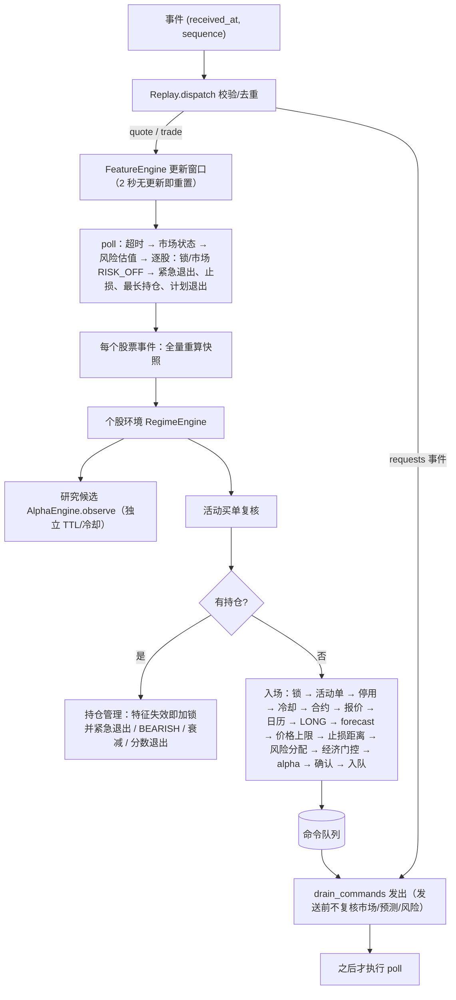
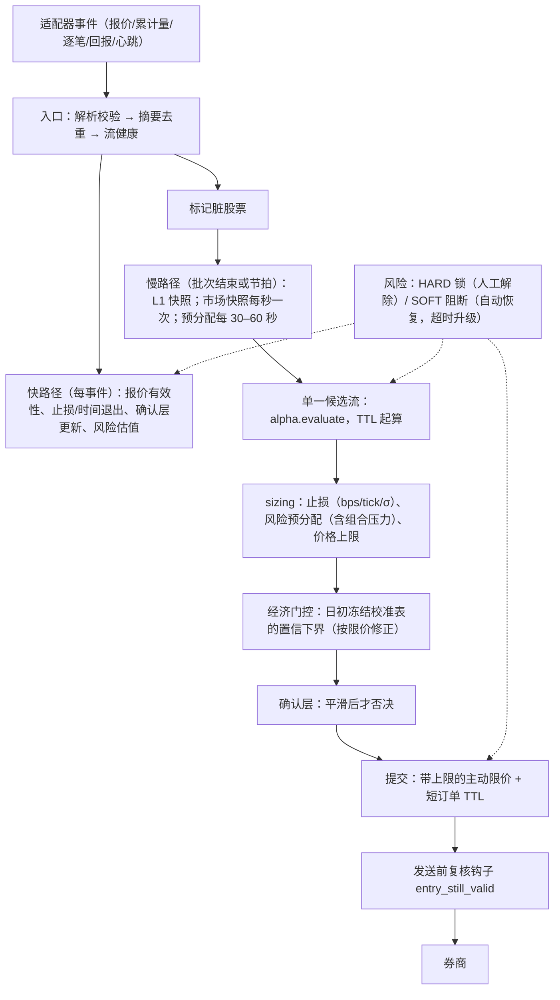

# Claude × Codex 协作文档：IBKR 日本股票多周期策略

第 1 轮评审：2026-10-04（JST）· 维护方：Claude、Codex · 当前状态：第 1 轮修复已由 Claude 实施（应用户要求），待 Codex 复核（见第 11 节）

本文档是两方协作的唯一问题台账。每个问题都有编号、位置、原因、影响、优先级、处置（删除/合并/重构/修复/新增/保留）、修改方案、验收标准、建议负责方和状态。修复时只需更新对应条目的状态，并在文末“变更记录”中追加一行。

---

## 0 协作约定

### 0.1 本轮输入与代码版本

| 项目 | 内容 |
| --- | --- |
| 规格 | `IBKR日本股票多周期协同策略文档.md` v1.2 |
| 代码 | `ibkr_microalpha/`、`tests/`。45 个文件的 SHA-256 与 `audit/2026-10-04/source-manifest.json` 完全一致（Claude 本轮复核）。下文行号均以此版本为准；代码变化后请改用“文件:函数名”引用。 |
| 运行日志 | `runs/demo/`、`runs/replayed/`。两者 6 类产物的哈希相同，是同一条人工轨迹的重复回放，不是两个独立实验。 |
| Codex 证据 | `audit/2026-10-04/`（execution、performance、strategy 子目录及探针）。按用户说明及目录内容推定为 Codex 产出，下文简称“Codex 证据”。 |
| Claude 证据 | `audit/2026-10-04/claude/probes.py`（11 个独立探针，离线、不写生产文件）及其输出 `probe-results.json`。 |
| 测试 | `python -m unittest discover -q`：142 项全部通过（2026-10-04 复跑）。测试全部通过不代表下列缺陷不存在：多数 P0 场景目前没有测试。 |

### 0.2 编号、优先级与流程

- **编号前缀**：FLOW 结构与流程、STR 策略设计、EXE 执行与风控、DATA 数据与特征、PERF 性能、RPT 报告、RPL 回放、CFG 配置与输入、CLN 冗余清理、TST 测试、PROC 协作流程。Codex 的原编号保留在“来源”列。
- **优先级**
  - P0：接入影子运行或实盘前必须处理；或会导致错误下单、程序崩溃、研究结论无效。
  - P1：影响正确性、稳定性或可扩展性的重要问题，下一迭代处理。
  - P2：效率、可维护性和报告质量问题，排期处理。
  - P3：可选清理。
- **状态流转**：待修复 → 进行中（写明负责方）→ 待复核 → 已关闭。进入“已关闭”需满足三项：另一方复核、对应回归测试通过、相关探针结果翻转。
- **改动规则**：一个编号对应一组改动。先提交会失败的回归测试，再提交修复。无行为变化的重构必须保证 `runs/demo/report.json` 逐字节一致。
- **不变量**：第 7.4 节“保留”清单中的机制，任何修改都不得破坏。

---

## 1 总体结论

### 1.1 一句话结论

骨架方向正确，安全默认值严格：四层门控、单事件循环、执行账本、对账和失败关闭均已具备。主要问题有四类：

1. 策略优势没有任何数据验证。经济门控的输入是人工写入的 forecast。
2. 有 2 个会导致错误下单的执行缺陷，增强版存在 1 个必然崩溃的缺陷。
3. 数据健康语义过严，在实盘中会频繁造成“当日锁死”和不必要的紧急平仓。
4. 特征计算方式和历史基准数据模型都无法扩展到多股票全天运行。

**结论**：可以继续离线研发，不能进入影子运行或实盘。

### 1.2 分维度评估

| 维度 | 评价 | 依据（代码 / 日志 / 探针） | 相关问题 |
| --- | --- | --- | --- |
| 结构清晰度 | 较好 | 模块与规格章节一一对应；`poll` 先处理风险和退出，再由 `evaluate` 评估新入场；单事件循环，因果时钟 | FLOW-03 |
| 核心逻辑与流程连贯性 | 一般 | 先做经济和风险检查，再判断 alpha；另有一条研究候选流；入场单排队后，发送前不再复核；增强版路径走不通 | FLOW-01、FLOW-02、EXE-02、DATA-01 |
| 理论依据 | 未验证 | 趋势延续、相对强弱、放量和 VWAP 结构的思路可以研究，但没有样本外证据；120 秒持仓在成本覆盖上先验偏弱 | STR-01、STR-08 |
| 判断条件与参数 | 偏弱 | 90 个数值参数全部人工设定；示例 scaler 使评分饱和（demo S=2.8675，理论上限 3.0）；部分门控被设为等效关闭 | STR-04、STR-05 |
| 风险控制 | 强，但有缺口 | 硬约束、失败关闭、原子预分配、日损失锁均已实现；但成交更正后可超卖、发送前不复核、锁不分级、止损用固定 JPY、压力预算未含跳价（demo 实际亏损超出预算 69.7%） | EXE-01、EXE-02、STR-02、STR-06 |
| 执行效率 | 差 | 单股票 demo 处理 6,786 个事件用时 13.7–14.4 秒（约 490 事件/秒）；股票 trade 事件 p50 为 9.4–10.9 ms、p99 为 17.9–20.4 ms；64% 的 CPU 消耗在历史基准全表扫描上 | PERF-01、PERF-02 |
| 可扩展性 | 差 | 单次快照耗时随股票数增加（1/10/40 只：1.41/1.78/3.75 ms），每秒总成本为 O(N²)；按秒保存的历史基准，单股全天约 371 MiB | PERF-02、DATA-03 |
| 稳定性 | 回放稳定，实盘语义脆弱 | demo 无异常；但持仓股报价静默 2.5 秒即当日锁死并紧急清仓；仅市场快照迟到 3.5 秒也会紧急清仓；回放失败时不留产物 | STR-02、DATA-02、RPL-01 |
| 代码冗余 | 中等 | 两条候选流、两处经济门控、两套报价校验、三层去重，以及只有测试在用的研究函数 | CLN-01～CLN-12 |
| 测试覆盖 | 范围广，但有盲区 | 142 项测试通过；增强版协调器、更正后超卖、请求发送顺序、报价静默都没有测试 | TST-01 |

### 1.3 必须先处理的 P0（6 项）

1. **EXE-01**：买入成交被向下更正后，已发出的卖单仍保留原数量。继续成交会形成空头。
2. **EXE-02**：`requests` 事件先发出排队中的买单，之后才做风险轮询。行情过期或预测失效时，买单仍会发出。
3. **DATA-01**：增强版在第一个研究候选处抛出 `TypeError` 崩溃。即使修复，预分配排序依赖订阅后才有的逐笔特征，永远无法进入 READY。若短期不用增强版，可先在配置校验中显式禁用，并降为 P1。
4. **CFG-01**：`FeatureSnapshot.valid` 不做类型校验。字符串 `"false"` 被当作真值，并能触发开仓。
5. **STR-01**：仓库内没有任何生成 forecast、scaler、阈值的代码。经济门控的输入全部为人工设定，策略优势无法检验。
6. **PROC-01**：仓库不是 git 仓库。两方的修改无法审阅、对比和回滚。此项需用户决定。

### 1.4 现有日志能证明什么、不能证明什么

**能证明**

- 回放可确定性重现：demo 与 replayed 的产物逐字节一致。
- 闭环机制可以运转：
  1. 09:10:10 生成候选，确认用时 2 秒；
  2. 09:10:12 买入 100 股 @961.3；
  3. 09:10:20 跳价触发止损，卖出 @950；
  4. 之后进入 300 秒冷却。

  结束时持仓与活动订单为零，无风险锁。
- 审计记录共 1,490 条，其中 1,484 条为 NO_TRADE（占 99.6%）。按股票计，拒绝原因实际只变化了 7 次（见 RPT-03）。
- 由日志可算出：该笔交易的压力预算为 760 JPY（100×(止损 5 + 滑点 1) + 80 + 80），实际亏损 1,290 JPY，超出 69.7%（见 STR-06）。

**不能证明**

- 收益或优势：只有一条人工路径，forecast 也是人工写入的。
- 实盘延迟与吞吐：日志里没有处理耗时、队列滞后或资源采样字段；模拟成交与请求在同一秒内完成，submit/cancel 的真实耗时未知；所有 quote/trade 都没有 `exchange_at`。
- 实盘稳定性：没有真实的断线、重连、部分成交或撤单竞态。

---

## 2 问题总表

| 编号 | 问题 | 位置 | 优先级 | 处置 | 来源 / 证据 | 建议负责 | 状态 |
| --- | --- | --- | --- | --- | --- | --- | --- |
| EXE-01 | 买入成交向下更正后，已发出的卖单可超卖形成空头 | execution.py:519–582 `_rebuild`；engine.py:352–359 | P0 | 修复 | Codex E1；Claude 探针 oversell | Codex | 已实施·待复核 |
| EXE-02 | `requests` 先发出排队买单，之后才做风险轮询 | replay.py:151–156、170–171；execution.py:614–669 | P0 | 修复 | Codex E2；Claude 读码确认 | Codex | 已实施·待复核 |
| DATA-01 | 增强版：首个研究候选即 TypeError；预分配死锁；TICK VWAP 几乎无法完整 | engine.py:583–584、528–543；features.py:246–250 | P0（增强版） | 修复+重构 | Codex strategy；Claude 探针 enhanced | Claude | 部分实施·待复核 |
| CFG-01 | 快照 `valid` 等布尔字段不校验类型，`"false"` 可开仓 | domain.py:91–102；replay.py:115–122 | P0 | 修复 | Codex snapshot-flags | Codex | 已实施·待复核 |
| STR-01 | 无校准/训练管线，经济门控输入全部人工设定 | 全仓库；demo.py:59–66；examples/research.json | P0（研究） | 新增 | Claude | 共同 | 部分实施·待复核 |
| PROC-01 | 仓库无版本控制 | 仓库根目录 | P0（流程） | 新增 | Claude | 用户决定 | 待用户决定 |
| STR-02 | 风险锁不分级：报价静默 2.5 秒或市场快照迟到 3.5 秒 → 当日锁死或全仓紧急卖出 | risk.py:69–108；engine.py:290–311、391–395、434–436、449–451、588–590 | P1 | 重构 | Claude 探针 gap、market_lag | Claude | 已实施·待复核 |
| DATA-02 | “无变化≠断流”未实现：2 秒无更新即过期，并重置全部窗口 | market.py:282–284；features.py:91、207–208 | P1 | 重构 | Claude 探针 gap | Claude | 已实施·待复核 |
| STR-03 | 入场限价等于当时 ask；ask 上移后变成被动挂单，直至候选到期 | engine.py:708–711；execution.py:680–682 | P1 | 修复 | Claude 探针 touch | Claude | 已实施·待复核 |
| STR-04 | 单次 L1 更新 OBI < −0.1 即否决候选，并冷却 30 秒 | signals.py:541–543；engine.py:704–705 | P1 | 修复 | Claude 探针 veto | Claude | 已实施·待复核 |
| FLOW-01 | 入场门控顺序与规格不一致；研究/可执行两条候选流 | engine.py:557–720；signals.py:307–421 | P1 | 重构+合并 | Claude | Claude | 已实施·待复核 |
| FLOW-02 | 依赖外部逐股 forecast（≤60 秒），且数量必须完全一致 | engine.py:169–175、482–499、659–667；economics.py:108–111 | P1 | 重构 | Claude | Claude 设计 / Codex 实现 | 已实施·待复核 |
| STR-05 | 参数无数据依据：评分饱和、门控等效关闭、90 个自由参数 | examples/research.json；signals.py:88–93 | P1 | 重构 | Claude 计算 | 共同 | 已实施·待复核 |
| STR-06 | 止损、滑点、安全余量用固定 JPY；压力预算未含跳价 | engine.py:38–41、360–361；risk.py:164–176 | P1 | 重构 | Claude（demo 日志） | Claude | 已实施·待复核 |
| STR-08 | 研究顺序：应先证伪成本最低的假设 | 研究计划 | P1 | 新增 | Claude | 共同 | 研究计划（无代码，工具已备） |
| EXE-03 | 退出限价非正时抛出异常，中断整个风险循环 | engine.py:360–368 | P1 | 修复 | Codex E3 | Codex | 已实施·待复核 |
| EXE-04 | 首成交评分与止损取整未写入执行日志 | engine.py:209–235；execution.py:892–966 | P1 | 修复 | Codex E4 | Codex | 已实施·待复核 |
| EXE-05 | 资金“已核实”实际是由配置推算 | engine.py:309–310；risk.py:73–89 | P1（实盘前） | 新增 | Codex R1 | Codex | 已实施·待复核 |
| DATA-03 | 历史基准数据模型（逐秒 × 逐日原始行）无法扩展 | features.py:44–77、344–350、404–418、487–502 | P1 | 重构 | Claude 探针 memory | Claude | 已实施·待复核 |
| PERF-01 | `_rvol_baseline` 每次快照全表扫描 5 次（占 64% CPU） | features.py:404–418、479 | P1 | 重构 | Codex PERF-01 | Codex | 已实施·待复核 |
| PERF-02 | 每个 quote/trade 都全量重算快照；breadth 使总成本为 O(N²) | engine.py:177–199；features.py:420–505 | P1 | 重构 | Claude 探针 scaling | Claude | 已实施·待复核 |
| RPT-01 | 漂移指标使用到期前的报价并冻结 | reporting.py:137–159 | P1 | 修复 | Codex REPORT-01（Claude 引入） | Claude | 已实施·待复核 |
| RPT-02 | 成交更正或撤销时重复累计执行损耗 | reporting.py:124–135、173；engine.py:228–230 | P1 | 修复 | Codex REPORT-02（Claude 引入） | Claude | 已实施·待复核 |
| CFG-02 | 整数和数值配置无类型校验（20.5 天也能通过） | config.py:14–32；features.py:102–115 | P1 | 修复 | Codex CONFIG-01 | Codex | 已实施·待复核 |
| TST-01 | P0/P1 场景无回归测试 | tests/ | P1 | 新增 | Claude | 随各项修复 | 已实施·待复核 |
| EXE-06 | 数据健康事件只触发 poll，不复核活动入场单 | replay.py:89–90；engine.py:386–468 | P2 | 修复 | Codex health-propagation | Codex | 已实施·待复核 |
| EXE-07 | 无组合层面的压力损失预算 | risk.py:142–176 | P2 | 新增 | Codex R2 | Codex | 已实施·待复核 |
| EXE-08 | `max_orders_per_day` 只计入场意图 | risk.py:114–116、135；engine.py:712 | P2 | 重构 | Codex R3 | Codex | 已实施·待复核 |
| DATA-04 | `volatility_bps` 缺锚点，且受报价频率影响 | features.py:451–454 对比 521–528 | P2 | 修复 | Codex；Claude 读码 | Claude | 已实施·待复核 |
| DATA-05 | RVOL/波动基准先截取 D 行再筛选有效行 | features.py:413–414、497–498 | P2 | 修复 | Codex；Claude 探针 rvol | Codex | 已实施·待复核 |
| DATA-06 | `r_600`、`obi` 列为必需特征，但没有任何层使用 | research.json `features.required_features` | P2 | 删除（移出必需列表） | Claude | Claude | 已实施·待复核 |
| DATA-07 | L1 累计成交量路径未接入回放；SAMPLED 成交可被“最后成交量”冒充 | features.py:313–342；replay.py:84 起 `trade` 分支 | P2 | 修复 | Claude | Codex | 已实施·待复核 |
| DATA-08 | 市场层特征双轨：逐股快照计算了 breadth/rv_mkt，但无人使用 | features.py:439–448、482–502；engine.py:162–167、391–395 | P2 | 合并 | Claude | Claude | 已实施·待复核 |
| STR-07 | MARKET_CAUTION 只有一种处置；`exchange_normal` 未接入 | signals.py:227–230、317、371 | P2 | 修复 | Claude | Claude | 已实施·待复核 |
| PERF-03 | `_return` 线性回溯、重复校验报价、Decimal 中间价重复计算 | features.py:380–394；domain.py:86–87 | P2 | 重构 | Codex PERF-03；Claude | Codex | 已实施·待复核 |
| PERF-04 | 每个事件都以 O(orders × executions) 计算费用储备 | engine.py:251–259；execution.py:228–235 | P2 | 重构 | Codex 费用扫描基准 | Codex | 已实施·待复核 |
| PERF-05 | 每次 poll 按股票重复全表扫描 `active_orders()` | execution.py:216–219；engine.py:401–468 | P2 | 重构 | Codex M1；Claude | Codex | 已实施·待复核 |
| PERF-06 | 增强版每次 evaluate 都计算订阅计划；`feature_windows` 重算整份快照 | engine.py:522–555；features.py:511–519 | P2 | 重构 | Claude；Codex | Claude | 已实施·待复核 |
| RPT-03 | NO_TRADE 按回调逐条记录（占审计 99.6%），拒绝计数统计的是回调次数 | engine.py:152–154 | P2 | 重构 | Claude；Codex M1 | Claude | 已实施·待复核 |
| RPT-04 | `IntentLedger` 与 `intent_path_value` 重复实现 | reporting.py:28–99；economics.py:291–346 | P2 | 合并 | Claude | Claude | 已实施·待复核 |
| RPT-05 | 报告缺少规格要求的项目和运行指标 | replay.py:184–203 | P2 | 新增 | Claude；Codex | 共同 | 部分实施·待复核 |
| RPL-01 | 失败事件先占用身份，再次出现时被静默跳过 | replay.py:39–60；cli.py:21–37 | P2 | 修复 | Codex REPLAY-01 | Codex | 已实施·待复核 |
| RPL-02 | 输入、身份、审计和执行日志全量驻留内存 | replay.py:34、58、205–216；features.py:123；engine.py:131 | P2 | 重构 | Codex PERF-02 | Codex | 部分实施·待复核 |
| CFG-03 | 时段常量分散在多个文件中硬编码 | market.py:99–127、164–170；engine.py:460–466；features.py:233–238 | P2 | 重构 | Claude | Claude | 已实施·待复核 |
| CFG-04 | 评分权重硬编码，不在冻结配置中 | signals.py:93 | P2 | 重构 | Claude | Claude | 已实施·待复核 |
| FLOW-03 | `engine.py` 承担的职责过多 | engine.py 全文件 | P2 | 重构 | Claude | Claude | 已实施·待复核 |
| FLOW-04 | 退出状态分散在多处；STOP_LOSS 理由粘性；“普通退出 TTL”命名误导 | engine.py:127–129、333–338、412–433 | P2 | 重构 | Claude | Claude | 已实施·待复核 |
| CLN-01～12 | 冗余代码与可删除逻辑（详见 6.5） | 多处 | P2/P3 | 删除/合并 | Claude；Codex | 见 6.5 | 部分实施·待复核（CLN-09 保留，CLN-12 未实施） |

---

## 3 策略结构与执行流程（问题集一）

### 3.1 整体结构是否清晰、合理

**结论**：整体结构清晰，大体合理。

**做得好的地方**

1. **分层与规格一致**：`market.py` 负责日历、时段和价档；`features.py` 负责因果窗口；`signals.py` 负责环境、主信号、确认和衰减；`economics.py` 负责经济门控；`risk.py` 负责组合风险；`execution.py` 负责订单与账本；`engine.py` 负责协调。
2. **优先级正确**：`poll`（engine.py:386–468）依次处理订单超时、市场状态、风险估值、锁定退出、止损、最长持仓和计划退出，`evaluate` 才评估新入场。退出不需要重新满足入场条件。
3. **失败关闭**：估值未知、未对账、订单状态未知、缺日历、缺合约权限，都会阻止开仓。
4. **因果时间**：所有事件按 `(received_at, sequence)` 推进，回放可重现。

**不合理的地方**

- 入场管线的顺序与规格不一致（FLOW-01）。
- 经济判断依赖仓库外的组件（FLOW-02）。
- 数据健康语义把“无变化”当作“断流”（DATA-02、STR-02）。
- 增强版缺少“L1 + 逐笔”两条特征轨道（DATA-01）。
- 协调器体积过大（FLOW-03）。

### 3.2 核心逻辑与实际执行流程



**与规格（第二章）的差异**

| 规格 | 实际 | 后果 | 问题 |
| --- | --- | --- | --- |
| 环境 → 主信号候选（TTL 起算）→ 确认 → 意图与组合分配 | 环境 → forecast/价格上限/止损/风险分配/经济 → alpha 候选 → 确认 | 漏斗归因错位；另设研究候选流，形成两套阈值 | FLOW-01 |
| 收益映射由研究冻结，随策略版本保存 | 每股每分钟外部推送 forecast | 系统不自洽；在线依赖一旦中断即停止交易 | FLOW-02、STR-01 |
| 风险检查贯穿每次报单 | 入队时检查；发送时只查 TTL 和卖量 | 过期行情下仍可能发出买单 | EXE-02 |
| 数据异常转入风险流程；“无变化不等于断流” | 2 秒无变化即视为过期；任何锁都要人工解除，并触发全仓紧急退出 | 一次静默即可结束当日交易 | STR-02、DATA-02 |
| 逐笔额度由长周期层预分配 | 预分配排序依赖逐笔特征，且调用签名错误 | 增强版不可用 | DATA-01 |

**逻辑上已经明确的部分**（保持不动）：

- 每只股票只保留一个意图，候选使用固定 TTL；
- 首次成交即设定止损并开始计时；
- 止损优先于入场；
- 退出不需要确认，迟到的成交补充退出；
- 日损失锁当日不可解除。

### 3.3 问题详情

#### FLOW-01 入场门控顺序与规格不一致，形成两条候选流（P1，重构 + 合并）

- **位置**：engine.py:557–720 `evaluate`（入场段 627–711），engine.py:572–584；signals.py:307–353 `observe`、364–421 `evaluate`。
- **原因**：可执行的 `Candidate` 在构造时就需要 `quantity` 和 `max_price`。因此代码先依次做 forecast、价格上限、止损、风险分配和经济门控，最后才判断 alpha 是否成立。为了统计“没有经济校准时的 alpha 机会”，又另加了一条 `observe` 流，它有自己的 TTL、冷却和阈值。
- **影响**：
  1. 规格的漏斗“环境 → 候选 → CONFIRM → 意图”实际变成“环境 → 经济/风险 → 候选”，拒绝原因被记录在错误的层级。
  2. 两套阈值可能分叉：`observe` 用快照中的 spread，`evaluate` 用报价中的 spread，且 `observe` 不检查报价年龄。因此 `research_candidates` 与 `candidates` 不可比。
  3. 多只股票同时处于 LONG 时，每个快照都会做一次风险枚举。demo 中 `allocate` 只被调用 5 次，单股票下不显著，股票越多越重。
- **方案**：候选只依赖信号，TTL 从生成时起算。数量和价格上限在候选之后的 sizing 步骤附加，经济门控放在 sizing 之后。研究统计改为“同一候选流在经济门控处的拒绝计数”，删除 `observe` 流（CLN-01）。

```python
def _consider_entry(self, snapshot, quote, regime, at):
    symbol = snapshot.symbol
    if (reason := self._entry_preconditions(symbol, quote, regime, at)):   # 锁/冷却/合约/日历/环境，按此顺序
        return self._reject(at, symbol, reason)
    candidate = self.alpha.evaluate(snapshot, quote, regime, self.market_state, at)  # 不再需要 qty/max_price
    if candidate is None:
        return                                    # 没有信号不是“拒绝”，不记 NO_TRADE
    self._count_candidate(candidate)              # 漏斗：候选（含尚无校准的候选）
    sizing = self._size(candidate, snapshot, quote, at)        # 止损距离、风险预分配、价格上限
    if not sizing.allowed:
        return self._reject(at, symbol, sizing.reason)
    economics = self.economics.evaluate(candidate, sizing, at) # 见 FLOW-02：本地查冻结校准表
    if not economics.allowed:
        return self._reject(at, symbol, economics.reason)      # “研究候选” = 在这里被拒的候选
    result = self.confirmation.evaluate(candidate, snapshot, quote, at,
                                        enhanced_ready=self._ready(symbol, at),
                                        net_advantage_positive=True)
    if result.status is Confirmation.CONFIRM:
        self._submit_entry(candidate, sizing, economics, quote, at)
```

- **验收**：
  - 漏斗各层计数单调不增；
  - 无校准时，候选仍计入“候选”，拒绝原因为 `calibration_unavailable`；
  - 删除 `observe` 后，T17/T25/T28 相关测试通过；
  - demo 报告中的 candidates、intents 和净额不变。

#### FLOW-02 经济门控依赖外部逐股 forecast，且数量必须完全一致（P1，重构）

- **位置**：engine.py:169–175 `set_forecast`；engine.py:659–667（forecast 新鲜度检查、`max_entry_price`）；engine.py:482–499 `_adjust_prediction` / `_economic_gate`；economics.py:108–111（数量必须完全相等）；demo.py:59–66（人工 forecast）。
- **原因**：规格要求在入场时给出“条件平均净收益及其置信下界”。实现把这一步外包给逐股、每分钟推送的 forecast 事件，入场价格上限和参考价也由该事件携带。
- **影响**：
  1. 仓库内没有组件能产生 forecast，策略本身不完整（STR-01）。
  2. 实盘需要一个在线服务至少每 60 秒推送一次；它一旦延迟或中断，系统即以 `forecast_missing_or_stale` 停止交易。
  3. 价格上限按最多 60 秒前的价格计算；`_adjust_prediction` 按 1:1 扣减价格漂移，隐含“预期退出价不随入场价变化”的假设。
  4. 风险层一旦降低数量，就以 `policy, version or quantity mismatch` 拒绝，原因不透明。
- **方案**：用“日初冻结的校准表”替代逐股 forecast。研究管线（STR-01）按“策略 × 持仓期 × 分数桶 × 数量档”输出均值和置信下界（均已含费用和未成交分支）。协调器在候选时刻本地查表，并按当前价格计算价格上限。forecast 事件只保留给研究覆盖使用。

```python
@dataclass(frozen=True)
class CalibrationRow:
    policy_id: str
    version: str              # 研究管线输出版本（含代码哈希与数据范围）
    holding_seconds: int
    quantity: int
    score_low: float
    score_high: float
    sample_days: int
    sample_count: int
    mean_net_amount: Decimal  # JPY/意图，参考价=候选时刻 ask，已含费用与未成交分支
    lower_net_amount: Decimal # 交易日区块自助法的均值置信下界
    max_chase_ticks: int      # 相对候选参考价允许追价的档数


class CalibrationTable:
    def __init__(self, rows, *, known_at):
        self.known_at, self._rows = known_at, {}
        for row in rows:
            key = (row.policy_id, row.version, row.holding_seconds, row.quantity)
            self._rows.setdefault(key, []).append(row)

    def lookup(self, *, policy_id, version, holding_seconds, quantity, score, at):
        if at < self.known_at:
            return None                                   # 决策时尚不可知
        for row in self._rows.get((policy_id, version, holding_seconds, quantity), ()):
            if row.score_low <= score < row.score_high:
                return row
        return None                                       # 该数量档/分数桶无校准 → 明确拒绝原因


def adjust_for_price(row, *, reference_price, limit_price, quantity, commissions):
    """按最坏成交价（限价）修正校准值；参考价来自候选时刻，不再来自外部 60 秒前的价格。"""
    drift = quantity * (limit_price - reference_price)
    fee_change = (commissions.commission(limit_price * quantity)
                  - commissions.commission(reference_price * quantity))
    return (row.mean_net_amount - drift - fee_change, row.lower_net_amount - drift - fee_change)
```

- **验收**：
  - 没有 forecast 事件时，回放仍能产生意图；
  - 校准表 `known_at` 晚于决策时刻时不可用；
  - 风险降量时，拒绝原因为 `calibrated_quantity_unavailable`；
  - T28 的计算结果保持不变。

#### FLOW-03 `engine.py` 承担的职责过多（P2，重构）

- **位置**：engine.py 共 720 行，其中 `poll` 83 行（386–468），`evaluate` 164 行（557–720）。同一个类负责风险估值与费用储备（251–311）、退出（327–371）、报警（373–384）、订阅预分配（522–555），以及漏斗和执行质量统计。
- **影响**：入场、持仓和风控逻辑交织在一起。例如 EXE-02 需要“发送前复用入场门控”，但这些门控散落在 `evaluate` 中，无法单独调用。测试也只能针对整个协调器进行。
- **方案**：分步拆分，每一步都保持 demo 报告逐字节一致。

| 新组件 | 来源 | 职责 |
| --- | --- | --- |
| `RiskValuation` | `_sync_risk`、`_fee_reserves`、`_exit_fee_reserve` | 估值、费用储备、日损失 |
| `PositionManager` | poll 的逐股段、`_request_exit`、`_residual_alarm`、冷却 | 持仓与退出 |
| `EntryPipeline` | FLOW-01 管线 | 入场；同时提供 `still_valid(order, at)` 给 EXE-02 |
| `SubscriptionCoordinator` | `_enhanced_ready` | 增强版预分配（DATA-01/PERF-06） |
| `StrategyEngine` | 剩余部分 | 事件路由与优先级 |

#### FLOW-04 退出状态分散、STOP_LOSS 理由粘性、“普通退出 TTL”命名误导（P2，重构）

- **位置**：engine.py:127–129（`exit_reasons`、`exit_started`、`exit_emergency` 三个字典）、333–338、412–433（flat 时需要逐个 pop 6 处状态）。
- **影响**：
  - 状态清理容易遗漏。
  - 一旦为 `STOP_LOSS`，`exit_reasons` 就不再更新，后续的真实原因（如 PLANNED_EXIT）不可见。按止损计算冷却是有意设计，但审计信息因此丢失。
  - `ordinary_exit_ttl_seconds` 名义上是“被动退出窗口”，实际上普通退出从一开始就是 `bid − slippage` 的可成交限价（engine.py:360–365）。这个参数只影响 emergency 标记和不可成交卖单的撤单。README 已声明“普通退出用主动限价基线”，但参数名会让人误读。
- **方案**：合并为单一状态对象，flat 时整体删除；参数改名为 `exit_escalation_seconds`。

```python
@dataclass
class ExitState:
    started_at: datetime
    reasons: list[str]
    emergency: bool = False

    @property
    def cooldown_kind(self) -> str:      # 冷却仍按“曾触发止损”计算，但保留全部原因用于审计
        return "STOP_LOSS" if "STOP_LOSS" in self.reasons else "normal"

self.exits: dict[str, ExitState] = {}    # 取代 exit_reasons / exit_started / exit_emergency
```

---

## 4 策略设计的科学性（问题集二：设计部分）

### 4.1 理论依据

- **思路本身可以研究**：日内相对强弱、放量和 VWAP 结构的趋势延续，加上“长周期过滤、短周期确认”，在结构上避免了四个周期各自交易、互相冲突。
- **规格第一章的四个关键假设全部未经验证**：方向过滤有增量、主信号有可交易优势、确认能改善结果、执行优化能改善净结果。
- **成本**：规格第九章的说明性 k 值（成本/σ）在 2 分钟持仓时为 1.56–2.01，需要相当高的条件均值才能覆盖成本。另外，30–120 秒的中间价收益在高流动性股票上常受买卖价反弹和短期反转影响。示例配置用的恰恰是成本最不利的 `holding_seconds: 120`。
- **确认层**：确认依赖 L1 最优价数量的不平衡（OBI），其信息时效通常是秒级。“持续 2 秒后再付价差入场”存在时间错配，其增量必须由 M2 对比 M1 的实验证明。
- **结论**：理论上值得研究，但没有任何证据表明可以交易。研究顺序见 STR-08。

### 4.2 判断条件、参数设置与风险控制

- **判断条件**：结构合理。三组阈值（进入、保持、偏空）带滞后，并要求持续确认；候选使用固定 TTL；衰减退出用分数下降幅度，避免除法。问题在于：否决与通过不对称（STR-04）、评分饱和（STR-05）、CAUTION 只有一种处置（STR-07）。
- **参数**：全部人工设定，暂时谈不上过拟合，但也没有任何依据。一旦开始调参，就面临多重检验风险（STR-05）。
- **主观判断**：forecast、scaler、阈值、止损和滑点全部是主观设定（STR-01、STR-05、STR-06）。
- **风险控制**：硬约束设计优秀。缺口见 EXE-01、EXE-02、EXE-05、EXE-07、STR-02、STR-06。

### 4.3 问题详情

#### STR-01 没有校准和训练管线，策略优势无法检验（P0-研究，新增）

- **位置**：仓库内没有标签生成、训练/验证切分、分桶校准或置信下界计算的代码。`FrozenRobustScaler.fit_training`（signals.py:82–86）没有被任何流程调用。`examples/research.json` 中的 scaler 和阈值均为人工值。demo.py:59–66 中的 forecast 直接写入 `sample_count 100, mean 1000, lower 800, calibrated True`。
- **影响**：
  - 经济门控是唯一的“是否值得交易”判断，而它的输入完全由人工给定。
  - 任何回放结果都只能证明管道在运转，不能证明优势。
  - 规格第十五章要求的 B0/M0–M3/H 对照、样本外置信下界和逐层漏斗对照，目前都无法执行。
- **方案**（按规格第十五章实施）：
  1. **数据采集**：IBKR L1 报价、累计成交量、基准，记录逐事件接收时间，写入原始 JSONL（与回放格式相同）。
  2. **特征**：用现有 `FeatureEngine` 因果回放生成特征和分数序列。研究与上线使用同一份代码，避免两边不一致。
  3. **标签**：对每个候选时点、每个持仓版本（120/300/600/1200 秒），按与协调器完全相同的退出政策模拟每个意图的净额（JPY/意图，含未成交分支）。
  4. **切分**：按交易日滚动，训练 40 日 / 验证 10 日 / 测试 10 日，最后 20 日保留；训练标签不得伸入验证期（隔离期 ≥ 最长持仓）。
  5. **校准**：按交易日区块自助法计算均值置信下界，输出冻结的校准表（FLOW-02）、scaler 和阈值，附数据范围与代码哈希。
  6. **顺序**：先跑 B0 和 M0（STR-08），再决定是否投入确认层和增强版。

```python
# research/labels.py（新增）——与协调器相同的固定主动限价政策；只使用决策之后的报价
def label_intent(quotes, i0, qty, policy, fees, deadline):
    """返回 JPY 净额；未成交返回 0（意图保留在样本中）；数据不足以退出返回 None（不得丢弃）。"""
    q0 = quotes[i0]
    cap = policy.entry_cap(q0)                         # 例如 ask + 1 tick，与 STR-03 一致
    i = i0 + 1
    while i < len(quotes) and (quotes[i].at - q0.at).total_seconds() <= policy.entry_order_ttl_seconds:
        if quotes[i].ask <= cap and quotes[i].ask_size >= qty:   # 规模不足按未成交处理（保守）
            break
        i += 1
    else:
        return Decimal(0)
    if i >= len(quotes):
        return Decimal(0)
    entry = quotes[i]
    buy = entry.ask * qty
    stop = entry.ask * (1 - policy.stop_bps / Decimal(10000))
    end = min(entry.at + timedelta(seconds=policy.holding_seconds), deadline)
    for q in quotes[i + 1:]:
        if q.bid <= stop or q.at >= end:               # 离散报价自然包含跳价
            sell = q.bid * qty
            return sell - buy - fees.commission(buy) - fees.commission(sell)
    return None


# research/calibrate.py（新增）——按交易日重抽样，不把高相关的秒级样本当独立样本
def day_block_lower_bound(net_by_day, alpha=0.05, draws=2000, seed=7):
    rng, days = random.Random(seed), sorted(net_by_day)
    def mean_of(sample):
        values = [v for d in sample for v in net_by_day[d]]
        return sum(values) / len(values)
    boots = sorted(mean_of([rng.choice(days) for _ in days]) for _ in range(draws))
    return mean_of(days), boots[int(alpha * draws)]
```

- **验收**：
  - 固定随机种子时，同一输入两次运行产出完全相同的校准表；
  - 训练标签期与测试期无重叠；
  - 回放中，早于校准表 `known_at` 的时刻不可用；
  - 报告列出全部已尝试的参数组合。

#### STR-02 风险锁不分级：瞬时数据问题导致当日粘性锁和全仓紧急平仓（P1，重构）

- **位置**：
  - risk.py:69–71 `lock`、91–96 `observe_daily_pnl`、98–108 `manual_unlock`（只能人工一次清除全部原因）；
  - engine.py:290–292、308–311（任一持仓报价暂时无效 → `unvalued_daily_pnl` 锁）；
  - engine.py:449–451、588–590、595–597、606–607、613–615（数据或特征失效 → 加锁）；
  - engine.py:391–395（市场快照超过 2 秒 → MARKET_RISK_OFF）；
  - engine.py:434–436（任一锁或 MARKET_RISK_OFF → 所有股票紧急退出）。
- **证据**：
  - Claude 探针 `gap`：demo 持仓 100 股后，该股报价暂停 2.5 秒（恢复后价格不变），立即产生 `position_feature_invalid` 和 `unvalued_daily_pnl` 两个锁，并以紧急卖单全仓退出。30 秒后数据早已恢复，锁仍在，新开仓需要人工解锁。
  - Claude 探针 `market_lag`：股票报价新鲜，只有市场快照迟到 3.5 秒，同样以 2999 的紧急卖单清仓 100 股。
- **原因**：所有锁共用一个集合。严重事件（日损失、KILL、账本不一致）与瞬时事件（估值暂缺、特征暖机、行情迟到）被同等处理。
- **影响**：实盘中 L1 报价 2 秒无变化或行情源短暂迟到都可能很常见（DATA-02）。一次静默就可能结束当日交易，并在不利价格紧急平仓。“风险优先”变成了“风险过度反应”，还会额外制造滑点。
- **方案**：改为两级机制。
  - **HARD 锁**：日损失、KILL_SWITCH、账本或对账不一致、残余风险报警、退出价格规则失效。只能人工解除，并触发风险退出。
  - **SOFT 阻断**：估值暂缺、特征失效、行情暂时过期。只阻止新开仓，条件恢复后自动解除。持续超过冻结阈值 `max_soft_block_seconds` 后升级为 HARD。
  - 持仓的止损、最长持仓和计划退出只依赖报价有效性，不依赖 alpha 特征。

```python
class PortfolioRisk:
    def __init__(self, config):
        ...
        self.lock_reasons: set[str] = set()           # HARD：人工解除，触发风险退出
        self.soft_blocks: dict[str, datetime] = {}    # SOFT：只禁止开仓，条件恢复自动解除

    def block(self, reason, at):
        self.soft_blocks.setdefault(reason, at)

    def unblock(self, reason):
        self.soft_blocks.pop(reason, None)

    @property
    def entries_blocked(self):
        return bool(self.lock_reasons or self.soft_blocks)

    def escalate(self, at, max_seconds):
        for reason, since in list(self.soft_blocks.items()):
            if (at - since).total_seconds() > max_seconds:
                self.lock(f"escalated:{reason}")


# engine.poll：行情迟到只阻止开仓；只有 HARD 锁或真实市场异常才全仓退出
stale = (self.market_snapshot is None or
         (at - self.market_snapshot.at).total_seconds() > self.config.market_max_age_seconds)
if stale:
    self.risk.block("market_data_stale", at)
    self.market_state = MarketRegime.MARKET_RISK_OFF
else:
    self.risk.unblock("market_data_stale")
    self.market_state = self.market_regime_engine.evaluate(self.market_snapshot, at)
self.risk.escalate(at, self.config.max_soft_block_seconds)
exit_all = self.risk.locked or (self.market_state == MarketRegime.MARKET_RISK_OFF and not stale)

# engine.evaluate（持仓分支）：特征失效 → SOFT，清零衰减计数；止损/时间退出照常由 poll 执行
if not snapshot.valid or snapshot.version != self.config.score_version:
    self.risk.block(f"feature_invalid:{symbol}", at)
    self.decay_trackers.pop(symbol, None)
    self._low_score_since.pop(symbol, None)
    return
self.risk.unblock(f"feature_invalid:{symbol}")
```

- **验收**：
  - 探针 `gap` 中静默 2.5 秒后：无 HARD 锁、无紧急卖单，数据恢复后可以继续交易；
  - 探针 `market_lag` 中：无卖单，只阻止开仓；
  - 静默超过 `max_soft_block_seconds`：升级为 HARD 并触发风险退出；
  - T10（日损失和 KILL 不可被信号解除）保持不变。

#### STR-03 入场限价等于当时 ask，上移后变为被动挂单直至候选到期（P1，修复）

- **位置**：engine.py:708–711（`limit = quote.ask`，`candidate_expires_at=candidate.expires_at`）；execution.py:680–682（只在候选到期时撤销买单）；engine.py:501–520（活动买单复核时不检查是否仍可成交）。
- **证据**：Claude 探针 `touch`。买单以 3001 发出后，报价变为 3001/3002，该买单在第 13–20 秒一直保持 WORKING，成为挂在买一的被动单，最长可持续到候选到期（第 30 秒）。
- **影响**：规格中的 M2 基线是“有价格上限的主动限价”（第十一章），实际却是“主动 + 最长约 18 秒被动”的混合政策，而且没有任何校准为它建模。被动等待期间，往往是价格回落时才被成交，存在逆向选择。执行质量统计也与政策标签对不上。
- **方案**：
  - 限价改为 `min(候选价格上限, ask + entry_limit_ticks)`；
  - 新增冻结参数 `entry_order_ttl_seconds`（例如 1–2 秒），到期撤销剩余量，本候选不再重挂（重挂需另行校准，见规格 T21）；
  - 经济门控按限价而非 ask 计算最坏成本。

```python
limit = min(candidate.max_price,
            self.ticks.move_ticks(quote.ask, self.config.entry_limit_ticks, at, instrument.tick_category))
order_expiry = min(candidate.expires_at, at + timedelta(seconds=self.config.entry_order_ttl_seconds))
mean, lower = adjust_for_price(row, reference_price=candidate.reference_ask, limit_price=limit,
                               quantity=quantity, commissions=self.commissions)   # 按最坏价格核算
order = self.book.submit(candidate.candidate_id, symbol, Side.BUY, quantity, limit, at,
                         candidate_expires_at=order_expiry)   # 其余元数据参数同现状；到期由 check_timeouts 撤余量
```

- **验收**：
  - 报价上移 1 档仍在缓冲内时可以成交；
  - 超出缓冲时，TTL 到期撤单并记录 `ENTRY_ORDER_EXPIRED`；
  - 回放中不存在工作时长超过 `entry_order_ttl_seconds` 的买单。

#### STR-04 确认层：单次 L1 更新即否决候选并冷却 30 秒（P1，修复）

- **位置**：signals.py:541–543（原始 OBI < −min_obi 时立即 VETO）；engine.py:704–705（VETO → `_invalidate` → alpha 冷却 `cooldown_seconds=30`）。
- **证据**：Claude 探针 `veto`。候选生成后，一次 OBI = −0.13 的 L1 更新（买 100 股 / 卖 130 股）使候选被否决，此后 40 秒内没有任何新的意图。
- **原因**：确认“通过”需要持续性（2 秒、≥3 次不同的更新、平滑后比例 ≥0.7），而“否决”只需要一个原始快照。
- **影响**：L1 最优价上的数量噪声很大，单个快照出现轻微负不平衡非常常见。确认层可能主要在做“随机否决”，冷却又把它放大为错过整段机会。这也与规格“避免单个快照触发”的原则不对称。
- **方案**：否决改用平滑后的 OBI，且至少积累 `smoothing_updates` 个不同更新后才判断。单次负值只返回 WAIT，并清零持续计时。阈值由训练数据决定。

```python
obi = (quote.bid_size - quote.ask_size) / (quote.bid_size + quote.ask_size)
history = [item[3] for item in updates][-(c.smoothing_updates - 1):] if c.smoothing_updates > 1 else []
smoothed = (sum(history) + obi) / (len(history) + 1)
if len(history) + 1 >= c.smoothing_updates and smoothed < -c.min_obi:
    return veto("smoothed quote direction reversal")       # 持续反转才否决
updates.append((quote.at, smoothed, quote.bid, obi))
if obi < -c.min_obi:
    self._positive_since.pop(key, None)                     # 单次负值：只重置持续计时
    return ConfirmationResult(Confirmation.WAIT, "transient negative imbalance", len(updates))
```

- **验收**：单次 −0.13 的更新 → WAIT；连续 3 次平滑值 < −0.1 → VETO；现有确认测试保持通过。

#### STR-05 参数缺乏数据依据：评分饱和、门控等效关闭、自由参数过多（P1，重构）

- **位置**：examples/research.json（scalers、regime/alpha 阈值、`max_volatility_bps: 1000`、`max_vwap_deviation_bps: 1000`）；signals.py:88–90（截断到 ±3）、93（权重硬编码）。
- **证据**：
  1. **评分饱和**：示例 scaler 的 MAD=1 bps，使 |rs_60|、|rs_30|、|vwap_slope_60| 只要 ≥4.45 bps（3×1.4826×MAD）就被截断为 ±3。demo 首成交时的分数 2.8675 中，三项处于截断上限，另一项为 0.2×2.3376（rvol=2.0）；理论最大值为 3.0。评分实际退化为“方向计数”，`entry_score: 0.5` 和 `exit_score: 0` 失去排序意义。
  2. **门控等效关闭**：1000 bps 的波动上限和追高上限，实际上不会拦截任何情况。
  3. **自由参数过多**：示例配置共有 90 个数值参数（engine 18、regime 14、alpha 13、confirmation 13、scalers 12、risk 10、market_regime 6、quality 2、features 2），全部为人工设定。
- **影响**：
  - 目前没有过拟合，因为根本没有拟合，但也没有任何参数有依据。
  - 一旦在回放中调参，90 个参数 × 4 个持仓版本 × M0–M3 × L1/增强版，将构成严重的多重检验风险。
  - 校验器无法区分演示配置和研究配置。
- **方案**：
  1. scaler 由训练集拟合（`fit_training`），并报告每个特征在训练期的截断率。截断率 > 2% 即视为尺度错误。
  2. 配置增加 `profile: demo | research | shadow`。非 demo 配置要求每组参数附带来源（训练窗口、代码哈希、生成时间），并拒绝“等效无穷”的门控值（上限由研究报告给出）。
  3. 收敛自由度：能由规则推导的参数（滑点、止损、价差上限可按 tick 或 σ 推导）不再作为自由参数。研究期只开放 ≤10 个自由参数，记录全部试验，并只用最后 20 日做一次性检验。

```python
def clip_rate(samples, scaler):
    z = [(x - scaler.median) / max(1.4826 * scaler.mad, scaler.epsilon) for x in samples]
    return sum(abs(v) >= 3 for v in z) / len(z)

# config.build_engine（profile != "demo" 时）
for name in document["scalers"]:
    if name not in document.get("provenance", {}).get("scalers", {}):
        raise ValueError(f"scaler {name} lacks training provenance")
```

- **验收**：
  - research profile 下，缺少来源的参数无法通过 `validate-config`；
  - 拟合报告包含每个特征的截断率；
  - demo profile 保持可运行。

#### STR-06 止损、滑点和余量用固定 JPY，与价格无关；压力预算未含跳价（P1，重构）

- **位置**：EngineConfig 中的 `stop_distance`、`exit_slippage`、`net_safety_margin`（engine.py:38–41，示例值为 5/1/100 JPY）；engine.py:360–361；risk.py:164–176（stress = q × (止损 + 滑点) + 费用）。
- **证据**：
  - 同样 5 JPY 的止损：股价 961 JPY 时为 52 bps，3,001 JPY 时为 16.7 bps，9,000 JPY 时为 5.6 bps。
  - 1 JPY 的退出滑点：在 ≤1,000 JPY 的 TOPIX500 价档中等于 10 个 tick，在 3,001 JPY 时等于 1 个 tick。
  - demo 日志：压力预算 760 JPY，实际亏损 1,290 JPY（跳价 961.3 → 950），超出预算 69.7%。
- **影响**：同一份配置在不同价位的股票上，风险含义相差一个数量级。风险预算低估了跳价，日损失锁成了唯一兜底。
- **方案**：
  - 止损按 `max(最小 tick 数, stop_bps, k×σ)` 计算（`stop_volatility_multiple` 已部分支持）；
  - 用 `exit_slippage_ticks` 取代 JPY 滑点，这同时从根本上消除 EXE-03 的非正价格路径；
  - 安全余量按目标名义金额的 bps 计算；
  - 压力损失加入“跳价储备”，取值为研究管线输出的该股 1–5 秒不利跳动的高分位数。

```python
tick = self.ticks.tick_size(price, at, category)
stop_jpy = max(tick * self.config.min_stop_ticks,
               self.config.stop_bps / BPS * price,
               self.config.stop_volatility_multiple * Decimal(str(vol_bps)) / BPS * price)
gap_jpy = self.calibration.gap_reserve_bps(symbol) / BPS * price      # 研究管线输出
slip_jpy = tick * self.config.exit_slippage_ticks
stress = quantity * (stop_jpy + gap_jpy + slip_jpy) + entry_fee + exit_fee
```

- **验收**：
  - 同一配置下，不同价档股票的止损 bps 一致；
  - demo 的压力预算 ≥ 实际跳价亏损，或明确记录 `STRESS_BUDGET_EXCEEDED`。

#### STR-07 MARKET_CAUTION 只有一种处置；交易所状态未接入（P2，修复）

- **位置**：signals.py:317、371（CAUTION 即禁止候选）；signals.py:227–230（`exchange_normal` 参数从未被传入）；engine.py:391–395。
- **影响**：
  - 规格第六章要求在 CAUTION 下二选一做实验：“不产生新候选”或“提高入场门槛”。目前只实现了前者，且不能配置。
  - 交易所状态异常无法直接触发 MARKET_RISK_OFF。
- **方案**：
  - 新增冻结参数 `caution_policy: block | raise_threshold`，以及 `caution_entry_score`；
  - 把适配器提供的交易所状态（或日历中的特别状态）作为 `exchange_normal` 传入。
- **验收**：两种 policy 各有对应测试；`exchange_normal=False` 时进入 MARKET_RISK_OFF。

#### STR-08 研究顺序：先证伪成本最低的假设（P1，研究计划，不涉及代码）

在投入确认层和增强版之前，先用采集数据完成以下三步：

1. B0：分钟级基线；
2. M0：主信号在 H=600/1200 秒下的样本外条件均值；
3. 按分数分桶后，检查最高桶的毛收益是否大于往返成本。

如果第 3 步不成立，就停止投入微观层，把资源转回分钟级版本（与规格第十八章一致）。该顺序可以把最大的不确定性放在最前面验证。

---

## 5 执行效率与整体性能（问题集二：效率与性能部分）

### 5.1 实测数据（同一台机器，Windows 11，CPython 3.14.0）

| 测量 | Codex | Claude | 说明 |
| --- | --- | --- | --- |
| demo 回放墙钟时间（6,786 个事件） | 13.9–14.4 秒（473–487 事件/秒） | 13.7 秒（495 事件/秒） | 单股票 + 基准；不含 save |
| 股票 trade 事件耗时 | p99 12.8–13.8 ms | p50 9.4 ms，p99 17.9 ms（带计数器的另一次运行：10.9/20.4 ms） | 回调内包含全量快照计算 |
| quote 事件耗时（股票 + 基准） | — | p50 0.39 ms，p99 16.2 ms | 基准报价很快；股票报价含全量快照，构成长尾 |
| `_rvol_baseline` | 7,060 次，累计 13.27 秒（占 64.1%） | 7,060 次（计数一致） | 每次快照对 5 个窗口全表扫描 3,020 行 |
| `datetime.date()` 调用 | 2,145 万次 | — | 在基准扫描内反复取日期 |
| 基准索引探针 | 5.03 秒（提速 2.86×） | — | 只改善 CPU，不解决数据量（DATA-03） |
| 快照耗时 vs 股票数 | — | 1/10/40 只：1.41/1.78/3.75 ms | 来自 breadth 循环（未加载基准行时） |
| 内存驻留 | 1 万/5 万/10 万个事件：3.6/18.8/37.6 MB | 每条基准行 216 B | 输入与身份全量驻留 |
| 热点调用次数 | — | poll 6,788；`_sync_risk` 6,793；`entry_gate` 2,782；`allocate` 5 | demo 中 `allocate` 极少，FLOW-01 的成本在多股票时才显现 |

### 5.2 容量估算与目标

**估算**（假设每只股票每秒约 4 次 L1 更新加若干成交）：

- 当前每个股票事件约 10 ms，即每只股票每秒约 50–80 ms CPU。单核大约 12–20 只股票就会饱和，这还没有计入 breadth 的 O(N²) 增长和全天历史基准。
- 只修 PERF-01 时，单事件约 3–4 ms（按 2.86× 推算），大约可支撑 30–50 只。
- **饱和的后果**：事件排队，决策使用过期数据，候选 TTL（20 秒）和 2 秒报价年龄门槛被耗尽。在实盘中，性能问题会直接转化为正确性问题。

**建议目标（待双方确认）**：

- demo 回放 ≤ 2 秒；
- 单次快照 ≤ 0.3 ms，且与股票数无关；
- 40 只股票 × 4 Hz 的负载占用 ≤ 单核 10%；
- 历史基准内存 ≤ 1 MiB/股/日；
- 每个事件的处理耗时和队列滞后写入指标流（RPT-05）。

### 5.3 频繁调用接口与不必要的等待

**券商请求**：`TokenBucket` 限速 50 次/秒并为风险请求预留 5 个；撤单和查询都有去重；未发现频繁调用。增强版每次 evaluate 都计算订阅计划（PERF-06），接入实盘后可能造成订阅抖动（受 120 秒最短驻留和 15 秒守卫限制）。

**不必要的等待**：

| 等待 | 原因 | 问题 |
| --- | --- | --- |
| 任何窗口重置后需等 600 秒（而不是 300 秒）才能恢复 | `r_600` 是必需特征，但没有任何层使用 | DATA-06 |
| 2 秒无报价变化即重置窗口并重新暖机 | “无变化”被当作“断流” | DATA-02 |
| 单次否决后冷却 30 秒 | 确认层否决不对称 | STR-04 |
| “普通退出 TTL” | 并非真实等待，只是命名误导 | FLOW-04 |

### 5.4 问题详情

#### PERF-01 `_rvol_baseline` 每次快照全表扫描 5 次（P1，重构）

- **位置**：features.py:404–418；479 行对 5/10/30/60/120 五个窗口逐一调用（即使 `required_features` 只用到 `rvol_30`）。
- **原因**：每次调用都对全部基准行做过滤，并在循环条件中反复执行 `local.date()`。
- **影响**：占回放 CPU 的 64%，并随股票数、历史天数和时间槽数线性放大。
- **方案**：Codex 已给出 `(symbol, source, window_seconds, end_second)` 索引方案（`audit/2026-10-04/performance/findings.md` PERF-01），只计算必需窗口的 RVOL，并缓存 `local.date()`。**但更根本的修复见 DATA-03**：先改数据模型，索引自然就变成 O(1)。若两项一起做，以 DATA-03 为准。

```python
# 只计算被启用的窗口，避免 4 次无效扫描
self._rvol_windows = tuple(int(n.split("_")[1]) for n in self.config.required_features if n.startswith("rvol_"))
...
if window in self._rvol_windows and (denominator := self._rvol_baseline(symbol, at, window)) is not None:
    values[f"rvol_{window}"] = all_volume / denominator
```

- **验收**：原轨迹的 report 完全一致；裸计时（不开 profiler）对比提速 ≥ 2.5×。

#### PERF-02 每个 quote/trade 都全量重算快照；breadth 使总成本为 O(N²)（P1，重构）

- **位置**：engine.py:177–199（每个股票 quote 和 trade 都调用 `features.snapshot` + `evaluate`）；features.py:482–486（每次快照遍历全部股票计算 breadth）、487–502（每次快照扫描市场波动基准）。
- **证据**：Claude 探针 `scaling`。单次快照耗时在 1/10/40 只股票时分别为 1.41/1.78/3.75 ms；40 只股票、每只 4 Hz 时，仅快照计算就需要约 0.60 CPU 秒/秒。同一秒内的 quote 和 trade 各计算一次，demo 中快照次数因此翻倍（1,502 次）。
- **原因**：规格的计算频率是“环境每 5 秒、主信号每 1 秒、确认按有效事件”，实现却在每个事件上全量计算。市场层特征也在每只股票的快照里重复计算（DATA-08）。
- **方案**：
  1. 市场层特征移出逐股快照，每次基准更新（或每秒）只算一次（DATA-08）。
  2. 分出快、慢两条路径：报价有效性、止损和确认更新每个事件执行；完整特征快照按“同一接收时刻批次结束”或固定节拍执行。缓存键必须包含最新 quote/trade 的修订（Codex 提醒：同一时刻的 quote 与 trade 会改变特征），因此在回放中，于接收时刻推进时统一 flush。

```python
# replay.dispatch：接收时刻推进时，先处理上一时刻的“脏”股票（同一时刻的 quote+trade 只算一次）
if self.last_key is not None and key[0] > self.last_key[0]:
    self.engine.flush(self.last_key[0])

# engine
def on_quote(self, quote):
    ...                                   # 校验、更新 self.quotes、poll（风险每事件执行）
    if quote.symbol in self.instruments:
        self._dirty.add(quote.symbol)     # 完整快照延后到批次结束

def flush(self, at):
    for symbol in sorted(self._dirty):
        self.evaluate(self.features.snapshot(symbol, at), at)
    self._dirty.clear()
```

- **验收**：
  - demo 中快照次数从 1,502 次降到 ≤ 751 次，report 一致（若确认层的不同更新计数受影响，需要解释）；
  - 40 只股票时单次快照 ≤ 0.3 ms；
  - 回放结束时，最后一批会被 flush。

#### PERF-03 `_return` 线性回溯、重复校验报价、Decimal 中间价重复计算（P2，重构）

- **位置**：
  - features.py:387：从队尾线性回溯；在 4 Hz 下，600 秒窗口需扫描约 2,400 项，每次快照有 7 个窗口 × 2（股票 + 基准）；
  - features.py:384、392：每个窗口都重新校验当前报价；
  - features.py:390–391：每次调用都 `replace(QuoteQuality)`，profile 中共 19,720 次；
  - domain.py:86–87：`Quote.mid` 每次访问都做 Decimal 加除，profile 中共 74.8 万次。
- **方案**：
  - 历史报价改用二分查找；
  - 每次快照只校验一次当前报价；
  - 在 `__init__` 中预先构造好 historical quality；
  - 特征计算使用入库时缓存的 float 中间价（订单金额仍用 Decimal）。

```python
from bisect import bisect_right

# _Series 增加 quote_ts（float 秒，与 quotes 同序）与 head（修剪起点，定期压缩）
def _at_or_before(state, cutoff):
    i = bisect_right(state.quote_ts, cutoff.timestamp(), state.head) - 1
    return state.quotes[i] if i >= state.head else None

# FeatureEngine.__init__
self._historical_quality = replace(self.config.quality,
                                   max_age_seconds=self.config.historical_quote_max_age_seconds)
```

#### PERF-04 每个事件都以 O(orders × executions) 计算费用储备（P2，重构）

- **位置**：engine.py:251–259 `_fee_reserves` 对每个已成交订单调用 `order_fees`；execution.py:228–235 `order_fees` 每次都扫描全部当前执行。
- **证据**：Codex `fee_scan_benchmark.json` 只统计 `_fee_reserves` 的耗时：200 个订单 / 200 笔成交时为 2.5 ms，2000/2000 时为 230 ms。该计算在每个事件上都会执行。
- **方案**（比 Codex 原方案更简单）：`_rebuild` 本来就会遍历全部成交，可以顺带生成按订单汇总的费用表，`order_fees` 改为 O(1) 查询。

```python
# execution.py _rebuild 内
fees_by_order: dict[int, Decimal] = {}
for fill in fills:
    fee = self._effective_commission(fill)
    fees_by_order[fill.order_id] = fees_by_order.get(fill.order_id, ZERO) + fee
    ...
self._order_fees = fees_by_order

def order_fees(self, order_id: int) -> Decimal:
    if order_id not in self.orders:
        raise KeyError(order_id)
    return self._order_fees.get(order_id, ZERO)
```

- **验收**：现有费用相关测试（更正、迟到费用、bust 保留费用）全部通过；2000/2000 场景下 `_fee_reserves` < 1 ms。

#### PERF-05 每次 poll 按股票重复全表扫描 `active_orders()`（P2，重构）

- **位置**：execution.py:216–219（每次调用扫描全部订单）；engine.py:403、331、345、352 等处在一次 poll 内对每只股票多次调用；`_sync_risk` 和 `check_timeouts` 也会再扫一遍。
- **影响**：每个事件的耗时为 O(股票数 × 当日全部订单)，并随交易日推进而增长。
- **方案**：每次 poll 开始时只扫描一遍，建立 `active_by_symbol`；需要时再给账本增加活动订单 ID 集合，在状态变化时维护。

```python
active_by_symbol = defaultdict(list)
for order in self.book.orders.values():   # 每次 poll 只扫一遍
    if order.active:
        active_by_symbol[order.symbol].append(order)
for symbol in self.instruments:
    active = active_by_symbol.get(symbol, [])
    ...
```

#### PERF-06 增强版每次 evaluate 都计算订阅计划；`feature_windows` 重算整份快照（P2，重构）

- **位置**：
  - engine.py:528–547：每次 evaluate 都对全部快照重新排序，并调用 `scheduler.plan`；规格要求每 30–60 秒一次；
  - engine.py:552 → features.py:511–519：`feature_windows` 为了列出窗口名称，又计算了一整份快照。
- **方案**：
  - 新增冻结参数 `plan_interval_seconds`；
  - `feature_windows` 改为从已有快照中提取：

```python
def feature_windows(snapshot):           # 使用已有快照，不再重算
    return {name: float(name.rsplit("_", 1)[-1]) for name in snapshot.values
            if name.rsplit("_", 1)[-1].isdigit()}
```

---

## 6 代码审查（问题集三）

### 6.1 执行与风控

#### EXE-01 买入成交向下更正后，已发出的卖单可超卖形成空头（P0，修复）

- **位置**：execution.py:519–582 `_rebuild`（重建后只检查超额成交，不检查活动卖单的剩余量）；engine.py:352–359（可卖量为 0 时，只有在“退出 TTL 已到”且“卖单限价高于 Bid”时才撤单）；发送前的检查（execution.py:633–648）只保护尚未发出的卖单。
- **证据**：Codex E1；Claude 探针 `oversell`：持仓 50 股，卖单可能剩余量 100 股，无锁、无撤单。
- **原因**：成交更正后的风险验证只覆盖了未发出的请求，缺少针对已发出订单的持仓不变量。
- **影响**：卖单继续成交后形成 −50 股空头。长仓策略在规格上明确禁止做空。
- **方案**：在账本层维护不变量，协调器无需特判：每次成交更正或撤销后，检查“活动卖单可能剩余量之和 ≤ 已确认持仓”。违反时撤销全部活动卖单（已发出的进入 CANCEL_PENDING，仍计入可能成交量）、加 ledger 锁并发起查询。

```python
def _enforce_sell_cover(self, at: datetime) -> None:
    """不变量：活动卖单可能剩余量之和 ≤ 已确认受控持仓。"""
    for symbol in {o.symbol for o in self.orders.values() if o.side == Side.SELL and o.active}:
        held = self.positions.get(symbol, Position(symbol)).quantity
        sells = [o for o in self.active_orders(symbol) if o.side == Side.SELL]
        if sum(o.possible_remaining for o in sells) <= max(0, held):
            continue
        for order in sells:
            self.cancel(order.order_id, at)   # 未发出 → 本地 CANCELLED；已发出 → CANCEL_PENDING
        self._lock("ledger: active sells exceed confirmed holding", at)
        self._query(at)

# fill() 末尾（_rebuild 与本订单状态更新之后；被撤的卖单处于 CANCEL_PENDING，不会被状态更新覆盖）：
if correction_of is not None:
    self._enforce_sell_cover(at)
```

- **验收**（Codex 验收清单）：
  - 更正为 50 股或 0 股、存在两张活动卖单、撤单回报迟到、撤单期间又有成交，每种情况都能及时撤单并发起查询；
  - 不会因为“已请求撤单”而提前释放风险额度。

#### EXE-02 `requests` 先发出排队买单，之后才做风险检查（P0，修复）

- **位置**：replay.py:151–156（`requests` 分支先 `drain_commands`）、170–171（之后才执行 `poll`）；execution.py:614–669（发送前只检查候选 TTL、ledger 锁和卖单数量）。
- **证据**：Codex E2。12 秒时生成买单，15 秒的 `requests` 事件把它发出，此时报价年龄已达 3 秒（上限 2 秒）；随后的 poll 才把市场置为 RISK_OFF 并撤单。
- **影响**：行情过期、预测失效或已到退出时限时仍能发出买单。撤单存在竞态，无法完全挽回。
- **方案**：给 `drain_commands` 增加发送前校验钩子，复用协调器的入场门控（拆分后即 FLOW-03 的 `EntryPipeline.still_valid`）；`requests` 分支先 poll，再发送。

```python
# execution.py
def drain_commands(self, at, max_count=50, *, entry_validator=None):
    ...
    for command in pending:                     # 现有循环；在 SUBMIT 分支最前面插入复核
        if command.kind == "SUBMIT":
            order = self.orders[command.order_id]
            if order.side == Side.BUY and entry_validator is not None:
                if (reason := entry_validator(order, at)):
                    order.state, order.reconciled = OrderState.CANCELLED, True   # 可证明未发出
                    self._record("LOCAL_ABORT", at, order_id=order.order_id, reason=reason)
                    continue
            ...                                 # 原有的 TTL / 卖量 / 锁检查保持不变

# engine.py
def entry_still_valid(self, order, at):
    if self.risk.locked or self.book.locked or not self.book.reconciled:
        return "risk_or_reconciliation_lock"
    if self.market_state != MarketRegime.MARKET_OK:
        return "market_not_ok"
    candidate = self.candidates.get(order.symbol)
    if candidate is None or candidate.candidate_id != order.intent_key or at >= candidate.expires_at:
        return "candidate_invalid_or_expired"
    quote = self._valid_quote(order.symbol, at)
    if quote is None or quote.ask > candidate.max_price:
        return "quote_invalid_or_above_cap"
    allowed, reason = self._economic_gate(self.forecasts.get(order.symbol), quote, order.quantity, at)
    return None if allowed else reason

# replay.py
elif kind == "requests":
    e.poll(at)                                   # 先推进时钟与风险
    self.last_commands = e.book.drain_commands(at, entry_validator=e.entry_still_valid)
...
if kind not in ("quote", "trade", "feature_snapshot", "market_snapshot", "requests"):
    e.poll(at)                                   # 避免对同一事件重复完整扫描
```

- **验收**：
  - 报价或市场数据过期、预测过期、报价越过价格上限、到达计划退出边界、日损失锁、候选到期，以上每种情况下 SUBMIT 都不出队；
  - 风险卖单和撤单仍享有预留容量；
  - `from_journal` 能重放 `LOCAL_ABORT`（已支持）。

#### EXE-03 退出限价非正时抛出异常，中断整个风险循环（P1，修复）

- **位置**：engine.py:360–361，`round_price(bid − exit_slippage)` 位于 363 行的 `try` 之外。
- **证据**：Codex E3。Bid=0.5、滑点=1 时抛出 `ValueError: price must be positive`，没有 EXIT_BLOCKED 记录，也没有卖单。
- **影响**：一只股票的退出失败，会中断同一次 poll 中后续股票的风险检查。
- **方案**：价格计算与提交放在同一个异常捕获范围内；滑点改为按 tick 数计算（STR-06），从根本上不会产生非正价格。

```python
try:
    limit = self.ticks.move_ticks(quote.bid, -self.config.exit_slippage_ticks, at, category)
    order = self.book.submit(f"exit:{symbol}:{self._exit_sequence}", symbol, Side.SELL,
                             available, limit, at, emergency=emergency)
except ValueError as error:                       # 价格规则或账本拒绝：记录并升级，继续处理其他股票
    self._record(at, "EXIT_BLOCKED", symbol=symbol, reason=str(error))
    self.risk.lock("exit_price_rule_invalid")
    return
```

#### EXE-04 首成交评分与止损取整未写入执行日志（P1，修复）

- **位置**：engine.py:209–226（直接修改 `order.entry_score` 和 `score_version`）；233–235（直接修改 `position.stop_price`）；execution.py:892–966 `from_journal` 只从 SUBMIT 中恢复评分。
- **证据**：Codex E4。demo 中 `execution.json` 记录的评分为 2.8675，`execution-journal.jsonl` 中 SUBMIT 记录的评分为 2.8447。从日志恢复与从快照恢复得到的 S_entry 不一致。
- **影响**：恢复后的衰减起点、风险审计和研究复现三者不一致。
- **方案**：禁止协调器直接修改账本元数据，改为调用账本方法，并写入可重放的事件。

```python
# execution.py
def set_entry_snapshot(self, order_id, score, version, *, source_at, at):
    order = self.orders[order_id]
    order.entry_score, order.score_version = score, version
    self._record("ENTRY_SNAPSHOT", at, order_id=order_id, score=score, version=version,
                 source_at=source_at)

def tighten_stop(self, symbol, price, at):
    position = self.positions[symbol]
    if position.stop_price is None or price > position.stop_price:     # 只允许收紧
        position.stop_price = price
        self._record("STOP_TIGHTENED", at, symbol=symbol, stop_price=price)
# from_journal 增加 ENTRY_SNAPSHOT / STOP_TIGHTENED 两个分支；评分缺失时记录 None。
```

#### EXE-05 资金“已核实”实际是由配置推算（P1，实盘前，新增）

- **位置**：engine.py:309–310（`initial_cash + cash_flow` 作为现金）；risk.py:73–89（直接采用调用方传入的 consistent 作为 `account_verified`）；execution.py:693 的 `reconcile` 中没有现金、购买力或币种字段。
- **方案**：新增 `AccountSnapshot`（account_id、currency、available_funds、net_liquidation、received_at、source）。预算取“策略资本剩余”与“券商回报的可用 JPY”中的较小者；快照缺失或过期即 HARD 锁。离线回放继续使用 `initial_cash`，但报告中要区分 modeled 和 reconciled。

#### EXE-06 数据健康事件只触发 poll，不复核活动入场单（P2，修复）

- **位置**：replay.py:89–90（`stream_health` 只更新特征引擎）；engine.py:386–468（poll 不重算快照）。
- **证据**：Codex `health-propagation.json`。注入成交流失效后，新计算的快照无效，但缓存的快照仍有效，活动买单保持 WORKING。
- **方案**：数据健康类事件（`stream_health`、`data_reset`、`subscription_failed`）之后，对受影响的股票调用一次 `reevaluate(symbol, at)`，即用新快照走一次 evaluate。

```python
def reevaluate(self, symbol, at):
    if symbol in self.instruments:
        self.evaluate(self.features.snapshot(symbol, at), at)
```

#### EXE-07 无组合层面的压力损失预算（P2，新增）

- **位置**：risk.py:142–176。只按名义金额汇总组合和行业敞口；压力损失只与单笔上限比较（175 行）。
- **方案**：新增 `portfolio_stress_fraction`。把持仓和在途买单的压力损失（含 STR-06 的跳价储备）累加，在预分配时整体检查。

```python
held_stress = sum(self.position_stress.values(), Decimal(0))            # 由协调器同步
reserved_stress = sum((r.stress_loss for r in self.reservations.values()), Decimal(0))
if stress + held_stress + reserved_stress > c.capital * c.portfolio_stress_fraction:
    continue
```

#### EXE-08 `max_orders_per_day` 只计入场意图（P2，重构）

- **位置**：risk.py:114–116、135；engine.py:712（只在 BUY 入场后计数）。
- **方案**：把该字段改名为 `max_entry_intents_per_day`；另行统计 submit、cancel、query 的次数和频率；普通请求设独立预算，风险退出和撤单永远放行，只报警，不被普通上限阻断。

### 6.2 数据与特征

#### DATA-01 增强版不可用（P0-增强版，修复 + 重构）

- **位置与证据**：
  1. **崩溃**：engine.py:583–584 调用 `record_candidate(enhanced_ready)`，而方法签名是 `(symbol, at, requirements)`（subscriptions.py:203）。Claude 探针 `enhanced` 在第 10 秒抛出 `TypeError`。测试没有覆盖增强版协调器。
  2. **预分配死锁**：engine.py:528–542 的排序依赖 `alpha_score`，而它需要 `rvol_30` 和 `vwap_slope_60`。增强版只有 TBT 一个成交来源，未订阅时这两个特征不存在，因此股票永远进不了排序，也就永远不会被订阅（Codex `preallocation_dependency`）。
  3. **TICK VWAP**：features.py:246–250 规定，只有当日第一条健康事件恰好在 09:00:00.000000 时，当日 VWAP 才算完整。实盘几乎不可能满足，增强版因此依赖 `daily_vwap` 种子，而仓库里没有种子来源。
  4. 订阅计划在每次 evaluate 都执行（PERF-06）。
- **根因**：一个 `FeatureEngine` 只能有一个成交来源，而增强版需要两条轨道：全市场的 L1 轨道（报价 + 累计量）和已订阅子集的逐笔轨道（TI、覆盖率）。
- **方案**：

```python
# (1) 修复签名
if self.subscription_scheduler is not None:
    self.subscription_scheduler.record_candidate(symbol, at, self.subscription_requirements)

# (2) 两条特征轨道：L1 轨道覆盖全部股票；逐笔轨道只服务已订阅股票，只贡献 TI/覆盖率
class FeatureHub:
    def __init__(self, l1: FeatureEngine, flow: FeatureEngine, *, required, version):
        self.l1, self.flow = l1, flow
        self.required, self.version = tuple(required), version   # 增强版的全部必需特征及冻结版本

    def snapshot(self, symbol, at, *, subscribed):
        base = self.l1.snapshot(symbol, at)              # rs/r/rvol/vwap_proxy/spread/volatility
        if not subscribed:
            return base
        extra = self.flow.snapshot(symbol, at)
        flow_values = {k: v for k, v in extra.values.items()
                       if k.startswith(("ti_", "classification_coverage_"))}
        values = {**base.values, **flow_values}
        missing = [n for n in self.required if n not in values]
        return FeatureSnapshot(symbol, at, values, not missing, self.version,
                               "MISSING:" + ",".join(missing) if missing else "")

# (3) 预分配只用订阅前就能得到的 L1 特征（权重、scaler 冻结在配置中）；每 plan_interval_seconds 计划一次
```

- **(4) VWAP**：增强版统一使用 L1 轨道的 `vwap_proxy_*`。若要用完整成交 VWAP，需接入券商日内 VWAP 种子（例如 RTVolume 字段，需另行核实），并单独作为一个版本验证。
- **临时措施**：若短期不用增强版，在 `build_engine` 中对 `confirmation.enhanced=True` 直接报错“未实现”，此项即可降为 P1。
- **验收**：
  - 探针 `enhanced` 不再崩溃；
  - 未订阅的股票能进入预分配排序并被订阅；
  - 订阅 60 秒以上且覆盖率达标后变为 READY；
  - T17/T18/T25 保持通过，并新增增强版协调器端到端测试。

#### DATA-02 “无变化≠断流”未实现（P1，重构）

- **位置**：market.py:282–284（任一字段 2 秒未更新即 `STALE_QUOTE`）；features.py:207–208（相邻报价间隔超过 2 秒即 `QUOTE_COVERAGE_GAP`，并重置全部窗口）；features.py:91 `max_quote_gap_seconds=2`。
- **原因**：用“最后一次变化的时间”同时表示字段年龄和流的健康状态。规格第四章明确要求：“没有报价变化不自动等于断流。分别维护报价字段年龄、流连接健康及基准新鲜度。”
- **影响**：IBKR L1 只在报价变化时推送（亚洲产品约 250 ms 一次快照）。安静的股票 2 秒无变化就会：
  - 重置全部窗口，并因 DATA-06 需要等 600 秒重新暖机；
  - 持仓估值缺失并被加锁（STR-02）。

  可交易时间会被大幅压缩，而且压缩程度与流动性相关，形成选择偏差。
- **方案**：
  - 新增报价流心跳：适配器周期性确认订阅存活，回放中对应 `quote_stream_health` 事件。报价有效性 = 流健康 ∧ 存在最近值。
  - 字段年龄分两档阈值：入场和确认等微观判断（如 2 秒）、持仓估值和止损（如 30 秒，冻结参数）。
  - 只在流健康中断时重置窗口。
  - 先用真实采集数据统计每只股票 L1 无变化间隔的分布（P50/P95/P99），再冻结阈值。

```python
@dataclass(frozen=True)
class QuoteQuality:
    max_age_seconds: float = 2              # 入场、确认：字段年龄
    valuation_max_age_seconds: float = 30   # 持仓估值、止损：在流健康前提下使用最近值
    max_field_skew_seconds: float = .5
    require_field_times: bool = True

def validate_quote(quote, now, ticks, category="TOPIX500", quality=None, *,
                   stream_healthy=True, purpose="entry"):
    ...
    limit = quality.max_age_seconds if purpose == "entry" else quality.valuation_max_age_seconds
    if age > limit:
        return Gate(False, "STALE_QUOTE")

# features.on_quote：只有流健康中断才重置窗口
if state.quotes and not self.quote_stream_covered(quote.symbol, state.quotes[-1].at, quote.at):
    self.reset(quote.symbol, "QUOTE_STREAM_GAP")
```

- **验收**：
  - 流健康时 5 秒无变化不重置窗口、不加锁；
  - 流健康中断时重置并重新暖机；
  - 入场仍要求 2 秒内的报价。

#### DATA-03 历史基准数据模型（逐秒 × 逐日原始行）无法扩展（P1，重构）

- **位置**：features.py:44–77（`VolumeBaseline`、`VolatilityBaseline` 按秒级 `end_second` 和单日保存）；344–350（只追加，不建索引）；404–418、487–502（查询时临时聚合中位数）；demo.py:39–44（demo 只为 151 个秒级时间槽生成了 3,020 行）。
- **证据**：Claude 探针 `memory`。每行约 216 B；单只股票全天需要 18,000 个时间槽 × 20 天 × 5 个窗口 = 180 万行，约 371 MiB；50 只股票约 18 GiB。输入事件也会相应膨胀：demo 中 44.5% 的事件是基准行。
- **影响**：PERF-01 的索引只能解决 CPU 问题，无法解决数据量问题。现有模型无法支撑多股票全天运行。
- **方案**：在离线阶段预先计算“日内同时段曲线”，每行对应（股票、来源、窗口、时间桶）的中位数和有效天数。时间桶可以取 1–5 分钟，具体由研究决定。查询为 O(1)；`known_at` 修订保留在每个键下的小列表中。

```python
@dataclass(frozen=True)
class SameTimeProfile:            # 离线由过去 D 个有效交易日计算
    symbol: str
    source: str
    window_seconds: int
    bucket_start_second: int      # 例如 300 秒一桶；午休不跨桶
    median_value: float
    valid_days: int
    known_at: datetime
    version: str

def add_profile(self, row):
    key = (row.symbol, row.source, row.window_seconds, row.bucket_start_second)
    self._profiles.setdefault(key, []).append(row)               # 同键多个修订，按 known_at 取用

def _profile(self, symbol, source, window, at):
    second = seconds_since_midnight(at)
    bucket = self.schedule.bucket_start(second, self.config.profile_bucket_seconds)  # CFG-03
    revisions = [r for r in self._profiles.get((symbol, source, window, bucket), ()) if r.known_at <= at]
    row = max(revisions, key=lambda r: r.known_at, default=None)
    if row is None or row.valid_days < self.config.rvol_min_days:
        return None
    return row.median_value
```

- **验收**：
  - 单只股票全天基准行数 ≤ 5 个窗口 × 70 个桶；
  - 同一份采样数据下，新旧模型的 RVOL 差异在冻结容忍范围内（由研究确定）；
  - 修订和 `known_at` 的因果性测试通过。

#### DATA-04 `volatility_bps` 缺锚点，且受报价频率影响（P2，修复）

- **位置**：features.py:451–454 只取窗口内的报价，缺少窗口起点之前的锚点；而 521–528 的 `_realized_volatility` 包含锚点，两者定义不一致。
- **证据**：Codex `volatility_boundary`。价格在窗口起点附近从 100 跳到 200 时，r_60 = 6929 bps，而 volatility_bps = 0。
- **影响**：波动门控、风险统计和 `stop_volatility_multiple` 都会低估跳跃。已实现波动按报价间隔累加平方收益，结果还会随更新频率（买卖价反弹）升高。
- **方案**：统一使用 `_realized_volatility(state, at, 60)`；收益改为在固定时间网格（例如 1 秒，取最近已知中间价）上采样；字段名中写明窗口，即 `volatility_bps_60`。

#### DATA-05 RVOL/波动基准先截取 D 行再筛选有效行（P2，修复）

- **位置**：features.py:413–414、497–498。
- **证据**：Claude 探针 `rvol`。21 行中有 20 行有效，但最近一日无效，结果 `denominator=None`，当天全天都没有 RVOL。
- **方案**：先筛选有效行，再取 D 行。规格的定义就是“过去 D 个有效交易日”。另设最大回看天数（例如 40 天），防止取到过旧的数据。

```python
valid = [by_day[d] for d in sorted(by_day, reverse=True) if by_day[d].valid]
volumes = [r.volume for r in valid[:self.config.rvol_days]]
```

#### DATA-06 `r_600`、`obi` 列为必需特征，但没有任何层使用（P2，删除）

- **位置**：examples/research.json 中的 `features.required_features`。环境层使用 r_300、rs_300、vwap_slope_120、spread、volatility；主信号使用 rs_30、rs_60、rvol_30、vwap_slope_60、vwap_deviation、spread、volatility；确认层直接从报价计算 OBI，不读快照中的 `obi`。
- **影响**：
  - `r_600` 让任何一次窗口重置后的暖机时间从 300 秒翻倍到 600 秒；
  - `obi` 是冗余的有效性条件。

  规格说 600 秒特征“用于稳定性及市场异常研究”，适合作为可选诊断项，而不是必需门控。
- **方案**：把这两项移出必需列表，继续计算，并作为诊断字段输出。开盘仍保留日历规定的 10 分钟暖机。

#### DATA-07 L1 累计成交量路径未接入回放（P2，修复）

- **位置**：features.py:313–342 的 `on_cumulative_volume` 是正确的 L1 成交量路径（用累计量差分），但回放中没有对应的事件类型，只有测试会调用它。demo 用的是 `volume_kind: SAMPLED` 的 `trade` 事件。
- **影响**：实盘适配器可能直接把“最后成交量”逐笔累加后作为 SAMPLED trade 送入。这正是规格第四章禁止的做法（“成交量不能通过反复累加普通行情里的最后成交数量构造”）。
- **方案**：新增 `cumulative_volume` 回放事件，并拒绝外部直接送入的 SAMPLED trade；demo 改为生成累计量事件。

```python
elif kind == "cumulative_volume":
    e.features.on_cumulative_volume(data["symbol"], at, data["total"],
                                    Decimal(str(data["last_price"])), identity,
                                    source=data.get("source", "L1_CUMULATIVE"))
    e.reevaluate(data["symbol"], at)
elif kind == "trade" and data.get("volume_kind") == "SAMPLED":
    raise ValueError("sampled volume must arrive as cumulative_volume, never as summed last sizes")
```

#### DATA-08 市场层特征双轨（P2，合并）

- **位置**：features.py:439–448（每只股票的快照都计算 r_mkt_*）、482–486（breadth）、487–502（rv_mkt）；engine.py:162–167、391–395（市场状态只认外部的 `market_snapshot` 事件）。
- **影响**：逐股快照里的市场特征没有被任何地方使用，却贡献了 O(N²) 的成本（PERF-02）。真正被使用的外部 market_snapshot 又没有可追溯的计算来源（README 写的是“来源需自行采集和审计”）。
- **方案**：在特征引擎中合并为单一的 `market_snapshot(at, universe)`，每次基准更新或每秒计算一次，并在内部调用 `set_market`。外部 market_snapshot 事件只保留给研究覆盖使用，并带版本标记。

```python
def market_snapshot(self, at, universe):
    bench = self._series.get(self.benchmark_symbol)
    values = {}
    if (r := self._return(bench, at, 300)) is not None:
        values["r_mkt_300"] = r
    if (rv := self._market_rv(at)) is not None:           # 原 snapshot() 中 487–502 的逻辑
        values["rv_mkt"] = rv
    returns = [r for s in universe if (r := self._return(self._series.get(s), at, 300)) is not None]
    if returns:
        values["breadth"] = sum(r > 0 for r in returns) / len(returns)
    spreads = [self._spread_bps(s, at) for s in universe]   # 新增辅助：当前有效报价的价差 bps，无效返回 None
    spreads = [x for x in spreads if x is not None]
    if spreads:
        values["spread_bps"] = median(spreads)
    ok = {"rv_mkt", "spread_bps", "breadth"} <= values.keys()
    return FeatureSnapshot("MARKET", at, values, ok, f"market-{self.config.version}")
```

### 6.3 报告、日志与回放

#### RPT-01 漂移指标使用到期前的报价并冻结（P1，修复；Claude 于 2026-10-03 引入）

- **位置**：reporting.py:137–159。到期后只检查报价是否有效，没有检查 `quote.at >= target`。
- **证据**：Codex REPORT-01 与 Claude 探针 `reporting`：报告值为 0 bps，正确值为 99.50 bps。demo 中的 5 秒漂移记为 4.16 bps，正确值为 5.20 bps。
- **方案**：在 horizon 之后，等待第一条接收时间 ≥ target 且在允许迟到范围内的报价；超出范围才记为不可用；同时记录 `target_at` 和 `observed_at`。

```python
for horizon in self.horizons:
    if horizon in drift.results:
        continue
    target = drift.fill_at + timedelta(seconds=horizon)
    if at < target:
        break
    if (at - target).total_seconds() > max_age_seconds:
        drift.results[horizon] = None                     # 超窗：不可用，不前向填充
        continue
    if quote is None or quote.at < target:
        continue                                          # 同一时刻稍后到达的新报价仍可用于测量
    drift.results[horizon] = (sign * 10000 * log(float(quote.mid / drift.reference_mid)), quote.at)
```

#### RPT-02 成交更正或撤销时重复累计执行损耗（P1，修复；Claude 于 2026-10-03 引入）

- **位置**：reporting.py:124–135（每条回报都追加一行）、173 行（全部相加）；engine.py:228–230 只传入布尔值 `correction`。
- **证据**：101 → 102 的更正，正确值 200，报告值 300；qty=0 的 bust，正确值 0，报告值 100。
- **方案**：以账本的“当前修订”作为唯一事实来源。`ExecutionBook` 公开 `current_executions()`；`ExecutionQuality` 只保存到达价和漂移结果，损耗在 summary 时从账本计算；漂移样本以 root execution 为键，bust 时删除。

```python
# execution.py
def current_executions(self):
    return [(root, self.executions[current]) for root, current in self._current.items()]

# reporting.py
def summary(self, book):
    rows = []
    for root, fill in book.current_executions():
        if fill.quantity == 0:
            self.drifts.pop(root, None)                    # bust：不再有有效漂移样本
            continue
        order = book.orders[fill.order_id]
        arrival = self.arrival.get(order.order_id)
        sign = 1 if order.side == Side.BUY else -1
        cost = sign * (fill.price - arrival) * fill.quantity if arrival is not None else None
        rows.append({"root": root, "exec_id": fill.exec_id, "order_id": order.order_id,
                     "side": order.side.value, "qty": fill.quantity, "price": str(fill.price),
                     "arrival_mid": str(arrival) if arrival is not None else None,
                     "price_cost": str(cost) if cost is not None else None})
    total = sum((Decimal(r["price_cost"]) for r in rows if r["price_cost"] is not None), Decimal(0))
```

#### RPT-03 NO_TRADE 按回调逐条记录，拒绝计数统计的是回调次数（P2，重构）

- **位置**：engine.py:152–154。
- **证据**：demo 审计中 99.6% 是 NO_TRADE（`SESSION_WARMUP` 1,200 条，实际只覆盖 600 个不同的秒；`cooldown` 260 条，实际 130 秒）；按股票计，拒绝原因只变化了 7 次。
- **影响**：审计体积随行情频率线性增长（实盘约增长 4–8 倍）；漏斗中的“拒绝原因分布”反映的是行情频率，而不是机会数。
- **方案**：审计只记录拒绝原因的变化；报告同时给出回调次数和不重复秒数两种计数。

```python
def _reject(self, at, symbol, reason):
    self.rejections[reason] += 1                                   # 回调次数（保留）
    second = at.replace(microsecond=0)
    if self._reject_second.get((symbol, reason)) != second:
        self._reject_second[(symbol, reason)] = second
        self.rejection_seconds[reason] += 1                        # 不重复秒数（漏斗使用）
    if self._last_reject.get(symbol) != reason:
        self._last_reject[symbol] = reason
        self._record(at, "NO_TRADE", symbol=symbol, reason=reason) # 只记录变化
# 产生候选或意图时清除 _last_reject[symbol]
```

#### RPT-04 `IntentLedger` 与 `intent_path_value` 重复实现（P2，合并）

- **位置**：reporting.py:68–99 `outcomes` 自行计算净额；economics.py:291–346 `intent_path_value` 已实现更完整的口径（残余保守估值、更正冲突、已实现与未实现拆分）。
- **方案**：`IntentLedger.outcomes` 改为组装 `IntentPath` 并调用 `intent_path_value`。这样 OPEN 意图也能得到按残余保守估值的结果（并标注不可估值的原因），删除重复的算术。

#### RPT-05 报告缺少规格要求的项目和运行指标（P2，新增）

需补充以下内容：

| 项目 | 说明 |
| --- | --- |
| READY 覆盖率 | `ready_candidate_ratio` 已实现，但只有测试在用（规格第四章第 6 项要求每日报告） |
| 成本诊断 | k、σ_ref、σ_B、条件均值和置信下界（规格第九章） |
| 运行清单 | 代码哈希、输入哈希、配置哈希、Python 版本（Codex 建议） |
| 运行指标流 | 每个事件的处理耗时（单调时钟）、队列滞后（处理时刻 − received_at）、定期内存采样；与审计分开存储 |

### 6.4 回放

#### RPL-01 失败事件先占用身份，再次出现时被静默跳过（P2，修复）

- **位置**：replay.py:49、57–58 在处理事件之前就写入 `day`、`last_key`、`seen_events`；51–54 遇到已有身份直接 return。cli.py 只在成功时保存产物。
- **方案**（Codex 方案）：
  - 先完成解析和静态校验，应用成功后才提交身份；
  - handler 中途失败时，把 runner 标记为 failed，拒绝后续 dispatch；
  - CLI 写出 `failure.json`（source、行号、已验证事件数、哈希、错误信息）。

```python
if self.failed:
    raise RuntimeError("replay failed; rebuild the engine and replay verified input")
parsed = self.validate_and_parse(event)      # 只校验，不修改 engine
try:
    self.apply(parsed)
except Exception:
    self.failed = True
    raise
self.seen_digests[event["event_id"]] = digest(event)
self.last_key, self.day = key, day
self.events_processed += 1
```

#### RPL-02 输入、身份、审计和执行日志全量驻留内存（P2，重构）

- **位置**：replay.py:34、58（保存完整事件的深拷贝）、205–216（save 时从内存重写输入）；features.py:123（`_Series.seen` 保存全天身份，reset 时也不清除）；engine.py:131（完整审计）；execution.py:182（完整执行日志）。
- **方案**：
  - 去重只保存 `event_id → 规范化摘要`；
  - 原始输入按顺序流式写盘；
  - 审计和执行日志由有界队列交给独立消费者批量写入，队列满时失败关闭；
  - 特征层不再做去重（CLN-07）。

```python
digest = hashlib.sha256(json.dumps(event, sort_keys=True, ensure_ascii=False).encode()).hexdigest()
if (known := self.seen_digests.get(identity)) is not None:
    if known != digest:
        raise ValueError("conflicting event identity; explicit correction is required")
    return
...
self.raw_sink.write(line)                    # 流式归档，取代 save() 时从内存重写
```

### 6.5 配置与输入

#### CFG-01 快照布尔字段不校验类型，`"false"` 可开仓（P0，修复）

- **位置**：domain.py:91–102（`FeatureSnapshot.__post_init__` 只检查时区和数值是否有限）；replay.py:115–122（`feature_snapshot`、`market_snapshot` 事件直接构造快照）。
- **证据**：Codex `snapshot-flags.json`：`valid: "false"` 时，环境为 LONG，并产生 1 张买单。
- **方案**：

```python
def __post_init__(self):
    aware(self.at)
    if type(self.valid) is not bool:
        raise ValueError("snapshot valid flag must be a boolean")
    if not isinstance(self.values, dict) or any(
            type(v) not in (int, float) or not isfinite(v) for v in self.values.values()):
        raise ValueError("feature values must be finite numbers")
```

#### CFG-02 整数和数值配置无类型校验（P1，修复）

- **位置**：config.py:14–32（`_construct` 只严格检查 bool）；features.py:102–115（`rvol_days` 和 `rvol_min_days` 没有整数检查）。
- **证据**：Codex CONFIG-01。`rvol_days: 20.5` 可以通过 `validate-config`，但第一次查询基准时抛出 `TypeError`。
- **方案**：根据 dataclass 的类型注解统一校验，并对每个字段补充测试。

```python
from typing import get_type_hints

def _construct(cls, data, decimal_fields=(), tuple_fields=()):
    ...
    hints = get_type_hints(cls)
    for name, value in values.items():
        expected = hints.get(name)
        if expected is int and type(value) is not int:
            raise ValueError(f"{cls.__name__}.{name} must be an integer")
        if expected is float and type(value) not in (int, float):
            raise ValueError(f"{cls.__name__}.{name} must be a number")
        if expected is bool and type(value) is not bool:
            raise ValueError(f"{cls.__name__}.{name} must be a boolean")
    return cls(**values)
```

#### CFG-03 时段常量分散在多个文件中硬编码（P2，重构）

- **位置**：market.py:99–112（时段）、121–127（11:25/15:20）、164–170（11:20/15:15）；engine.py:460–466（再次写死 11:20/15:15）；features.py:233–238（午休 11:30/12:30）。
- **影响**：规格附录 A 要求冻结“禁止开仓、退出截止和异常升级时点”，但这些时间现在不在配置中，修改时也容易漏改某一处。
- **方案**：

```python
@dataclass(frozen=True)
class SessionSchedule:
    morning_open: time = time(9)
    morning_entry_cutoff: time = time(11, 20)
    morning_exit_deadline: time = time(11, 25)
    morning_close: time = time(11, 30)
    afternoon_open: time = time(12, 30)
    afternoon_entry_cutoff: time = time(15, 15)
    afternoon_exit_deadline: time = time(15, 20)
    continuous_end: time = time(15, 25)
    warmup_seconds: int = 600
# JapanCalendar、PositionManager、FeatureEngine 共用同一个实例，并写入 frozen-config。
```

#### CFG-04 评分权重硬编码，不在冻结配置中（P2，重构）

- **位置**：signals.py:93 `SCORE_WEIGHTS`。
- **影响**：修改权重必须改代码，而 `score_version` 字符串可能不变，导致版本漂移。
- **方案**：权重写入 `alpha.score_weights`，并把配置哈希（含权重）写入版本字段和报告。

### 6.6 冗余与可删除逻辑

以下清理都不影响核心策略、交易安全和风险控制。

| 编号 | 位置 | 问题 | 处置 | 方案 | 优先级 |
| --- | --- | --- | --- | --- | --- |
| CLN-01 | signals.py:273–353（`SignalOpportunity`、`observe`、`_observation_*`）；engine.py:138、572–584；funnel `research_candidates` | 研究候选流与可执行候选流重复实现阈值、TTL 和冷却 | 合并后删除 | 随 FLOW-01 改为单一候选流；研究统计由经济门控的拒绝计数得到 | P2 |
| CLN-02 | engine.py:122、320、437、506、691–699 | `engine.candidates` 与 `AlphaEngine._active` 是同一状态的两份副本 | 删除 | 统一使用 `alpha.current(symbol)` | P2 |
| CLN-03 | engine.py:490–499 与 659–690 | 经济门控与 forecast 检查各写了一遍（Codex M1） | 合并 | 抽取为 `EntryEconomics`，入场、复核和发送前校验（EXE-02）共用 | P2 |
| CLN-04 | market.py:256–289 与 signals.py:52–63 | 两套报价校验，规则不同（后者不查价档和时段） | 删除 `_quote_valid` | 统一使用 `validate_quote(..., purpose=...)` | P2 |
| CLN-05 | engine.py:572–575、648–651、439–442 | 同一事件内多次计算日历门控；`entry_gate` 每次都排序全部公告（market.py:150–157） | 合并 | 每个事件计算一次并复用；公告在入库时排序 | P3 |
| CLN-06 | engine.py:557/568（`enhanced_ready` 参数被覆盖）；signals.py:227–230（`exchange_normal` 未传入）；signals.py:301/362/420（`invalidation_reasons` 无人读取）；execution.py:80–82（`Order.remaining` 别名）；engine.py:236–237（`fill_callbacks`） | 死参数和死状态 | 删除或接入 | `exchange_normal` 接入 STR-07；`invalidation_reasons` 写入审计后删除该字段；其余直接删除（`fill_callbacks` 已被 `intents_with_fills` 取代） | P3 |
| CLN-07 | replay.py:34–58；features.py:123、187–197、270–281；signals.py:477、529–539 | 三层去重：入口、特征层（全天驻留）、确认层 | 合并 | 只在入口去重（存摘要）；删除特征层的 `seen`；确认层按候选去重，范围小，保留 | P2 |
| CLN-08 | economics.py:121–455；subscriptions.py:82–89、209–211 | 只有测试在用的研究函数：`executable_buy_cap`（无测试、未使用）、`orders_commission`（未使用）、`net_bps`、`reference_sigma_bps`、`cost_diagnostic`、`ChannelBudget`、`IntentPath`…`choose_execution_policy`、`common_valid_sample`、`quota_from_lines`、`ready_candidate_ratio` | 移动或删除 | 移入 `ibkr_microalpha/research/`，由 STR-01 管线和 RPT-05 使用；删除 `executable_buy_cap`、`orders_commission`；`ChannelBudget` 接入候选 TTL 预算检查（规格第三章公式） | P3 |
| CLN-09 | risk.py:56；execution.py:189 | `RLock` 与“单事件循环、不支持多线程调用”的设计不符，容易给人线程安全的错觉 | 保留并注释，或删除 | 成本可以忽略；在类注释中写明“不提供线程安全” | P3 |
| CLN-10 | cli.py:25–30；demo.py:19–20；replay.py:213 | demo 生成时已完整运行一次，CLI 又回放一次；`save()` 再算一次 report | 简化 | 增加 `--verify-replay`（默认关闭，CI 中开启）；report 只计算一次后传给 `save` | P3 |
| CLN-11 | reporting.py:138–140 | `ExecutionQuality.observe` 每次 poll 都遍历已完成的样本 | 重构 | 未完成的样本放在活动队列，完成后移入汇总 | P3 |
| CLN-12 | execution.py:817–833 | `execution.json` 内嵌完整 journal，与 `execution-journal.jsonl` 重复（Codex P3） | 简化 | 快照 v2 改为引用外部 journal 并附哈希 | P3 |

### 6.7 测试与流程

#### TST-01 P0/P1 场景无回归测试（P1，新增）

每项修复都要附带“先失败、后通过”的测试，至少包括：

- 增强版协调器端到端测试（DATA-01）；
- 更正后超卖（EXE-01）；
- 发送前复核：报价过期、预测失效、越过价格上限、到达退出时限（EXE-02）；
- `"false"` 等非布尔标志（CFG-01）；
- 报价静默 2.5 秒与市场快照迟到（STR-02、DATA-02）；
- 入场单 TTL（STR-03）；
- 单次负 OBI（STR-04）；
- 漂移和更正（RPT-01、RPT-02）。

另外新增性能回归：把 `claude/probes.py` 中的 `scaling`、`timing` 和 Codex 的 `benchmark.py` 纳入 CI 并设置阈值。阈值见 5.2，待双方确认。

#### PROC-01 仓库无版本控制（P0-流程，需用户决定）

现状：`git status` 报告“not a git repository”。本轮审计只能依靠 SHA 清单来锁定版本，两方修改既无法审阅 diff，也无法回滚。

建议由用户执行以下命令。`.gitignore` 已排除 `runs/`；`audit/` 中的证据建议纳入版本控制。

```bash
git init
git add -A
git commit -m "baseline: state reviewed on 2026-10-04"
```

之后每个编号单独提交，提交信息以编号开头（例如 `EXE-01: enforce sell cover after corrections`）。

---

## 7 删除 / 合并 / 重构 / 保留清单

### 7.1 删除

| 对象 | 原因 |
| --- | --- |
| `AlphaEngine.observe` 研究候选流（CLN-01） | 随 FLOW-01 改为单一候选流 |
| `engine.candidates` 副本（CLN-02） | 与 `AlphaEngine._active` 重复 |
| signals.py `_quote_valid`（CLN-04） | 与 `validate_quote` 重复 |
| 逐股快照中的 breadth、rv_mkt、r_mkt_*（DATA-08） | 无人使用，并造成 O(N²) 成本 |
| `features.required_features` 中的 `r_600`、`obi`（DATA-06） | 无任何层使用，却延长暖机时间 |
| 特征层的全天去重 `_Series.seen`（CLN-07） | 与入口去重重复，且全天驻留内存 |
| 逐回调的 NO_TRADE 审计（RPT-03） | 改为只记录变化 |
| `executable_buy_cap`、`orders_commission`、`Order.remaining`、`fill_callbacks`、`evaluate(enhanced_ready=...)` 参数（CLN-06、CLN-08） | 未使用或被覆盖 |
| 每次 `_return` 的 `replace(QuoteQuality)`、重复的报价校验（PERF-03） | 可预先计算或只算一次 |

### 7.2 合并

| 对象 | 合并为 |
| --- | --- |
| 经济门控两处实现（CLN-03） | `EntryEconomics`，并改为校准表（FLOW-02） |
| `IntentLedger.outcomes` 与 `intent_path_value`（RPT-04） | 统一使用 `intent_path_value` |
| 市场层特征（DATA-08） | 特征引擎的单一 `market_snapshot` |
| 时段常量（CFG-03） | `SessionSchedule` |
| 三个退出状态字典（FLOW-04） | `ExitState` |
| 三层去重（CLN-07） | 入口单点去重 |

### 7.3 重构

- 入场管线顺序（FLOW-01）
- 风险锁分级（STR-02）
- 报价健康语义（DATA-02）
- 历史基准数据模型（DATA-03）
- 快慢路径与批次 flush（PERF-02）
- 两条特征轨道（DATA-01）
- 协调器拆分（FLOW-03）
- 费用缓存与活动订单索引（PERF-04/05）
- 持久化流式化（RPL-02）
- 统一配置 schema（CFG-01/02）

### 7.4 保留（不变量，任何修改不得破坏）

- 金额与价格使用 Decimal；
- 按 `(received_at, sequence)` 因果排序；
- exec_id 幂等，保留成交更正谱系，迟到费用替换估计值而不是累加；
- 撤单确认协议：CANCEL_PENDING 期间仍计入可能成交量；状态未知时不重发；
- 完整、归属明确的对账屏障；成功对账后不重放旧请求；
- 风险请求的预留容量；原子预分配；最小交易单位与佣金逐档枚举；
- 日损失锁当日不可解除；KILL_SWITCH 不可被信号解除；
- 首次成交即设止损并开始计时；止损优先于入场；退出不需要确认；迟到的买入成交会补充退出；绝不卖成空头；
- 候选 TTL 固定，不因信号持续而延长；
- 午休和收盘前计划退出，残余风险报警；
- 冻结配置；回放与审计落盘在交易回调之外完成。

---

## 8 实施路线与分工

| 阶段 | 内容 | 建议负责 | 进入下一阶段的验收 |
| --- | --- | --- | --- |
| 0 立即 | PROC-01（用户决定）。固定回归基线：单元测试、`audit/2026-10-04/claude/probes.py --save`、Codex 的 `benchmark.py` 与 `reproduce*.py` | 用户；双方 | 基线结果纳入版本控制 |
| 1 P0 | EXE-01、EXE-02、CFG-01、DATA-01（或显式禁用增强版）、RPT-01、RPT-02、TST-01 中对应部分 | EXE、CFG：Codex；DATA-01、RPT：Claude；每项由另一方复核 | 每项都有先失败后通过的测试；探针 oversell、enhanced、reporting 结果翻转；demo report 不变 |
| 2 P1 结构 | 按组实施：STR-02+DATA-02；STR-03；STR-04；FLOW-01+FLOW-02+CLN-01～03；EXE-03；EXE-04；CFG-02；PERF-01+DATA-03；PERF-02+DATA-08 | 见总表 | 探针 gap、market_lag、touch、veto 结果翻转；demo 的 intents 和净额不变或给出解释；达到 5.2 的性能目标 |
| 3 研究 | STR-01（采集 → 标签 → 滚动切分 → 校准表）、STR-05、STR-06、STR-08（B0/M0/H 先行） | Claude 起草规格并编写标签与校准代码；Codex 负责采集适配器与批量回放 | 校准表可复现（固定种子）；训练与测试无标签重叠；报告列出全部试验；B0/M0 样本外结果给出“继续/停止”结论 |
| 4 P2/P3 | 其余 EXE、DATA、PERF、RPT、RPL、CFG、CLN | 见总表 | 无行为变化的重构保证 demo report 逐字节一致 |

**复核规则**：Codex 的改动由 Claude 复核，Claude 的改动由 Codex 复核。复核内容包括：读代码、复跑全部测试与探针、确认不违反第 7.4 节不变量。分工只是建议，用户可以调整。

---

## 9 对 Codex 证据的复核意见

| Codex 编号 | 本文编号 | Claude 结论 | 补充说明 |
| --- | --- | --- | --- |
| E1 | EXE-01 | 同意 P0，已独立复现 | 修复放在账本层，每次更正或撤销后检查不变量 |
| E2 | EXE-02 | 同意 P0，读码确认 | 建议用 `drain_commands(entry_validator=...)` 钩子复用协调器门控，避免另写一套检查 |
| E3 | EXE-03 | 同意 P1 | 同时把滑点改为 tick 数（STR-06），从根本上消除非正价格 |
| E4 | EXE-04 | 同意 P1 | — |
| R1 | EXE-05 | 同意（实盘接入前 P1） | — |
| R2 | EXE-07 | 同意 P2 | 压力预算还应包含跳价储备（STR-06） |
| R3 | EXE-08 | 同意 P2 | — |
| 费用扫描 P1/P2 | PERF-04 | 同意 P2 | 更简单的实现：`_rebuild` 本就遍历全部成交，可顺带生成按订单汇总的费用表 |
| M1 | CLN-03、CLN-05、CLN-06、RPT-03 | 同意 | 经济门控的合并与 FLOW-01/02 一起处理 |
| PERF-01 | PERF-01 | 同意 P1 | 补充：索引只解决 CPU；“逐秒 × 逐日原始行”的数据模型本身无法扩展（DATA-03），建议直接改为分桶的日内曲线 |
| PERF-02 | RPL-02 | 同意 P2 | — |
| PERF-03 | PERF-03、PERF-05、CLN-11 | 同意 | 补充：breadth 造成每秒 O(N²) 的成本，见 PERF-02 的扩展性实测 |
| REPORT-01 | RPT-01 | 同意 P1 | 该缺陷由 Claude 于 2026-10-03 引入，由 Claude 修复 |
| REPORT-02 | RPT-02 | 同意 P1 | 同上 |
| REPLAY-01 | RPL-01 | 同意 P2 | — |
| CONFIG-01 | CFG-02 | 同意，定为 P1 | `validate-config` 报告“有效”后，运行即崩溃；与 CFG-01 一起改为统一 schema |
| strategy：enhanced_opportunity_crash | DATA-01 | 同意 P0，已独立复现 | — |
| strategy：preallocation_dependency | DATA-01 | 同意 | 根因是单一特征引擎只能有一个成交来源，需要 L1 与逐笔两条轨道 |
| strategy：volatility_boundary | DATA-04 | 同意 P2 | — |
| strategy：baseline_valid_days | DATA-05 | 同意 P2，已独立复现 | — |
| strategy：dedup_retention | CLN-07、RPL-02 | 同意 | 建议只在入口去重，特征层不再保存全天身份 |
| health-propagation | EXE-06 | 同意 P2 | — |
| snapshot-flags | CFG-01 | 同意，定为 P0 | 可以直接导致错误开仓 |
| “poll/deepcopy 不是主要瓶颈” | — | 同意（单股票场景） | 多股票时，poll 中逐股全表扫描订单的问题（PERF-05）会显现 |
| “fill_callbacks 应改名” | CLN-06 | 同意 | 建议直接删除，已有 `intents_with_fills` |

**Claude 本轮新增（Codex 证据中未覆盖）**：STR-01～STR-08（含 gap、market_lag、touch、veto 四个探针）、DATA-02、DATA-03、DATA-06、DATA-07、DATA-08、FLOW-01～FLOW-04、PERF-02（扩展性实测）、PERF-06、RPT-03（量化）、RPT-04、RPT-05、CFG-03、CFG-04、CLN-01～CLN-12 中的大部分、PROC-01。

---

## 10 复现与验收

在仓库根目录运行：

```bash
python -m unittest discover -q
python audit/2026-10-04/claude/probes.py --save
python audit/2026-10-04/strategy/reproduce_strategy_findings.py
python audit/2026-10-04/execution/reproduce.py
python audit/2026-10-04/performance/benchmark.py benchmark
```

**当前基线**（修复后应发生变化的值已标注）：

| 探针 | 修复前结果 | 修复后应为 | 修复后实测（`probe-results-after.json`） |
| --- | --- | --- | --- |
| enhanced | 第 10 秒 `TypeError` | 不崩溃（DATA-01） | 不崩溃；产生候选；标的进入订阅 |
| oversell | 持仓 50，卖单可能剩余 100，无锁 | 卖单进入撤单流程，带 ledger 锁和查询（EXE-01） | CANCEL_PENDING（可能剩余量 100 保留）+ ledger 锁 + CANCEL/QUERY |
| gap | 2.5 秒后锁 `position_feature_invalid`、`unvalued_daily_pnl`，紧急卖出 100 股；30 秒后锁仍在 | 无 HARD 锁、无卖单；恢复后可交易（STR-02/DATA-02） | 无 HARD/SOFT 锁、无卖单；心跳覆盖下窗口未重置 |
| market_lag | MARKET_RISK_OFF，紧急卖出 100 股 @2999 | 只阻止开仓（STR-02） | MARKET_UNKNOWN + SOFT `market_data_unavailable`，无卖单 |
| touch | 13–20 秒买单一直 WORKING（被动挂在买一） | 到 `entry_order_ttl_seconds` 时撤单（STR-03） | 限价 3002（ask+1 档）；第 14 秒（TTL 2 秒）撤单 |
| veto | 一次 OBI −0.13 即否决，40 秒内无意图 | 返回 WAIT，候选继续（STR-04） | 0 次否决，1 次 `transient negative imbalance` WAIT |
| reporting | 漂移报告 0 bps（正确 99.50）；更正损耗报告 300（正确 200） | 与正确值一致（RPT-01/02） | 99.50 bps；更正后损耗 150（引擎夹具口径） |
| rvol | `denominator=None` | 返回 20 个有效日的中位数（DATA-05） | 1000 |
| scaling | 1/10/40 股：1.41/1.78/3.75 ms | ≤ 0.3 ms，且与股票数无关（PERF-02/03、DATA-08） | 0.158/0.158/0.155 ms；市场快照 0.13/0.33/0.93 ms（每时刻一次）；40 股 × 4 Hz 约 28.6 ms CPU/秒（修复前约 599 ms） |
| memory | 216 B/行，单股全天约 371 MiB | ≤ 1 MiB/股/日（DATA-03） | 日内曲线 330 行/股、约 127 KiB/股；50 股约 6.2 MiB |
| timing | 6,786 个事件约 13.7 秒；trade p50 9.4 ms | demo ≤ 2 秒（PERF-01/02） | 新 demo 3,797 个事件约 0.76 秒（约 4,976 事件/秒）；quote p50 0.10 ms、p99 0.22 ms |

说明：修复后 demo 的事件构成已改变（日内曲线替代 3,020 行逐秒基准、累计量替代采样成交、增加心跳与账户快照、市场快照改为内部计算），因此 timing 不是同一输入的逐项对比；scaling 与 memory 是同口径对比。

**方案预验证**：Claude 以临时子类的方式（未修改仓库代码）验证了以下修复方案，结果符合预期。正式实现时仍需补充回归测试。

| 方案 | 预验证结果 |
| --- | --- |
| EXE-01 `_enforce_sell_cover` | 已发出的卖单进入 CANCEL_PENDING（可能剩余量 100 保留到撤单确认）；加 ledger 锁；队列中有 CANCEL 与 QUERY。未发出的卖单则在本地直接 CANCELLED |
| RPT-01 漂移修复 | 5 秒漂移 = 99.50 bps（正确值）；无合格报价且超窗时记为 unavailable |
| DATA-05 先筛有效再取 D 行 | `denominator = 1000`（原为 None） |
| PERF-04 按订单费用表 | 与 `order_fees` 的结果逐单一致（demo 账本只有 2 张订单，覆盖有限） |

---

## 11 第 1 轮实施记录（2026-10-04，Claude）

用户要求“根据文档完善代码”后，Claude 实施了第 2 节中除 PROC-01 外的全部条目（部分条目为部分实施，见 11.3）。原建议由 Codex 负责的条目也由 Claude 实施，**请 Codex 按 11.5 复核**。实施前的代码已备份于 Claude 会话 scratchpad，仓库仍无版本控制（PROC-01）。第 2–6 节的行号指评审时版本（与 `source-manifest.json` 哈希一致的代码），修复后已变化；新代码中请按“文件:函数名”定位（入场在 `entry.py`，退出在 `positions.py`，估值在 `valuation.py`）。

### 11.1 验证结果

| 检查 | 结果 |
| --- | --- |
| `python -m unittest discover -q` | 195 项全部通过（原 142 项中按新语义更新的测试 + 41 项评审回归测试 `tests/test_review_fixes.py` + 新增风险/信号/报告测试） |
| `python -m compileall -q ibkr_microalpha` | 通过 |
| `python -m ibkr_microalpha demo --verify-replay` | 生成输入的重放报告与生成时一致 |
| `audit/2026-10-04/claude/probes.py --save` | 全部探针按第 10 节翻转，结果在 `probe-results-after.json`（修复前结果仍在 `probe-results.json`） |

### 11.2 与第 2–6 节方案的差异（需复核）

| 编号 | 方案 | 实际实现 | 理由 |
| --- | --- | --- | --- |
| STR-02 | SOFT 持续超时升级为 HARD | 只在**持有受控风险**（持仓或活动订单）时升级；空仓时 SOFT 只阻止开仓 | 否则开盘前市场数据未就绪就会把当天锁死；空仓没有需要处置的风险 |
| STR-02 | 持仓特征失效 → SOFT | 不加任何锁，只清零信号退出状态并记录 `HELD_FEATURES_INVALID`；估值报价失效才 SOFT/升级 | 特征暖机不影响止损/最长持仓/计划退出；若计入 SOFT 会在 300 秒暖机期内升级并清仓，重现 gap 探针问题 |
| STR-02 | — | `first_fill_score_invalid` 与 `decay_entry_snapshot_invalid` 仍为 HARD | 入场评分缺失属于入场时的数据异常，保持保守（T24 原测试） |
| DATA-02 | 估值 30 秒 | `QuoteQuality.valuation_max_age_seconds`（默认 30）+ 可选 `require_quote_heartbeat`；无心跳时窗口仍按 2 秒间隔重置 | 心跳来源未接入前保留原安全边界；示例 demo 已发送心跳 |
| FLOW-02 | 校准表替代 forecast | 两者并存，由 `engine.economics_source` 冻结选择；示例为 `calibration`，协调器测试夹具显式用 `forecast` | 研究覆盖与既有 T13/T28 测试需要 forecast 路径 |
| FLOW-01 | 经济门控拒绝即作废候选 | `economic_price_cap`（报价暂时越过不可变上限）不作废，其余经济/风险拒绝作废；漏斗分别计 `economics_rejected` 与 `risk_rejected` | 上限固定、价格可能在 TTL 内回落；风险拒绝不应计入经济拒绝 |
| STR-03 | 订单 TTL 1–2 秒 | 示例 `entry_order_ttl_seconds: 2`、`entry_limit_ticks: 1`；到期撤单后普通冷却 30 秒，同一候选不重挂 | 规格 T21：重挂需另行校准 |
| STR-06 | 跳价储备来自研究 | `gap_reserve_bps` 暂为冻结配置（示例 10 bps），研究管线输出后替换 | 尚无真实跳动分布 |
| DATA-03 | 日内曲线 | `baseline_bucket_seconds > 0` 用 `same_time_profile`；为 0 时沿用索引化的逐日逐秒行（PERF-01） | 兼容既有研究输入与测试 |
| DATA-08 | 市场快照内部计算 | `engine.market_source: internal\|external`；内部模式下拒绝外部 `market_snapshot` 事件 | 避免双轨；外部模式保留给测试与研究覆盖 |
| PERF-02 | 快/慢路径 | 回放在接收时刻推进或 `requests` 前对“脏”股票统一评估一次；风险轮询仍每事件执行 | 同一时刻的 quote 与成交量只算一次，且保证 `requests` 前完成决策 |
| CLN-07 | 删除特征层去重 | 保留但按 900 秒窗口裁剪、跨日清空；全日身份由回放摘要负责 | 特征引擎也可能被非回放调用，保留纵深防御且不再全日驻留 |
| CLN-09 | 删除或注释 RLock | 保留 | `test_risk` T15 依赖并发原子预分配 |
| CLN-01（对应 Codex 报告 F19） | Codex 的 `CLAUDE_CODEX_COLLABORATION.md` 建议研究流与执行候选流保持分开，以免“没有预测就没有机会”的选择偏差 | 已合并为单一候选流，但候选在经济门控**之前**计数：无校准/无预测时仍计入 `candidates`，再记为 `economics_rejected`，因此漏斗不丢失这类机会 | 请 Codex 复核此取舍；同报告指出的“冷却倍增”措辞已在 README 改为线性延长 |
| EXE-08 | 日常请求预算 | `risk.max_routine_requests_per_day`（示例 500）；超额的普通 SUBMIT 本地 `LOCAL_ABORT`，风险请求永不受限 | — |

### 11.3 部分实施与未实施

| 编号 | 状态 | 剩余工作 |
| --- | --- | --- |
| DATA-01 | 已修崩溃、L1 特征预排序、30–60 秒计划节拍、`feature_windows` 复用快照 | 未实现 L1 + 逐笔“双轨”特征中枢；增强版仍要求中途订阅的 `daily_vwap` 种子，种子来源（如 RTVolume）需适配器核实 |
| STR-01 | 新增 `ibkr_microalpha/research/`：`label_intent`、`walk_forward`、`build_calibration_rows`、`day_block_lower_bound`、`fit_scalers`、`calibration_table_event` 及测试 | 真实数据采集与批量回放、B0/M0/H 实验尚未运行；示例校准行仍为 ARTIFICIAL |
| RPT-05 | 报告已含 READY 覆盖率、运行清单（代码/配置/输入 SHA-256）、逐类事件耗时与驻留计数 | k、σ_ref、σ_B 等成本诊断属于研究报告，未进入回放报告 |
| RPL-02 | 回放只保留摘要、原始输入与审计在 CLI 中流式写盘、特征去重有界 | 执行日志 journal 仍在内存（规模与订单数成正比，数量小） |
| CLN-12 | 未实施 | `execution.json` 内嵌 journal 的 v2 快照格式（P3） |
| PROC-01 | 未实施 | 需用户决定 `git init` |
| STR-08 | 无代码 | 研究顺序建议，工具已就绪 |

### 11.4 行为变化（影响既有输出与 Codex 脚本）

- 配置新增必填项：`profile`、`engine` 中的 `economics_source/market_source/entry_limit_ticks/entry_order_ttl_seconds/min_stop_ticks/stop_bps/exit_slippage_ticks/net_safety_margin_bps/gap_reserve_bps/max_soft_block_seconds/budget_buffer_seconds/cancel_p99_seconds/exit_escalation_seconds`；删除 `stop_distance/exit_slippage/net_safety_margin/ordinary_exit_ttl_seconds`；`risk.max_orders_per_day` 更名为 `max_entry_intents_per_day`；增强版 `subscriptions` 需 `plan_interval_seconds`。旧的 `runs/*/frozen-config.json` 已用新配置重新生成。
- 示例必需特征去掉 `r_600`、`obi`（DATA-06）。
- `Candidate` 不再含 `quantity/max_price`；`AlphaEngine.evaluate` 不再接收数量与上限；`AlphaEngine.observe`、`SignalOpportunity`、`invalidation_reasons`、`Order.remaining`、`funnel['fill_callbacks']`、`economics.executable_buy_cap` 已删除。
- `ExecutionQuality.summary(book)` 需要账本；`PortfolioRisk.observe_daily_pnl(value, at)` 需要时间。
- `audit/2026-10-04/` 下 Codex 的复现脚本调用的是修复前内部接口（如 `_rvol_baseline`、`_enhanced_ready`、`summary()`），在新代码上会报错，这是预期的；对应验收已改写为 `tests/test_review_fixes.py` 中按编号命名的测试。

### 11.5 请 Codex 复核

1. **执行与风控（原建议 Codex 负责）**：`execution.py` 的 `_enforce_sell_cover`、`drain_commands(entry_validator=...)`、日常请求预算、`set_entry_snapshot/tighten_stop` 及 `from_journal` 重放；`entry.py::still_valid`；`positions.py::request_exit` 的价档滑点与 `exit_price_rule_invalid`。
2. **SOFT/HARD 语义**：`risk.py` 与 `engine.poll` 中“仅在有受控风险时升级”的取舍是否符合风控要求。
3. **回放事务性**：`replay.py` 的先解析后应用、失败中止、摘要去重，及 `cli.py` 的 `failure.json`。
4. **复跑**：`python -m unittest discover -q`、`python audit/2026-10-04/claude/probes.py`，必要时按新接口更新 `audit/2026-10-04/execution/reproduce.py` 等脚本。
5. 复核通过后将第 2 节对应条目改为“已关闭”，有异议的在本节追加记录。

---

## 附录 A 建议的目标流程



---

## 变更记录

| 日期（JST） | 作者 | 变更 |
| --- | --- | --- |
| 2026-10-04 | Claude | 创建本文档：汇总 Codex 证据并逐项复核；新增策略、结构、数据健康、可扩展性等方面的问题；给出问题总表、修改方案、分工与验收基线；新增 `audit/2026-10-04/claude/probes.py` 与 `probe-results.json`；对 EXE-01、RPT-01、DATA-05、PERF-04 的方案做了预验证。本轮未修改任何生产代码 |
| 2026-10-04 | Claude | 应用户要求实施第 1 轮修复（第 11 节）：195 项测试通过，探针全部翻转（`probe-results-after.json`），更新 README、IMPLEMENTATION_STATUS、示例配置与 demo；第 2 节状态改为“已实施/部分实施·待复核”，等待 Codex 复核 |
