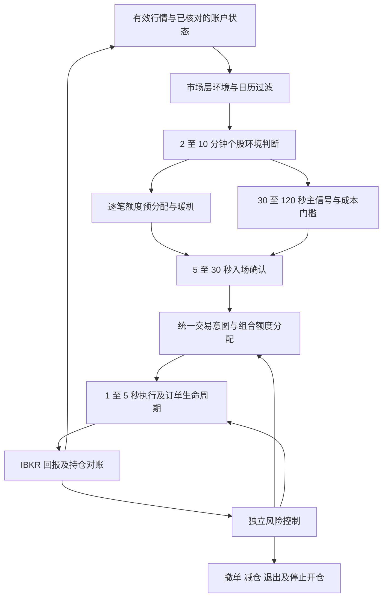

# IBKR 日本股票多周期协同策略文档

版本：多周期研究版 v1.1  
整理及规则核查日期：2026 年 10 月 2 日，日本时间  
适用读者：策略研究、交易系统开发及交易运维人员  
状态：研究和开发规格，尚未取得实盘准入证据

本文将《策略思路.txt》中的四层协同思路细化为可以研究、实现和验收的策略规格：**2–10 分钟判断环境，30 秒–2 分钟识别机会，5–30 秒确认入场，1–5 秒管理执行。** 首版研究日股长仓趋势延续；是否有交易价值，以真实数据条件和保守成交假设下的样本外净收益判断。

本文以用户提供的《策略思路.txt》为主要设计来源，并以 IBKR 和 JPX 官方资料补充通道、成本和市场规则。分钟级长仓策略作为对照基线；本文独立定义多周期研究方案。原材料中的邀约、指令式文字、收益判断和示例参数属于参考内容，不构成本次操作授权或已验证事实。

**v1.1 修订说明**：在 v1.0 基础上补充九项内容（v1.0 已备份到 `废弃思路` 目录）：

1. 持有期、波动和成本的量级检查，并据此把主研究持仓期由 120 秒调整为 300–600 秒，120 秒保留为对照（第九章）。
2. 通道时间预算（第三章）。
3. 逐笔额度预分配，解决候选 TTL 短于逐笔暖机时间的冲突（第四章）。
4. 市场层环境和日历过滤（第六章）。
5. 主信号增量特征候选和 L1 确认规则草案（第七、八章）。
6. 被动与主动执行的选择公式及执行层评价（第十一章）。
7. 多周期退出映射和 Alpha 衰减退出（第十二章）。
8. 新增对照实验、逐层漏斗指标、T17–T21 测试、模块和参数冻结项。
9. 附录 D 对《策略思路》原稿的逐条处理。

## 一 策略定位和核心假设

### 策略范围

| 项目 | 首版设计 |
| --- | --- |
| 交易品种 | 经合约、行情及账户权限确认的东证内国普通股票 |
| 策略族 | 日内相对强弱动量与放量趋势延续 |
| 信号族 | 收益动量、相对成交量、VWAP 结构及可用的盘口和成交方向 |
| 方向 | 仅开多仓；下跌标签用于拒绝开仓及退出判断 |
| 资金 | JPY 资金，不借款、不使用杠杆；实际可用资金需账户核实 |
| 持仓 | 同一股票最多一个开仓意图，不加仓，不跨午休和收盘持仓 |
| 执行 | 被动限价和有价格上限的主动限价，完整处理撤单和部分成交 |
| 首版排除 | 做空、配对、指数期货对冲、竞价交易、隔夜和独立的秒级抢单 |

这些是首版设计选择。资金规模、可用股票数和账户实体尚未提供，不据此生成可直接实盘使用的仓位配置。

### 需要证明的四个假设

1. **方向过滤有增量价值**：长周期环境可以改善中周期信号的净收益或下行风险，同时不过度损失有效机会。
2. **主信号有可交易优势**：短期相对强弱与放量结构，在指定退出规则下仍有足以覆盖成本的预测能力。
3. **入场确认改善交易结果**：微观特征改善成交后的价格表现，收益增量足以补偿等待、未成交和错失机会。
4. **执行优化改善净结果**：被动和主动切换，在成交率、逆向选择、费用和机会损失合并计算后有价值。

原稿所述“明显减少逆势交易”“减少追高和假突破”“链路已经达到几十毫秒”等，没有随附可复现证据，本文均不当作已证明的前提。券商确认耗时、交易所收到订单的耗时及实际成交耗时必须分别测量。

### 四层的职责和研究投入

| 层 | 特征观察窗口 | 回答的问题 | 输出 | 研究投入参考 |
| --- | --- | --- | --- | --- |
| 环境层 | 120、300、600 秒 | 当前环境是否允许做多 | LONG、NEUTRAL、BEARISH、RISK_OFF | 20% |
| 主信号层 | 30、60、120 秒 | 是否有值得交易的机会 | 候选、预测收益、有效期 | 40% |
| 确认层 | 5、10、30 秒 | 当前是否具备合适入场条件 | CONFIRM、WAIT、VETO | 30% |
| 执行层 | 最近 1–5 秒及当前订单状态 | 用什么价格、数量和方式成交 | 挂单、等待、撤单、替换、退出 | 10% |

比例沿用原稿末尾的研究重点，**不能作为四层打分相加的下单权重**。方向、成本、数据和风险条件采用门控关系；执行层没有扩大仓位或推翻风控拒绝的权限。

观察窗口、计算频率、候选有效期、订单有效期和实际持仓期分别配置。30–120 秒的信号窗口不代表必须持仓相同时间；1–5 秒的执行窗口也不表示订单必然在 5 秒内成交。

**持仓期单独研究。** 第九章的量级检查显示，在 IBKR 成本下持有 1–2 分钟，需要预测出接近或超过 2 倍持有期标准差的价格变动。因此本版把主研究持仓期定在 5–10 分钟：30–120 秒主信号层负责发现条件波动放大的机会并择时，不决定持有多久；120 秒持有保留为对照版本。

## 二 决策架构和优先级



实现时区分五种职责：信号计算可能的优势；决策生成交易意图；执行管理订单；风险硬性阻断或要求退出；组合管理多个股票对账户资金和风险的共同占用。四个时间尺度映射到这些职责，不各自维护独立持仓。

所有普通交易决策按以下优先级运行：

1. 接收并核对成交、活动订单和账户状态，更新最坏情形风险占用。
2. 处理账户锁定、紧急撤单、风险减仓和风险退出。
3. 处理午休前、收盘前、最长持仓和其他计划退出。
4. 处理信号衰减、环境转弱和普通主动退出。
5. 管理已有入场订单，重新核算价格、剩余数量和候选有效期。
6. 在仍允许交易时评估新开仓。

风险检查贯穿候选、组合分配、每次报单和每次改单。退出不需要重新获得做多环境或入场确认。正常入场可以 WAIT；已触发的硬止损不能因确认不足而等待。

## 三 市场和账户前提

### 交易时段和证券规则

东证现货上午交易为 09:00–11:30，下午为 12:30–15:30。连续竞价于 15:25 结束，15:25–15:30 为只受理订单、不撮合的收盘竞价准备阶段，15:30 集合竞价。首版退出必须提前安排，不能把 15:30 当作连续成交的最后时点。[JPX 交易时段](https://www.jpx.co.jp/english/equities/trading/domestic/01.html)、[JPX 交易方式](https://www.jpx.co.jp/english/equities/trading/domestic/04.html)

内国普通股票的标准交易单位为 100 股；其他证券类型另行核实。报价单位随证券分类和价格档位变化，价格不能统一按 1 日元或固定小数位取整。系统应维护有生效日期的规则表，并使用合约及路由对应的市场规则。[JPX 交易单位](https://www.jpx.co.jp/equities/trading/domestic/03.html)、[JPX 报价单位](https://www.jpx.co.jp/english/equities/trading/domestic/07.html)

### IBKR 行情的适用边界

普通 Watchlist 行情来自时间快照，官方表列亚洲产品更新周期为 250 毫秒。这是产品更新口径，不是端到端延迟，也不是保证每 250 毫秒收到一次变化，更不能视作完整的交易所事件流。[IBKR 行情更新频率](https://www.interactivebrokers.com/docs/tws-api/doc/market-data-live/top-of-book-l-1/market-data-update-frequency)

API 行情权限需按实际用户名核实，TWS 中能看到行情不代表 API 已有相同权限。实际行情类型必须核对为实时；冻结、延迟或延迟冻结数据不允许触发新开仓。[TWS 与 API 行情区别](https://www.interactivebrokers.com/docs/general/market-data-subscriptions/tws-data-vs-api-data)、[IBKR 行情类型](https://www.interactivebrokers.com/docs/tws-api/doc/market-data-delayed/market-data-type-behavior)

目前官方规定 Tick-by-Tick 同时订阅数为总行情线路的 5%，同一合约 15 秒内最多请求一次。专项额度表中 100 条行情线路对应 5 个逐笔订阅和 3 个深度订阅；两者不可互相替代。实际额度和所需流的占用必须验证。[逐笔订阅规则](https://www.interactivebrokers.com/docs/tws-api/doc/market-data-live/tick-by-tick-data/introduction)、[专项行情额度](https://www.interactivebrokers.com/docs/general/market-data-subscriptions/market-data-lines/specialized-market-data-lines)

L2 不保证展示每个报价，也不包含 odd lot；盘口数量减少不必然是撤单，增加不必然是同一参与者补单。IBKR 深度重置错误 317 后，应清空本地订单簿并重建。[IBKR 深度数据边界](https://www.interactivebrokers.com/docs/tws-api/doc/market-data-live/market-depth-l-2/introduction)

### 通道时间预算

四层结构会把多段等待叠加在同一个候选的有效期内。确认持续时间、报单确认、被动等待和撤单重挂加起来，必须放得进候选 TTL：

```text
T_confirm + L_submit,p99 + Σ T_wait,i
  + n_requote × (L_cancel,p99 + L_submit,p99) + 缓冲 ≤ 候选 TTL
```

| 组成 | 当前口径 | 证据状态 |
| --- | --- | --- |
| L1 更新 | 亚洲产品快照约 250 毫秒 | 官方产品口径，不等于端到端延迟 |
| 确认持续时间 | 研究 1、2、3 秒，并要求最低有效更新数 | 设计参数 |
| 本地特征、决策与风控 | 目标远小于 L1 更新间隔 | 需实测 |
| 报单到券商确认 | 早期材料称中位数 262 毫秒、p99 741 毫秒 | 未复现，不能作为配置依据 |
| 撤单到确认终态 | 未测 | 必须单独测量，含 PendingCancel 期间成交 |
| 被动等待 | 配置项 | 由成交日志校准 |

举例：TTL 20 秒、确认 3 秒、最多重挂 2 次，报单和撤单 p99 都保守按约 1 秒估计。固定耗时约为 3 + 1 + 2 × 2 = 8 秒，再留 2 秒缓冲，所有被动等待合计只剩约 10 秒。这只演示预算的算法，实际数值要换成实测分布。

两点推论：

1. 在 250 毫秒快照下，执行层每秒最多看到约 4 次更新。它能做的是在挂单、等待、撤单重挂、主动成交这几个动作之间做少数几次选择，做不到连续微调报价。
2. 如果实测尾部延迟让预算不成立，就减少重挂次数或缩短确认时间。不能为了让旧信号继续交易而延长 TTL。

### 启动前必须确定的账户配置

| 项目 | 必须记录的实际值 | 未确定时的行为 |
| --- | --- | --- |
| 账户 | 法人实体、账户类型、用户名及策略管理范围 | 不启用实盘 |
| 股票合约 | conId、币种、证券类型、主交易所、允许路由 | 不交易该合约 |
| 资金和费用 | 可用 JPY、买入资金限制、费率方案、最低佣金及附加费用 | 不开仓 |
| 行情 | 实时权限、L1、成交、深度、基准数据及对应来源 | 不启用依赖缺失数据的版本 |
| 市场状态 | 连续竞价、竞价、特别报价、停牌等状态的可靠识别方法 | 状态未知时不新开仓 |
| 订单能力 | 可用限价及主动限价行为、有效期、取消协议、拒单处理 | 不启用该执行方式 |
| 通道容量 | TWS、Gateway、API 版本、共享行情额度和实测请求限制 | 先采集验证 |
| 对账 | 策略订单标识、人工订单共存规则、持仓和成交查询能力 | 状态不一致时保持锁定 |

首版须冻结行情来源与路由配置。盘口来自某交易所而订单可被路由到其他场所时，应在报告中记录这种差异；不能据一个场所的深度模拟所有路由的成交能力。

## 四 数据规范和股票池

### 两种可比较的数据版本

| 版本 | 所需数据 | 可以使用的特征 | 限制 |
| --- | --- | --- | --- |
| L1 基线 | 实时最优价量、有效成交量字段、个股及基准历史 | 动量、相对强弱、相对量、盘口失衡代理 | 不伪造完整逐笔流、主动买卖流或撤单流 |
| 微观增强版 | 同一数据规范加可用逐笔成交和同步报价；深度为可选项 | 成交方向不平衡、盘口变化代理及确认持续性 | 仅覆盖已获额度并完成暖机的股票 |

若只具备 L1 条件，可以运行单独验证的 L1 版本；不能将缺失的逐笔确认设为零，然后声称运行了同一增强版。两版本的配置、阈值和实验结果分别保存。

### 必须保存的数据字段

每个事件至少记录合约、来源、市场数据类型、事件类型、价格和数量、原始时间戳、接收时间戳及本地顺序号。来源没有提供交易所时间时，字段记为 UNKNOWN，不能拿本地时间冒充。另存特征快照、候选、意图、风控决定、订单请求、确认、取消、成交、费用和账户快照。

实时决策只使用当时已接收的数据。回放按接收时间及稳定顺序号推进；交易所时间用于测量和对齐，不能让晚收到的信息提前参与决策。使用单调时钟测量本地时延和有效期，用 Asia/Tokyo 日历判断交易时段。

报价有效至少要求：买卖价均为正，买价低于卖价，数量有效，价格符合合法档位，价量时间差和行情年龄不超配置容忍值。成交量不能通过反复累加普通行情里的最后成交数量构造；累计量差值或逐笔累计必须处理重置、重复、修正和流切换。

没有报价变化不自动等于断流。分别维护报价字段年龄、流连接健康及基准新鲜度。普通 L1 若无法证明适合 1–5 秒微观处理，就暂停依赖这些信息的入场和追价；已有持仓转由风险流程管理。

### 股票池形成

前一交易日使用当时已知的流动性、价差、tick 占价比、波动及数据完整性生成股票池。盘中只根据已经收到的信息更新候选排序，并记录每次变更。股票池必须可以在回放中重建。

硬性剔除包括：未确认合约或权限、一个交易单位已超风险或资金限额、不能覆盖费用的波动空间、异常报价、停牌或特别报价、状态未知及无法可靠退出的标的。预定财报和重大事件可设过滤，但日历来源与更新时间必须保存。

深度和逐笔额度优先保留给已有持仓、活动订单及预候选股票（见下节），再分配给观察对象。切换订阅后须重新暖机；不能将未采集的历史逐笔信息补成零。首轮可从少量经验证股票开始，池规模以账户额度与回放能力决定。

### 逐笔额度的预分配和暖机

逐笔确认版有一个时间冲突：候选 TTL 的研究起点是 20 秒，确认层最长窗口是 30 秒，而同一合约 15 秒内又不能重复请求逐笔数据。如果等候选出现后才订阅，确认窗口来不及暖机，候选就已经过期。所以逐笔额度要由更长周期的层提前分配：

1. 每 30–60 秒计算一次预候选分数并排序。分数综合三项：个股环境为 LONG 的强度、主信号离候选阈值有多近、Tradability（流动性、价差、tick 占价比）。
2. 额度按以下顺序分配：已有持仓和活动订单的股票，然后是预候选排名靠前的股票，最后是观察对象。基准或期货如果需要逐笔数据，单独预留额度。按专项额度表，100 条行情线路对应 5 个逐笔订阅，所以实际能预分配的往往只有 3–4 只股票。
3. 新订阅的股票至少保留 T_min（例如数分钟），避免频繁切换和触发 15 秒重复请求限制。完成最长确认窗口的暖机后，才标记为 READY。
4. 只有 READY 股票上的候选运行逐笔增强确认。其余候选运行 L1 版确认，结果单独标注，不混入增强版统计。
5. 每天报告“候选发生在 READY 股票上的比例”。这个覆盖率如果很低，增强版即使回放有效，实盘也用不了几次。

预分配本身也是一个选择过程：如果预候选分数和后续收益相关，READY 股票就不是随机样本。增强版与 L1 版的比较必须限定在同一批 READY 股票上进行。

## 五 特征定义和计算口径

令 b、a 为有效最优买卖价，Qb、Qa 为对应数量，m 为中间价，h 为回看秒数。以下所有公式只在完整有效窗口上使用。

```text
mid = m = (b + a) / 2
spread = a - b
spread_bps = 10000 × (a - b) / m
r_h = 10000 × ln(m_t / m_(t-h))
OBI = (Qb - Qa) / (Qb + Qa)
microprice = (a × Qb + b × Qa) / (Qb + Qa)
micro_bias = (microprice - m) / (a - b)
```

r_h 的单位为 bps，OBI 在 −1 至 +1 之间。两档 microprice 只是加权报价估计；上述定义下 `micro_bias = OBI / 2`，它们是同一信息的变换，不能当两项独立证据重复加分。

历史价格 m_(t-h) 取该时点以前最近的有效报价，同时检查历史取值的年龄。不跨断线或午休无限前向填充。采样频率变高不会产生新的市场信息。

### 趋势和相对强弱

```text
RS_h = r_stock,h - beta × r_benchmark,h
VWAP = sum(trade_price × trade_volume) / sum(trade_volume)
vwap_deviation_bps = 10000 × (m / VWAP - 1)
vwap_slope_h = 10000 × ln(VWAP_t / VWAP_(t-h))
```

首轮简单版本可固定 beta=1，表示未经风险系数调整的相对收益；后续 beta 仅使用过去训练数据估计并提前冻结。基准须有真实可用的数据，可选已验证的实时指数或代表性 ETF，不能混用延迟指数。行业强弱作为后续增量特征；缺行业数据时使用独立配置版本。

VWAP 明确为同一数据来源的当日累计值，开盘重置；午休不重置当日累计值，但滚动斜率窗口在午后重新暖机。采样成交估计须命名为 VWAP 代理，与完整成交 VWAP 区分。

### 放量和成交方向

```text
RVOL_h = V_h / median(过去 D 个有效交易日相同时段的 V_h)
TI_h = (V_buy,h - V_sell,h) / (V_buy,h + V_sell,h)
classification_coverage = (V_buy,h + V_sell,h) / V_all,h
```

RVOL 的分母只用过去数据，首轮 D 可取 20 个有效交易日作为研究起点；同一数据类型和时段比较，分母太小或样本不足即失效。放量表示活跃度，单独不决定方向。

主动买卖方向使用该成交当时已经可知、并满足时间容忍值的报价估计：在有效卖价或其上方成交记 BUY，在有效买价或其下方成交记 SELL，报价不同步、中间价或异常成交记 UNKNOWN。该标签是推断，不声称知道真实发起方。分母为零时 TI 无效，覆盖率过低时不启用依赖 TI 的确认。

**发生在 Bid 的成交通常是卖方打到买价，不能写成“Bid 成交增强，因此买入”。** 盘口买量增加和买价成交增加必须作为不同事件分析。

### 市场层和辅助特征

```text
r_mkt,h   = 市场基准（已验证为实时的指数期货或代表性 ETF）的 h 秒收益
breadth_h = 股票池内 r_h > 0 的股票占比（只统计当时报价有效的股票）
rv_mkt,h  = 市场基准最近 h 秒已实现波动 / 同时段历史中位数
accel     = r_30 / 30 − r_120 / 120     （单位时间收益之差，bps/秒）
```

- breadth 依赖股票池的构成，股票池每次变化都要记录版本。
- accel 是 r_30 和 r_120 的线性组合，只能作为增量候选去检验，不能和 r_30 同时加分，然后宣称多了一项证据。
- 期货与现货的交易时段、基差和行情权限都不同。用期货做基准时要记录来源，午休期间也不与现货窗口拼接。

### 标准化

首轮按股票及可比较的时段，用训练集拟合稳健标准化：

```text
z(x) = clip((x - median_train) / max(1.4826 × MAD_train, epsilon), -3, +3)
```

epsilon 是按特征单位设置的稳定项。标准化参数、时段分组和缺失处理规则在验证及测试期间冻结；不能使用当天收盘后才得知的分布。若改用在线更新，更新顺序必须严格因果并可回放。

## 六 长周期环境判断

首轮每 5 秒评估一次，使用 120、300、600 秒窗口。LONG 表示允许寻找做多机会，BEARISH 表示偏空但不授权做空，NEUTRAL 表示方向不明确，RISK_OFF 表示异常或禁止交易。

一个可实现的趋势版起点如下，所有数值阈值在训练集确定：

1. 实时数据、连续竞价状态、账户风险和滚动窗口全部有效；否则 RISK_OFF。
2. `r_300 > max(0, theta_trend)`、`RS_300 > max(0, theta_rs)`、`vwap_slope_120 > max(0, theta_vwap)` 同时成立，并持续超过环境确认时长，标记 LONG。
3. 方向条件明显转负时标记 BEARISH；未达到任一方向的确认条件时标记 NEUTRAL。
4. 波动、价差或流动性超过已验证上限时，由任何方向转为 RISK_OFF。

环境确认时长可先研究 10、20、30 秒，使用进入和退出不同阈值抑制来回切换；参数一次实验中固定。600 秒特征用于稳定性及市场异常研究，首版仍要求开场后滚动数据暖机 10 分钟。

环境变为 NEUTRAL 时作废候选、撤入场余单，并依据剩余优势决定已有持仓是否退出；变为 BEARISH 时无条件生成普通退出意图；变为 RISK_OFF 时进入异常风险处理流程，可执行时按风险政策退出。原候选不得随着环境切换自动改成反向订单。

### 市场层环境

在个股环境之上，再加一个全股票池共享的市场层状态。它只做门控，不产生交易：

| 状态 | 条件草案 | 对个股的影响 |
| --- | --- | --- |
| MARKET_OK | 数据有效，市场波动和价差处于正常区间 | 个股按自身环境运行 |
| MARKET_CAUTION | rv_mkt 或全池价差中位数超过第一档阈值，或 breadth 急剧转弱 | 二选一做实验：不产生新候选，或提高入场门槛；仓位缩减只能由风险层执行 |
| MARKET_RISK_OFF | 市场基准数据失效、波动超过上限、交易所状态异常 | 所有股票视同 RISK_OFF，停止开仓，已有持仓按风险流程处理 |

市场层状态优先于个股状态。个股为 LONG 也不能覆盖 MARKET_RISK_OFF。

“个股 LONG 是否还要求市场方向为正（r_mkt,300 > 0）”是一个待检验的问题。原稿希望用 TOPIX 或日经的方向减少逆势交易；但个股相对强弱已经扣除了基准收益，再要求市场同向，可能会删掉大量有效样本。用实验 M1a（只用个股环境）和 M1b（个股环境加市场方向）来比较。行业方向等数据可靠后，再按同样方法检验。

### 日历型过滤

有些日期和时点的价格行为与普通连续交易不同，要在交易日历中提前标记：

| 类型 | 例子 | 首版处理 |
| --- | --- | --- |
| 衍生品结算 | 每月第二个星期五的 SQ，季度月影响更大 | 开盘段单独统计，可推迟开仓窗口 |
| 政策公布 | 日本银行金融政策会议结果，公布时间不固定，可能落在交易时段内 | 会议日整体为 MARKET_CAUTION，公布前后一段时间禁止新开仓 |
| 指数调整 | 日经 225、TOPIX 定期调整的生效日 | 尾盘和竞价成交量异常，相关统计单独标注 |
| 权利落ち | 主要配息、配股基准日之后的除权日 | 当日成交量和价格水平与历史同时段不可比，RVOL 单独标注 |
| 个股决算 | 发布日前后 | 沿用第四章的事件过滤 |

日历的来源和更新时间纳入版本。某一日的日历状态无法确认时，按 MARKET_CAUTION 处理。

## 七 主信号和候选生成

### 首版只采用趋势延续

研究个股相对基准走强、短周期量能扩大且价格结构没有过度拉伸的趋势延续。均值回归不与趋势项直接混合进同一首版评分；回归策略需要独立环境定义、标签和退出规则。

首轮每 1 秒评估 30、60、120 秒窗口。候选须同时满足：环境 LONG，RS_30 和 RS_60 分别高于各自 `max(0, theta_rs_h)`，RVOL 达标，VWAP 偏离未超过追高上限，价差和波动处于允许区间。

可先采用下列**研究用评分**进行排序：

```text
S = 0.45 × z(RS_60)
  + 0.25 × z(RS_30)
  + 0.20 × z(ln(RVOL_30))
  + 0.10 × z(vwap_slope_60)
```

系数是为了建立可重复基线的设计起点，不是最优权重。短窗动量之间相关，后续须做消融和相关性检查。原稿的分数 2.7、阈值 2.0 和各特征的示例贡献不直接移用。

### 分数和预期收益分开

S 用于排序和候选门槛，不能直接当预期 bps。另用训练数据估计给定特征、环境、订单规模和退出政策下的预期净收益及不确定性。可以从简单分箱和保守置信区间起步；样本不足或成本无法估计时，只记录候选，不产生交易意图。

初期分别研究 30、60、120、300、600、1200 秒前瞻收益和指定退出政策的净结果。选定持仓和退出政策后，再冻结收益映射；中间价预测曲线只用于诊断，不替代可执行盈亏。

### 主信号的增量特征候选

原稿的主信号层还列了成交不平衡、VWAP 偏离、短期均值回归、价差和波动。首版评分 S 不包含这些项，按下表逐项检验：

| 候选 | 用法 | 检验要求 |
| --- | --- | --- |
| TI_60（逐笔版） | 加入 S，或作为候选门槛 | 只在 READY 股票上比较；与确认层的 TI_10 同源，两层都用时要衡量确认层在主信号已含 TI 时的条件增量 |
| accel | 加入 S | 控制 r_30、r_60 之后是否仍有增量 |
| vwap_deviation_bps | 追高惩罚 | 首版已作为硬上限；改成连续惩罚另行测试 |
| 条件波动 σ_h | 不作为方向特征 | 用于第九章的 k_h 和成本门槛 |
| 短期反转项 | 不加入趋势评分 | 趋势和回归混在一个分数里，分数就无法解释；回归另立策略 |
| spread_bps | 用于门槛和成本 | 不作为方向特征 |

### 候选对象和生命周期

每个候选保存：candidate_id、conId、LONG 方向、生成时间、有效截止时间、各层快照、分数、收益估计、成本版本、目标数量上限、价格上限和失效原因。候选 TTL 可先研究 10、20、30 秒，首轮取 20 秒作为回放起点。

候选在环境不符、主信号跌破退出门槛、成本不足、数据失效、时间到期或风险拒绝时失效。持续同方向信号可以更新特征快照，但不无限延长原候选截止时间。失效后须重新达到生成条件及冷却规则，才生成新候选。

## 八 短周期入场确认

确认层管理候选的入场时点，不产生独立仓位。微观增强版以 5、10、30 秒窗口评估，收到有效事件时更新，决策频率受配置限制。

首轮研究以下联合条件：

- 平滑 OBI 或 micro_bias 与做多方向一致，二者只选择一个作为同源信号。
- TI_10 为正并达到训练阈值，成交分类覆盖率满足最低要求。
- 价差没有异常扩大，报价及成交字段在时间上可对齐。
- 价格距离候选生成时点未超过追价上限，重新估计后的净优势仍为正。
- 条件持续到确认时长，且包含最低有效更新数，避免单个快照触发。

首轮可研究 1、2、3 秒持续性及不同更新数，不能因本地每秒重采样就把同一报价算成多次确认。所谓补单、卖盘消耗仅记录为可见数量及价格变化代理，不推断真实订单队列。

| 输出 | 条件 | 决策 |
| --- | --- | --- |
| CONFIRM | 全部必需条件通过 | 送组合及风险门槛 |
| WAIT | 条件不完整但候选仍有效 | 继续观察，不发送新订单 |
| VETO | 方向反转、数据无效、价差异常或净优势消失 | 作废候选；若有入场单则撤单 |

L1 基线使用独立的报价持续性规则，不要求不可用的 TI；其效果与增强版分开比较。确认层要以每个候选最终的净结果、机会损失和成交后不利变动评价，不能只看成交交易的胜率。

### L1 基线确认规则草案

没有逐笔流时，确认只能依靠 L1 快照。研究起点如下：

1. 最近 n 个**不同的** L1 更新中，平滑后的 micro_bias 处于做多方向的比例达到阈值。n 和阈值在训练集确定。
2. 确认窗口内最优买价没有下移；或者下移后，已恢复到候选生成时的买价。
3. 价差不超过该股同时段正常价差的设定倍数，报价年龄满足要求。
4. 当前卖价相对候选生成价的偏移，仍在追价上限之内。

L1 快照中数量的变化，无法区分成交、撤单和新挂单。第 2 条只是价格结构的代理，不用来推断订单流。

## 九 交易成本和开仓经济门槛

### 佣金与订单规模

核查日的 IBSJ 日本股票官网费表首档列示 Tiered 为成交金额的 0.05%，Fixed 为 0.08%，两者首档每单最低 80 日元；Tiered 另列交易所和清算费。账户实体、计划、路由及具体安排会影响适用费用，实盘应以实际账户规则和成交账单校准。[IBSJ 日本股票费用](https://www.interactivebrokers.co.jp/en/pricing/commissions-stocks.php)

假设一笔买入和一笔卖出，金额近似相同，仅按上述首档计算：

| 单边成交金额 | Fixed 单边佣金 | Fixed 往返佣金 | Tiered 单边基础佣金 | Tiered 往返基础佣金 |
| --- | --- | --- | --- | --- |
| 100,000 日元 | 80 日元 | 16 bps | 80 日元 | 16 bps |
| 300,000 日元 | 240 日元 | 16 bps | 150 日元 | 10 bps |
| 1,000,000 日元 | 800 日元 | 16 bps | 500 日元 | 10 bps |

表中不包含价差、滑点或尚未计入的附加费用，也不代表用户账户报价。金额变化、拆单及部分成交后的修改可能改变最低费用的适用方式；官网提示某些交易所的改单可能被按新单处理。实际建模按完整订单生命周期核算并与账单验证，不能假定高频改价免费。[费用披露及改单最低费用](https://www.interactivebrokers.co.jp/en/pricing/commissions-stocks.php)

### 统一收益口径

采用以下两种口径之一，并明确标识：

1. **中间价预测口径**：预计中间价收益减入场和退出价格损耗、佣金和尚未包含的费用，得到预计净收益。损耗包含价差、规模和延迟影响，不只填一个常数。
2. **真实或模拟成交口径**：用实际入场、退出成交价计算价格盈亏，再减佣金和其他费用。已经反映在成交价中的价差和滑点不再重复扣除；逆向选择另作归因，不机械再次扣除。

长仓已完成交易的策略净盈亏为：

```text
PnL_net = sum(卖出成交金额) - sum(买入成交金额)
          - 全部订单佣金 - 尚未包含的交易费用
```

部分退出用成本分配方法核算；未退出部分另计浮动盈亏。系统经营报告额外分摊行情、服务器及资金成本，税后收益另列。不能混用经营成本、交易成本和税前交易收益。

### 开仓及追价门槛

风险允许不代表值得交易。候选必须有可靠的净收益估计，保守下界超过已冻结的安全余量；单笔规模变更和每次改单后重新计算。

若使用预计未来可执行卖价 P_exit，且其中已包含退出价差和退出滑点，则：

```text
预计净金额 = q × (P_exit - 买入限价)
            - 尚未包含的往返费用及其他损耗
要求：预计净金额的保守下界 > 安全余量金额
```

其中 q 为合法交易单位取整后的数量。收益模型、退出政策与价格上限须一致；无法可靠估计 P_exit 时不能用一个任意 fair price 代替。

原稿示例 fair price 为 3000.42、却追买到 3000.50。若 3000.42 代表预计可实现卖价，追到 3000.50 在未计费用前就已不满足条件；若它只是当前加权报价，则没有提供未来收益证据。Microprice 上移只能影响执行方式，不能替代成本门槛。

扩大金额可能降低最低佣金占比，但同时增加冲击和资金风险。订单金额由风险和容量决定；不能为了跨越最低佣金拐点而强行放大仓位。

### 持有期、波动和成本的量级检查

信号窗口短，不代表适合短持仓。设持有期收益的标准差为 σ_h（bps），往返总成本为 C（bps），定义：

```text
k_h = C / σ_h
```

k_h 的含义：扣除成本之前，策略需要预测出相当于几倍持有期标准差的平均价格变动。

下面是说明性计算，所用假设都不是实测值：

- **波动**：连续竞价时段的日内收益标准差取 1.5%。连续竞价约 325 分钟（上午 150 分钟，下午 12:30–15:25 共 175 分钟），按随机游走计算 `σ_h = 1.5% × sqrt(h / 325)`，忽略日内季节性。
- **成本 A**：100,000 日元 Fixed，往返佣金 16 bps，加材料报告的 7.6 bps 价差，共 23.6 bps。
- **成本 B**：300,000 日元 Tiered，往返约 10.6 bps（含交易所和清算费），加 7.6 bps 价差，共 18.2 bps。

| 持有期 | σ_h | k_h（成本 A） | k_h（成本 B） |
| --- | ---: | ---: | ---: |
| 1 分钟 | 8.3 bps | 2.84 | 2.19 |
| 2 分钟 | 11.8 bps | 2.01 | 1.55 |
| 5 分钟 | 18.6 bps | 1.27 | 0.98 |
| 10 分钟 | 26.3 bps | 0.90 | 0.69 |
| 20 分钟 | 37.2 bps | 0.63 | 0.49 |
| 30 分钟 | 45.6 bps | 0.52 | 0.40 |

**按线性高斯近似解读**：设条件期望 `E[r | z] = ρ × z × σ_h`。对于 z = 2 的极端信号，即使不计安全余量，也需要 ρ ≥ k_h / 2。在成本 A 下，持有 2 分钟需要 ρ ≈ 1，等于完美预测；持有 10 分钟也需要约 0.45。日内收益预测的相关性通常远低于这些水平。由此得到四点推论：

1. **只能交易条件波动放大的状态。** 平均意义上连续的小幅预测，在 IBKR 成本下几乎不可能盈利。可交易的机会只能来自条件波动显著放大的状态（放量、突破、消息后的价格发现），或者条件分布明显非线性的尾部。因此 k_h 必须用该信号桶内的条件 σ_h 来算：同一持有期下，条件波动翻倍，k_h 就减半。
2. **主信号负责择时，不决定持有期。** 30–120 秒主信号层的价值是发现这些状态并择时；持有期应接近环境层的 5–10 分钟或更长，而不是和主信号窗口一样短。
3. **订单金额和费率方案直接影响 C。** 订单金额越过最低佣金拐点、选用合适的费率方案，都能直接降低 C；但金额受风险和容量约束（见第十章）。
4. **k_h 是必报指标。** 每个信号桶都要报告 C、条件 σ_h、k_h 和实际净收益。如果 k_h 明显大于 1，回放却显示盈利，首先怀疑前视、成交模型过于乐观或样本太少。

1.5% 的日内波动和 7.6 bps 的价差都只是说明性假设。实际研究中按股票和时段，用数据重新计算 σ_h、C 和 k_h。

### 一笔交易需要涨多少个报价单位

说明性算例：某股票合法报价单位为 0.5 日元，以 3,000.5 日元买入 100 股（约 300,050 日元），Fixed 方案每边佣金约 240 日元，安全余量按成交金额的 10 bps 计，约 300 日元。

```text
100 × (P_exit − 3000.5) > 240 × 2 + 300
P_exit > 3008.3
→ 可成交卖价（买一价）至少要到 3008.5
→ 即上涨 8 日元，约 16 个报价单位，约 27 bps
```

这里的 P_exit 是退出时可成交的买价，已经包含退出价差。按上一节的说明性波动，27 bps 约为 2 分钟标准差的 2.3 倍、10 分钟标准差的 1.0 倍。

原稿“盈利 +5 tick、止损 −3 tick”的出场设定，在这个价位和费率下连往返佣金都覆盖不了：+5 tick 只有 2.5 日元 × 100 股 = 250 日元，低于 480 日元的往返佣金。改用 Tiered 方案后，每边佣金约 150 日元加少量交易所和清算费，同一算例需要可成交卖价至少到 3007.0，即上涨 6.5 日元、约 13 个报价单位，结论不变。

## 十 数量分配和账户风险

### 数量计算

首版每个候选独立求允许数量，再由组合层原子分配额度。设 A 为日初冻结的策略风险资本 A_day_start，B 为单笔亏损预算，D 为每股压力损失，L 为交易单位。B 以 JPY 计，D 和所有止损、滑点距离以 JPY/股计：

```text
B = A × 单笔风险比例
D = 止损价格距离 + 每股退出滑点储备 + 每股费用储备
q_risk = floor((B / D) / L) × L
q = floor(min(q_risk, q_cash, q_symbol_cap,
              q_portfolio_cap, q_liquidity_cap) / L) × L
```

费用含最低佣金时，D 会随数量变化，应枚举合法数量重新核算；公式只是求初值。最终 q 取整后重新核对全部压力损失、费用和额度，不通过则逐手缩减；任何允许数量小于一个交易单位时，输出 NO_TRADE。买入资金包含佣金储备和活动买单占用，不把账面余额直接当可重复使用资金。

成交量参与率只作为容量代理；L1 可见数量不是保证可成交数量。历史容量要使用当时已经可知的流动性，不能用交易后的整段成交量倒推可以下多大订单。

### 风险配置的研究起点

以下是回放与仿真的**待验证设计参数**，不是用户已批准的实盘配置。缺少 A、账户约束或实际限额时，实盘开关保持关闭。

| 参数 | 起点 | 规则 |
| --- | --- | --- |
| 单笔压力亏损预算 | A 的 0.10% | 计费用及退出储备；超预算不下单 |
| 单股最大名义敞口 | A 的 10% | 已成交和可能成交的活动买单合并占用 |
| 策略总长仓上限 | A 的 30% | 多股并发须先占额度再报单 |
| 同时持仓数 | 最多 3 只 | 相关股票另设行业及基准风险上限 |
| 策略日损失锁定 | A 的 0.50% | 计已实现、浮动和估计未报费用，锁定当日开仓 |
| 同股普通退出冷却 | 30 秒 | 持仓及活动单均核实归零后计时 |
| 同股止损冷却 | 300 秒 | 连续止损还应延长冷却或停用该股 |
| 单意图重新挂单次数 | 最多 2 次 | 候选截止时间和追价上限仍有效 |
| 报单及撤改限额 | 根据实际连接配置 | 预留风险动作额度，禁止无限重试 |

行业上限、行情年龄、确认时差、波动阈值、止损距离和滑点保护等未给固定实盘值。上线前必须填入经验证的有限值，不得把 UNKNOWN 解释为无限大。账户其他持仓需纳入账户风险监控；本策略只自动操作明确归属自身的订单和持仓。

日损失限额按当日日初冻结的 A_day_start 计算，不因盘中盈亏放大。日盈亏由当日已实现净盈亏、按有效 Bid 估值的剩余策略头寸盈亏、未报费用和预计退出费用储备共同计算；仅扣尚未在净盈亏、持仓成本或其他费用项中体现的费用，实际费用到账后替换对应估计，扣除外部资金划转影响。无可靠估值时进入锁定和核对流程，不将未知浮亏记为零。账户层另监控包含非策略持仓的整体损失和资金状态。

### 紧急状态的含义

KILL_SWITCH 立即禁止新开仓，作废候选，撤销受控活动开仓单，并进入持仓核对及风险退出流程。该锁定不能被后续强信号解除。

断线、停牌、特别报价或没有可靠价格时，系统不能保证立刻平仓。此时仍需锁定、保留真实未完成状态、报警和持续核对；连接恢复后按经验证的程序处理。不得在日志中把“已请求撤单或平仓”记作“已撤清或已平仓”。

## 十一 执行规则和订单状态

### 被动与主动执行

默认以被动限价研究入场，但仅在信号生命周期足够、数据有效和预计条件成交结果可接受时使用。被动成交不保证节省成本：容易在不利行情中被成交，也可能错失有效机会。

| 场景 | 行动 | 必须同时满足 |
| --- | --- | --- |
| 候选有效，盘口稳定，等待成本可接受 | 在合法买价或价差内挂买单 | 净优势、资金、价格和数量门槛 |
| 条件改善但尚无成交 | 继续等待或申请撤单后重挂 | 候选未过期，追价及次数限制通过 |
| 优势强且延迟等待的机会损失较高 | 使用可成交限价买入 | 当前卖价及规模在硬价格上限内 |
| 候选失效或数据失效 | 撤开仓剩余单 | 不自动升级为主动追单 |
| 普通信号退出 | 可限时被动卖出，再评估主动退出 | 最迟退出时限及止损持续有效 |
| 硬止损或计划退出到期 | 启动风险退出，可成交限价优先 | 不等待入场确认，遵守市场状态及安全协议 |

对开仓设固定的最高买价，由收益门槛、候选生成价的最大允许偏移和滑点上限共同约束。开仓价格上限失效时放弃交易。普通退出设有限等待时长；风险退出采用独立退出保护和升级流程，无法成交要报警，不能为了维持漂亮的滑点指标长期滞留风险。

价差内 Mid 挂单仅在价格合法且路由确实支持时使用；不能假定所有日股或路由都支持 Mid、post-only、IOC 或所有保护性订单。普通限价订单也不能保证最终以 maker 成交。

### 被动与主动的选择

以“立即可成交的限价买入”为基准，比较被动挂单的预期价值。以下各量均以 JPY/股计，按当前规模估计：α 为候选在计划持有期的预期价格收益（中间价口径），s 为价差，f 为每股费用。

```text
V_aggr = α − s/2 − f
V_pass = P_fill × (α − AS + s/2 − f)
       + (1 − P_fill) × max(α_late − δ − s/2 − f', 0)

选择被动：V_pass − V_aggr > 执行安全余量
```

- **P_fill**：等待期内被动单成交的概率，按股票、时段、价差和盘口状态估计。
- **AS**：被动成交条件下的逆向选择。成交往往恰好发生在价格对我方不利的时候，AS 衡量由此造成的成交后收益下降。
- **α_late、δ**：未成交后剩余的预期收益，以及等待期间已经发生的价格漂移。`max(…, 0)` 表示未成交后也可以放弃交易。
- **f'**：之后改用新订单成交时可能另计的最低佣金。一个意图拆成多张订单且每张都有成交时，每张订单可能各自适用最低佣金。

没有成交日志时，P_fill 取保守低值、AS 取保守高值，结果通常是首版以有价格上限的主动限价为主，被动挂单先作为影子实验积累数据。微观状态（micro_bias、TI）只通过改变 P_fill、AS、δ 的估计来影响执行方式的选择，不改变 α 必须通过的成本门槛。

### 执行层的评价

执行层的价值必须做对照计算，不能只看被动单省下了多少价差：

| 指标 | 定义 |
| --- | --- |
| 到达价格 | 决策时刻的有效中间价 |
| Implementation Shortfall | 每个意图的（平均成交价 − 到达价格）× 成交量 + 费用；未成交部分的机会成本单列为参考值，不计入已实现 PnL |
| 执行增值 | 同一批候选，在 M3（被动/主动切换）与 M2（固定主动限价）下每个意图的净收益之差 |
| 成交后漂移 | 成交后 5、30、120 秒的中间价变化，按被动和主动分组 |
| 错失率 | 被动等待后最终未成交、而信号随后兑现的比例 |

执行增值如果不显著为正，就保留更简单的固定主动限价执行。

### 三种状态分开管理

| 类型 | 最低状态集合 |
| --- | --- |
| 策略状态 | WARMUP、READY、HALTED、RECONCILING |
| 意图及持仓状态 | FLAT、ENTRY_PENDING、LONG、EXIT_PENDING、COOLDOWN、UNKNOWN |
| 内部订单状态 | LOCAL_CREATED、SUBMIT_PENDING、WORKING、PART_FILLED、CANCEL_PENDING、FILLED、CANCELLED、REJECTED、EXPIRED、UNKNOWN |

内部状态是策略模型，不与 IBKR 状态字符串简单一一等同。Submitted、PreSubmitted、PendingCancel、ApiCancelled、Inactive 等须由适配器结合回报及错误映射。orderStatus 可能重复；PendingCancel 尚未确认取消，期间仍可能成交。[订单状态回报](https://www.interactivebrokers.com/docs/tws-api/doc/order-management/order-status/introduction)、[取消状态和竞态成交](https://www.interactivebrokers.com/docs/tws-api/doc/order-management/order-status/understanding-order-status-message)

### 撤单和替换协议

1. 发出 CANCEL 后，旧单仍计可能成交数量，状态为 CANCEL_PENDING。
2. 等待旧单确认终态，并合并此前及迟到的成交回报；超时则进入 UNKNOWN，查询和对账，禁止盲重挂。
3. 核对已成交量、受控持仓、尚未成交的剩余风险，重新评估候选和数量。
4. 旧单终态且状态一致时，才允许发送非冲突的新单。替换后保留新旧订单关系。

首版统一采用上述撤单后重挂协议；将来如果启用 IBKR 原位修改，必须单独验证总数量与剩余数量语义、回报顺序、队列和费用影响。

每个意图有幂等键，订单 ID 的生成和恢复由适配器集中管理。成交以可核对的执行回报为准，按 execId 等稳定标识去重并处理更正；不能把重复 orderStatus 的累计成交量再次累加。费用晚到时更新原交易，不生成新成交。

### 部分成交和退出竞态

第一次成交立即创建持仓和风险约束，最长持仓计时从首次成交开始，后续成交不重置。候选过期不意味着已成交头寸消失；撤销剩余开仓量，同时按持仓退出规则处理已成交部分。

普通退出先撤完活动开仓余量并核对，再平实际持仓。紧急退出可以在入场余单取消过程中处理已确认持仓，但须使用经异常测试的协调协议；退出卖单数量上限为已确认受控持仓减仍可能成交的活动卖单余量。迟到买入成交重新计入持仓并安排补充退出，不能因此卖成裸空。

仓位、活动单或订单状态 UNKNOWN 时不开仓。除可验证的风险操作外，不发送依赖猜测持仓数量的订单。人工订单共存时按账户和策略归属协调，防止重复平仓及自成交。

## 十二 持仓管理和退出

退出按风险、时间和信号三类区分。每一持仓创建时保存 entry_time、实际成本、stop_price、max_holding_time、退出政策版本及原因，不由后续信号随意重置。

### 硬退出

| 触发 | 行为 |
| --- | --- |
| 已确认的止损条件或单笔风险超限 | 立即进入风险退出 |
| 账户或策略日损失阈值 | 锁定开仓、撤余单、按风险协议减仓或平仓 |
| 到达最长持仓时间 | 退出；不能因仍有好信号延长 |
| 午休前或日终退出截止时间 | 执行计划退出并核对归零 |
| 订单和持仓状态失配、通道异常 | 锁定并对账，按可执行条件处理风险 |

止损价格可由已完成的短期波动和价格结构计算，先研究 `max(最小合法价格距离, k × 已知波动尺度)`；k 和最小距离在训练集确定。所有距离统一换算为 JPY/股：收益率波动须乘入场价格，bps 波动还需除以 10000。长仓 stop_price 从已确认入场成本减该距离形成，按合法报价规则处理并重新核算压力预算，创建后不得放宽以逃避止损。首版以有效 Bid 不高于 stop_price 触发止损；若另启用券商保护单，需单独验证其触发语义。行情失效不能解释为止损未触发，而应进入数据异常流程。

首轮最大持仓比较 120、300、600、1200 秒四个版本。按第九章的量级检查，以 300 秒和 600 秒为主研究起点，120 秒作为短持有对照。最终选哪个，取决于样本外净收益和风险结果，不能从窗口名称推导。持有期越长，开仓截止时间约束越早生效（见第十三章）。跳价、流动性不足和通道故障可能导致实际亏损超过止损预算。

### 信号退出

持仓期间继续评估剩余优势；S 低于独立的退出阈值并持续指定时长时退出。环境 NEUTRAL 时依据剩余优势判断退出，BEARISH 时直接生成普通退出意图，RISK_OFF 时走异常风险处理。入场阈值高于普通退出阈值，避免在同一分界点反复开平。

微观成交方向反转可提高普通退出紧迫度，但不把单个卖方成交直接当强制平仓信号。普通退出最多等待经验证的执行 TTL，达到时限即升级；硬止损始终优先。

固定止盈和移动止盈作为对照版本，不能未经检验全部叠加。若采用移动止损，只能收紧风险，不能放宽原止损。首版不平均亏损、不反手、不利用退出后的强信号绕过冷却。

### 多周期退出映射

原稿主张退出也按四层处理。对应到本文的规则：

| 层 | 退出职责 | 本文规则 |
| --- | --- | --- |
| 环境层 | 方向是否仍然成立 | NEUTRAL 时按剩余优势判断；BEARISH 时普通退出；RISK_OFF 和 MARKET_RISK_OFF 时走风险流程 |
| 主信号层 | 优势是否衰减 | Alpha 衰减退出（见下） |
| 确认层 | 微观状态是否反转 | 只提高普通退出的紧迫度，不单独触发平仓 |
| 执行层 | 用什么方式退出 | 普通退出在退出 TTL 内选择被动或主动；风险退出直接使用主动限价 |

Alpha 衰减退出作为独立版本研究。定义草案：

```text
decay_t = S_t / S_entry
连续 m 次评估 decay_t < λ  → 普通退出
```

S_entry 是首次成交时的分数快照，后续部分成交不重置。λ、m 在训练集确定。衰减版与“S 低于绝对退出阈值”版、固定持有期版、环境转向版分别比较，不同时叠加。

原稿的例子中，30 秒动量从 +0.8 逐步降到 −0.2，同时 TI 从 +0.5 降到 −0.3。在本文中，前者对应 decay_t 下降，后者只提高退出的紧迫度。

## 十三 日本时段和暖机规则

以下时间是首版运维设计，均为 JST；交易所边界是官方规则，提前停止开仓和提前退出是策略选择。

| 时段 | 首版操作 |
| --- | --- |
| 开盘前 | 校验交易日、权限、配置、资金和账户对账；活动订单和历史残余风险须明确 |
| 09:00–09:10 | 确认个股已进入连续竞价，滚动窗口暖机，不开仓 |
| 09:10–11:20 | 条件有效时允许新开仓 |
| 11:20–11:25 | 禁止新开仓，完成退出流程 |
| 11:25–11:30 | 核对受控持仓及活动单归零；未完成即进入异常退出和报警 |
| 11:30–12:30 | 午休不交易，不把跨午休价量拼成连续窗口 |
| 12:30–12:40 | 午后重新确认交易状态和滚动数据暖机 |
| 12:40–15:15 | 条件有效时允许新开仓 |
| 15:15–15:20 | 禁止新开仓，完成日终退出 |
| 15:20–15:25 | 对账和残余风险处理；未归零即报警 |
| 15:25–15:30 | 不运行连续竞价策略，不依赖此阶段必能平仓 |
| 收盘后 | 核对成交、费用、订单及持仓，生成回放与实盘偏差报告 |

开盘延迟、停牌恢复、特别报价解除、断线和订阅切换后，相关窗口重新暖机。日历优先于固定时间表；个股尚未连续交易时，即使已过 09:10 也不开仓。入场前及等待、重挂过程中持续检查：`最迟首次成交时刻 + 最长持仓时间 + 退出缓冲 ≤ 计划退出截止时间`。最迟首次成交时刻须计入剩余候选或订单等待时间和链路尾部延迟；时间预算不够则取消候选或撤开仓余单。

## 十四 一次交易的完整流程示例

下面仅说明规则连接，不是某只股票的推荐或真实报价。

1. 数据及账户对账有效。环境层显示 300 秒动量、相对强弱和 VWAP 斜率满足 LONG 条件。
2. 主信号层发现 30、60 秒相对收益增强和相对量上升，生成有效期 20 秒的候选；收益映射提示保守净优势达标。
3. 确认层开始 WAIT；可分类成交流转强、盘口偏向持续后输出 CONFIRM。
4. 组合层按一个合法交易单位或其整数倍分配数量。费用、资金和压力亏损满足上限，执行层提交带价格上限的限价买单。
5. 订单部分成交，系统立即计入实际持仓。未成交余量不重置候选截止时间，也不重置首次成交时钟。
6. 到期仍未全部成交时请求撤余单；取消确认前若有迟到成交，先更新持仓和风险，不直接按原数量重挂。
7. 持仓信号衰减，或者先触发止损、最长持仓及计划退出，按相应优先级生成退出意图。
8. 核对所有成交与活动单，确认持仓归零后进入冷却。实际费用到齐后更新该意图最终净结果。

任何一层失败，流程都有明确停止点。候选被放弃、未成交和只部分成交，也作为完整研究样本保留，不能只报告成功成交的交易。

## 十五 回放和研究方法

### 时间切分和无前视要求

使用按交易日顺序的训练、验证和测试，禁止随机拆分重叠秒级样本。一个研究起点是训练 40 日、验证 10 日、测试 10 日滚动，并保留最后 20 日作为不参与反复选参的最终测试；具体长度根据有效样本和市场环境覆盖调整并提前记录。

特征、标准化、收益映射、股票池、基准选择、退出规则和费用模型全部纳入版本。训练标签依赖的候选等待、成交等待及持仓区间不得伸入验证或测试；跨界样本剔除，必要的隔离期依据最长标签影响范围设定。回测开始时要有真实的历史暖机数据，不用测试后的数据补齐。

每次订单只能在决策之后、经过模拟实际链路耗时后参与撮合。延迟至少覆盖特征处理、提交、确认和取消流程的实测分布，并检验尾部情形。消息接收时钟、数据缺失和逐笔调度应与真实采集一致；完整交易所数据上的漂亮回测不能自动代表 IBKR 数据版本。

### 成交模型

- 主动单按其可成交时刻、价格上限和可支持规模模拟，不按决策时的中间价成交。
- 被动单触价不等于成交；没有队列证据时使用保守成交假设，并对成交概率和条件价格表现做敏感性分析。
- 部分成交、撤单期间成交、拒单、到期和断线参与盈亏及风险计算。
- 同一可见成交量不能被多个模拟订单重复使用；多股共享资金和请求额度一起回放。
- 不知道真实队列时应报告成交不确定性，后续通过影子运行和真实小规模执行数据校准。

### 逐层对照实验

入场归因实验在相同股票池、数据、资金、成本及测试区间下，采用统一的止损、固定最长持仓和计划退出政策；暂不增加普通的环境转向或微观信号退出，以便只检验入场增量。数据异常、账户风险等硬退出在所有实验中保持有效。这是离线实验控制，不修改正式运行的退出规定。

| 实验 | 变化 | 回答的问题 |
| --- | --- | --- |
| B0 | 分钟级长仓特征基线，应用统一退出及执行政策 | 分钟特征是否更适合通道和成本 |
| M0 | 只用主信号和固定执行，不加环境和微观确认 | 主信号本身是否有净优势 |
| M1a | M0 加个股环境门控 | 过滤减少损失还是仅减少交易 |
| M1b | M1a 再加市场方向门控 | 市场同向要求是否值得损失样本 |
| M2 | M1a、M1b 中较优者加短周期确认（L1 版和逐笔版分别运行） | 改善的净结果是否覆盖等待和机会损失 |
| M3 | M2 加被动和主动切换 | 执行优化是否提升每个意图的最终净收益 |
| H | 以 M2 或 M3 为对照，最长持仓取 120、300、600、1200 秒 | 主信号能否支撑短持仓；检验第九章的量级判断 |

随后以 M3 为对照单独检验环境转向退出、Alpha 衰减退出及可选微观退出，最后回放本文完整的部署政策。不能将同时改变入场和退出的增量全部归因于入场过滤。L1 与微观增强版分别跑上述比较。若某一层不能稳定提供增量，保留更简单的已验证版本；不能仅因为“四层结构更完整”而强行启用全部层。

### 报告的最低内容

信号报告包括不同预测期的收益分布、分箱结果、样本量、标准化及校准误差；执行报告包括候选数、意图数、成交率、部分成交率、等待、撤改、滑点、成交后不利变动和费用；组合报告包括净盈亏、最大回撤、日损失、敞口、资金利用和收益集中度。

未成交意图的已实现价格盈亏为零；若产生适用费用，意图净盈亏仍须扣除。另报告可复现的参考执行机会损失，不能把理论机会收益加入已实现 PnL。对每个意图汇总全部子单和费用，避免拆单制造样本量。平均每笔收益、胜率与交易频率必须同时提供成本及不确定性。

每个交易日另出一张**逐层漏斗**：

```text
环境 LONG 时长占比 → 候选数 → CONFIRM 数 → 交易意图数 → 有成交的意图数 → 净盈利意图数
```

每一层都附拒绝原因的分布。用这张表判断哪一层过严、哪一层几乎不起作用。成本相关的报告中还要列出各信号桶的 C、条件 σ_h 和 k_h（见第九章），以及逐笔 READY 覆盖率（见第四章）。

按交易日或较长连续区块估计置信区间，不能把高相关秒级样本当成独立交易。记录所有试过的参数和策略版本；报告多次挑选带来的偏差。检查收益是否集中于少数股票、少数事件日或某一单独时段。

### 必做压力场景

提高额外滑点、恶化入场和退出各一档合法报价、放大链路尾部延迟、降低被动成交概率、增加改单费用及减少行情额度。测试成本不足时策略是否主动减少交易，以及多股同向信号同时出现时是否超资金和风险上限。

出现以下任一情况，研究即应淘汰：

- 主优势只存在于中间价口径。
- 计入真实费用后净收益转负。
- 确认和执行的增量只来自忽略了未成交样本。
- 收益只靠少数特殊日。
- 很小的成本误差就能消灭收益。
- 最小合法交易单位已经超出风险预算。
- 按条件波动计算的 k_h 明显大于 1，回放却显示稳定盈利，且无法解释原因。
- 逐笔增强版的 READY 覆盖率过低，实盘无法形成有意义的交易量。

## 十六 异常测试和准入门槛

以下为需要实现并通过的验收测试，本次编写文档未运行这些交易系统测试。

| 编号 | 场景 | 必须观察到的结果 |
| --- | --- | --- |
| T01 | 重复行情和重复订单状态回报 | 不重复候选、订单或成交累计 |
| T02 | 乱序、迟到及更正的成交回报 | 持仓、资金和费用可核对，无法解释时锁定 |
| T03 | 买单部分成交后候选到期 | 撤余量，已成交部分立即受止损和计时管理 |
| T04 | CANCEL_PENDING 期间成交 | 更新真实持仓，旧单终态前无冲突替换单 |
| T05 | 撤单超时或新单提交结果未知 | 查询及对账，禁止无限重试和重复买入 |
| T06 | 提交后连接中断，重连恢复 | 活动单、成交、持仓一致前保持 RECONCILING |
| T07 | 行情变延迟、深度重置或关键字段失效 | 阻断依赖该数据的开仓，重建和暖机 |
| T08 | LONG 转 NEUTRAL 或 BEARISH | 作废候选，按政策处理持仓，不自动做空 |
| T09 | 止损同时出现强入场信号 | 风险退出优先，不能新增仓位或等待确认 |
| T10 | 日损失或 KILL_SWITCH 触发 | 后续新信号全部拒绝，锁定状态不自行解除 |
| T11 | 出场过程中迟到买入或仍有卖出余量 | 持仓持续正确，卖出不超过受控可卖数量 |
| T12 | 一个交易单位超过资金或风险上限 | NO_TRADE，不放宽限制凑成交 |
| T13 | 买价追到经济上限或候选 TTL 到期 | 停止追价并撤余单，已成交仓位按退出政策管理 |
| T14 | 11:30、12:30、15:25 及停牌切换 | 不跨休市拼窗口，不在竞价状态运行连续策略 |
| T15 | 多股并发抢同一组合额度 | 只分配可用总额，不因并行计算重复占用 |
| T16 | API 限速、拒单及错误价格档位 | 有界失败处理，风险动作保留调度容量 |
| T17 | 候选出现在逐笔尚未 READY 的股票上 | 不运行增强确认，改用 L1 版并标注；不把缺失的逐笔数据当成零 |
| T18 | 逐笔订阅切换，同时碰到 15 秒重复请求限制 | 调度器不重复请求、额度不超限，持仓股票的订阅不被挤出 |
| T19 | MARKET_RISK_OFF 发生时个股处于 LONG | 停止全部新开仓，个股状态不能覆盖市场层 |
| T20 | 日历标记日、政策公布时段，以及日历缺失 | 按 CAUTION 规则执行；日历缺失时同样按 CAUTION |
| T21 | 重挂次数或候选 TTL 的时间预算耗尽 | 停止重挂并撤余单，不延长 TTL |

### 分阶段准入

| 阶段 | 放行标准 | 需要保留的证据 |
| --- | --- | --- |
| 数据研究 | 能重建行情、状态、时钟、股票池和有效窗口 | 采集质量、权限及能力报告 |
| 离线回放 | 因果顺序正确，成本及成交模型可解释，关键异常测试通过 | 回放、对照和压力报告 |
| 影子运行 | 实际链路可生成稳定意图，风险、限速、时段及对账可运行 | 完整意图与账户状态日志 |
| 模拟盘 | 生命周期测试通过，无重复单及无法解释的仓位 | 场景测试和对账记录 |
| 受控小规模实盘 | 账户配置明确，样本外净收益具有足够安全余量，关键测试全通过 | 实际执行校准和已冻结限额 |
| 扩容 | 执行、费用和风险偏差在预设范围内，容量证据支持 | 分规模对比及持续风险报告 |

影子和模拟盘不能证明真实队列成交能力。进入实盘前必须填好日损失、单股和组合上限、时延及费用误差容忍值、退出异常升级流程，并确定谁负责人工解除锁定和处理无法平仓的异常。

实盘发现状态不一致、异常费用、滑点超容忍范围或数据能力变化时，立即停止新开仓并按风险流程处理；收益表现持续低于冻结标准时退回研究。解除风险锁定需要明确操作及重新检查，不由策略自动“恢复盈利后继续”。

## 十七 模块划分和建设顺序

| 模块 | 责任 | 必需产物 |
| --- | --- | --- |
| Market Adapter | 合约、行情、日历、价量单位及市场状态 | 统一有效事件及能力清单 |
| Feature Engine | 维护窗口、标准化、暖机和特征失效 | 可回放的四层特征快照 |
| Market Regime and Calendar | 市场层状态、日历过滤 | 全池共享的市场状态及日历版本 |
| Subscription Scheduler | 行情线路、逐笔和深度额度、暖机 | 订阅计划、READY 标记、覆盖率报告 |
| Regime Engine | 方向和异常环境 | 带时间及失效规则的环境状态 |
| Alpha Engine | 主信号、校准收益和候选 TTL | 候选对象及解释 |
| Confirmation Engine | 候选的确认、等待及否决 | 结果、数据覆盖及原因 |
| Decision and Portfolio | 持仓决策、幂等和共享额度 | 统一交易意图 |
| Risk Engine | 单笔、组合、账户及紧急风险 | 硬阻断、退出或锁定要求 |
| Execution Adapter | 限速、下单、撤改、回报、订单 ID | 完整生命周期及成交账本 |
| Reconciler and Recorder | 对账、恢复、审计和数据落盘 | 偏差报告及复现材料 |

行情和订单回调里只做必要更新，不同步运行大规模训练、阻塞查询或文件写入。异步任务的结果带版本和时间，过期结果不能覆盖新的状态。

建设顺序为：先验证账户与数据能力并采集；随后建立回放、成本和基线；再研究主 Alpha 和环境过滤；逐项加入确认与执行优化；完成生命周期、风险及异常验收后，才进入后续交易阶段。复杂的微观模型不能替代基础对账和风险能力。

## 十八 当前设计审查结论

策略标签为：**日内趋势延续、相对强弱与量能信号、零售券商 API、多股票共享风险、被动和主动混合执行**。对 IBKR 通道的适配仍以实际数据、延迟、成本和订单能力验证为准。

红线审查的当前结论为 **未通过实盘准入**。原因是本次提供的是思路和文档，没有可审计的运行代码、行情与订单日志，尚不能确认以下硬要求已经实现：不可被信号解除的 kill switch、部分成交和撤改单安全、失效数据阻断、风险硬约束、日终退出及重连对账。本文已规定这些要求，不能把“写入规格”当成“系统测试通过”。

| 五层 Gate | 当前评分 | 已写入的要求 | 仍需证明 |
| --- | --- | --- | --- |
| 信号 | 未评分 | 窗口、方向、单位、失效与标准化 | 数据完整性及样本外净优势 |
| 决策 | 未评分 | 默认不交易、候选生命周期和优先级 | 幂等、冷却及状态转换正确 |
| 执行 | 未评分 | 价格上限、撤单确认、部分成交与异常处理 | 真实回报下生命周期无竞态错误 |
| 风险 | 未评分 | 预算、共享额度、硬退出及锁定 | 限额硬阻断和异常时实际处理能力 |
| 组合 | 未评分 | 多股资金、风险和活动单共同占用 | 并发分配、账户共存和总账一致 |

现阶段无法根据文档为实现打数值评分，也不作 100 分总评级。可以推进数据采集和离线验证，尚不能据此认定能盈利或可以直接实盘。

本版对策略形态最重要的调整是**持有期**。按第九章的量级检查，以 IBKR 的成本做 1–2 分钟持仓，几乎要求完美预测。因此四层结构的定位应是：在 5–10 分钟或更长的持有期内，用较短周期发现条件波动放大的机会、改善入场和退出。它不是一个秒级或分钟级的高换手系统。这一判断仍需由实验 H 用真实数据验证。

优先需要补齐的三项是：**真实数据与费用证据、完整订单生命周期及对账、能够覆盖所有信号的账户风险和退出能力。** 策略族保持首版趋势延续；若秒级确认没有净增量，应使用通过验证的更简单分钟级版本。做空、回归、配对和竞价另行研究及准入。

## 附录 A 参数冻结清单

下列参数须与策略版本一起保存。本清单中的研究起点不是实盘参数，所有必需字段都有明确有限值后才可启用相应交易版本。

| 组 | 必须冻结的内容 |
| --- | --- |
| 市场层 | 基准来源；rv_mkt 与 breadth 窗口；CAUTION 和 RISK_OFF 阈值；是否要求市场同向 |
| 日历 | 日历来源与更新时间；标记类型；各类型的禁止开仓时段 |
| 环境 | 120、300、600 秒窗口；计算周期；进入和退出阈值；持续性及异常上限 |
| 主信号 | 30、60、120 秒窗口；评分及特征版本；标准化；候选阈值；20 秒 TTL 研究起点 |
| 确认 | 使用 L1 还是逐笔版；5、10、30 秒窗口；TI 覆盖；持续时长及有效更新数 |
| 数据 | 字段年龄、报价同步容忍值、历史取值年龄、流健康、来源和订阅调度 |
| 订阅调度 | 额度分配顺序、预候选分数、更新频率、T_min、暖机长度 |
| 时间预算 | 候选 TTL 的分解、重挂上限、各类延迟分位数的来源和日期 |
| 收益和成本 | 标签退出政策、收益映射、置信下界、安全余量、费率及规模损耗模型 |
| 执行 | 开仓价上限、被动等待 TTL、最大追价、撤改单次数、取消超时及有界重试；P_fill 和 AS 的估计版本、执行安全余量 |
| 持仓 | 最长持仓（120、300、600、1200 秒中选定）、止损距离、普通退出 TTL、环境转弱政策、Alpha 衰减参数 λ 和 m、冷却 |
| 风险 | A、单笔预算、单股及组合限额、日损失、行业上限、请求及订单上限 |
| 时段 | 日本交易日历、暖机、禁止开仓、退出截止和异常升级时点 |
| 恢复 | 订单 ID 和幂等恢复、对账频率、风险锁定解除方式、人工接管边界 |

## 附录 B 一页验收记录

每次拟进入下一研究或交易阶段时，填写同一份记录：策略及配置版本、数据覆盖日期、真实能力清单、股票池版本、测试区间、成本来源、对照实验结果、压力结果、k_h 与逐层漏斗、T01–T21 通过情况、持仓及订单对账结果、未解决问题和准入结论。

记录必须把已验证事实、模型假设和待核实项目分开；存在关键 UNKNOWN 时不能填“通过”。净收益证据与运行安全证据分别满足要求后，才支持进一步验证。

## 附录 C 参考材料和证据边界

本地主要来源为 [策略思路.txt](F:/ibkr-jp-microalpha/策略思路.txt)。四层分工来自主要来源；本文的公式、状态、风险起点、流程及验收条款属于完善后的设计建议。

官方链接支持相邻的时段、交易单位、报价单位、数据、订单及费用陈述，核查日期为 2026 年 10 月 2 日。规则和权限变化后须重新核实并更新版本；这些来源不证明任何信号有盈利优势。

v1.1 中的量级检查、时间预算和执行选择公式属于设计推导，所用的波动、价差和延迟数值都是说明性假设。其中 7.6 bps 价差、262/741 毫秒确认耗时来自已归档的早期材料，均未复现。

## 附录 D 对《策略思路》原稿的逐条处理

| 原稿说法 | 处理 | 原因 |
| --- | --- | --- |
| 2–10 分钟定方向，30 秒–2 分钟找机会，5–30 秒确认，1–5 秒执行 | 采纳为主架构 | 各层是门控关系，不各自持仓 |
| 1–5 秒不作为 alpha 主来源，只负责执行 | 采纳 | 符合 IBKR 的通道条件；时间预算见第三章 |
| 权重 10–15% / 30–35% / 30–35% / 20–30%，以及末尾的 40/30/20/10 | 只作研究投入参考 | 不能当作评分权重相加 |
| 5–30 秒作为“短周期盘口和成交 alpha”，评五星 | 降为确认层 | 逐笔额度约 5 个，L1 是快照，独立 alpha 证据不足 |
| 环境层输出 Long / Short / Neutral | 改为 LONG / NEUTRAL / BEARISH / RISK_OFF，并增加市场层 | 首版不做空；需要异常状态 |
| 用 TOPIX、日经和行业方向过滤 | 放到市场层，是否要求市场同向由 M1a、M1b 实验决定 | 相对强弱已扣除基准收益，再要求同向可能删掉有效样本 |
| 四个条件同时为正，即 Regime = LONG | 保留结构；阈值改由训练确定，并增加持续性和进出滞后 | 防止状态来回切换 |
| Alpha Score = 2.7，阈值 2.0 | 不直接移用 | 系数和阈值没有依据；分数不等于预期收益 |
| “过去 3 秒 Bid 成交持续增强”视为看多 | 修正 | 发生在买价的成交多为卖方主动 |
| Microprice 高于 Mid，同时盘口失衡持续 | 两者只取其一 | 两档定义下 micro_bias = OBI / 2，是同一信息 |
| fair price 为 3000.42，却追买到 3000.5 | 修正 | 追价不能超过“预计可实现退出价扣除成本”的上限 |
| “盈利 +5 tick，止损 −3 tick” | 不采用 | 在常见价位下，+5 tick 覆盖不了往返佣金（第九章算例） |
| 出场也按多周期处理，Alpha 衰减后由执行层选择 Maker 或 Taker | 采纳 | 见第十二章的多周期退出映射 |
| “链路已经几十毫秒级”“瓶颈不是 C++ 算得不够快” | 记为待测 | 没有可复现日志；瓶颈判断以实测为准 |
| 避免四个周期各自买卖、互相打架 | 采纳 | 单一意图、层层门控、冷却和滞后 |
| 如果只能选一个周期，偏向 30 秒–2 分钟 | 部分采纳 | 作为信号窗口采纳；作为持仓期，按第九章不推荐 |
